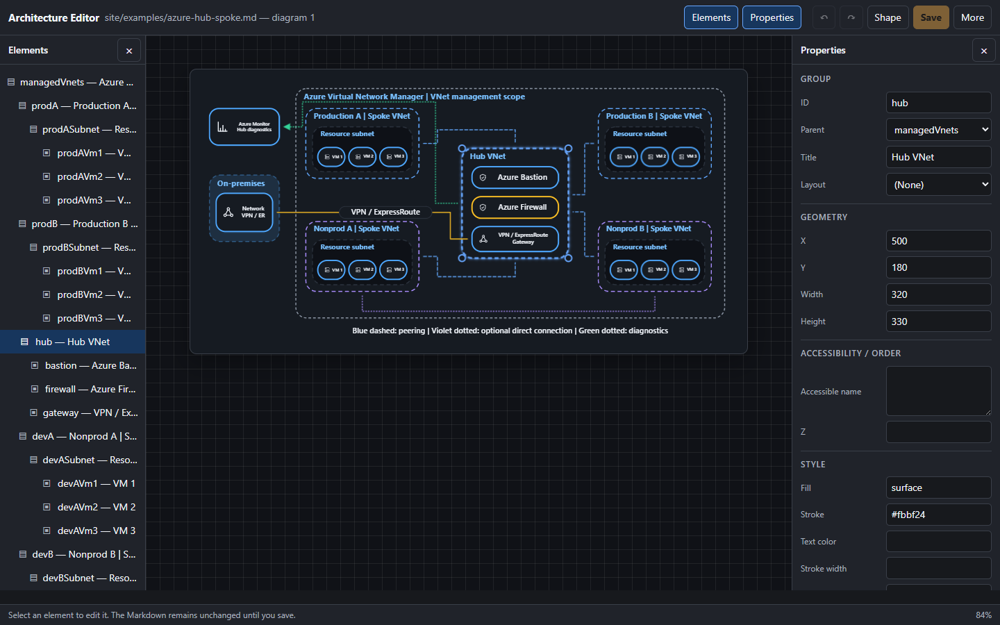

<p align="center">
  <a href="https://github.com/runceel/markdstage">
    
  </a>
</p>

<h1 align="center">MarkdStage</h1>

<p align="center">
  <strong>Markdown, ready for the stage.</strong>
</p>

<p align="center">
  <a href="./README.md">English</a>
</p>

<p align="center">
  <a href="https://github.com/runceel/markdstage/actions/workflows/ci.yml"></a>
  <a href="./LICENSE"></a>
  
  
</p>

<p align="center">
  <a href="https://runceel.github.io/MarkdStage/">紹介サイト</a> |
  <a href="#canvas-extension">Canvas Extension</a> |
  <a href="#desktop">Desktop</a> |
  <a href="#cli">CLI</a> |
  <a href="#community-macos-app">macOS アプリ</a> |
  <a href="#examples">表示例</a> |
  <a href="#markdown-format">Markdown 形式</a> |
  <a href="#documentation">ドキュメント</a> |
  <a href="https://github.com/runceel/markdstage/releases">リリース</a>
</p>

MarkdStage は、AI とスライドを作成し、文章や図を手元で調整できるオープンソースのツールです。
資料やメモから下書きを依頼し、言い回しや図の配置を直接編集して、確認・発表・共有まで進められます。
内容は Markdown、見た目はテーマで管理できます。AI や GitHub Copilot App を使わずに、
Markdown を直接編集して発表することもできます。

<a id="markdstage-を選ぶ理由"></a>

## 作成から発表・共有まで

| 作業 | できること |
| --- | --- |
| **作成** | 元資料、対象者、発表時間を AI に伝えて下書きを依頼できます。Canvas のガイドや CLI の Agent Skill から、形式とテーマの情報を参照できます。 |
| **調整** | テーマを保ったまま Markdown の言い回しを編集できます。Architecture 図の配置は画面上で調整でき、小さな変更を毎回 AI に依頼する必要はありません。 |
| **確認** | AI に「スライドに内容が収まっているか確認して」と依頼できます。AI がレイアウト診断と必要なページの画像を使って、修正が必要な箇所を調べます。 |
| **発表** | 手元でスピーカーノートと次のスライドを見ながら、操作が同期する観客向けウィンドウで発表できます。 |
| **共有** | 閲覧用の PDF や、確認・編集用のハイブリッド PowerPoint に出力できます。受け手に MarkdStage の導入を求めずに配布できます。 |

診断は見た目の確認を補助するもので、すべてのデザイン上の問題を判断するものではありません。
配布前には最終出力の全ページを確認します。PowerPoint では対応する文章・リスト・表・コード・
Architecture 図を編集でき、対応外の表現には画像フォールバックを使います。
PowerPoint 側の変更は Markdown には逆反映されません。対応範囲は
[発表とエクスポートのガイド](./docs/user-guide/ja/presenting-and-export.md)を参照してください。

## MarkdStage の使い方

| 利用環境 | 用途 |
| --- | --- |
| **[GitHub Copilot と Canvas](#canvas-extension)** | GitHub Copilot App で作成・修正を依頼し、Architecture 図を画面上で調整して、Canvas から発表・出力できます。 |
| **[CLI と Agent Skill](#cli)** | Claude Code または Codex で作成・確認を依頼し、`preview --watch` で手元の調整ができます。Canvas は不要です。 |
| **[直接編集とネイティブアプリ](#present-without-ai)** | Markdown を自分で書くか作例から始め、Canvas、CLI、Windows アプリで直接表示できます。 |
| **MarkStageForMac**（第三者製） | コミュニティ製の macOS ネイティブアプリで発表します。本リポジトリの開発・サポート対象外です |

<a id="canvas-extension"></a>

## Canvas Extension を使う

このリポジトリをプロジェクトとして開くと、`.github/extensions/markdstage/` がプロジェクトスコープで
読み込まれます。別のリポジトリへユーザースコープでインストールする場合は、現在の
**[v3.8.3 リリース](https://github.com/runceel/markdstage/releases/tag/v3.8.3)** を指定して
GitHub Copilot に依頼します。

> 次の GitHub リポジトリフォルダーから MarkdStage をユーザースコープへインストールしてください。
>
> `https://github.com/runceel/markdstage/tree/v3.8.3/.github/extensions/markdstage`

Extension は利用者の環境でローカルのコードを実行します。インストールする前に中身を確認し、
同じ状態を再現できるよう、信頼できるリリースタグかコミット SHA を指定してください。
`main` ブランチは開発中の最新版です。

### 最小ワークフロー

Extension の導入後、元資料やメモを添えて Copilot に依頼します。

> このメモから技術者向けの5枚のスライドを作成してください。dark テーマの `slides.md` として保存し、
> MarkdStage Canvas で表示してください。

先に `slides.md` を用意する必要はありません。作成後は、変更したい箇所を指定できます。

> テーマはそのままで、2枚目の説明だけ短くしてください。

1. 言い回しは Markdown、図の調整は [Architecture Editor](#examples) で直接編集できます。
2. Copilot に「スライドに内容が収まっているか確認して」と依頼します。自分で見た目を確認するときは **More controls > Output preview** を使えます。
3. **◀ ▶**、**矢印キー**、**☰ スライド一覧**でスライドを送れます。対応環境では Surface Pen も使えます。
4. **More controls** から発表用ウィンドウを開くか、PDF / PowerPoint に出力します。配布前に最終出力を確認します。

既存のデッキには「`slides.md` を使ってこのデッキをプレゼンテーションしてください」と依頼できます。
Copilot が形式のガイド、表示中のデッキ、診断を使う仕組みは
[AI を使った作成ガイド](./docs/user-guide/ja/ai-assisted-authoring.md)で説明しています。

Canvas の **More controls > Open Markdown** か `I` キーを使えば、AI を介さずにワークスペースの Markdown をそのまま開けます。
Git リポジトリではリポジトリルート、それ以外では現在のセッションで開いているフォルダーが
ワークスペースになります。`open_canvas` を直接呼び出す場合の Canvas ID は
**`MarkdStage`** です。

```text
canvasId: MarkdStage
```

<a id="cli"></a>

## CLI を使う

[MarkdStage CLI](./docs/user-guide/ja/cli.md) は Canvas なしで、Claude Code、Codex、ターミナル、
CI から利用できます。**Node.js 24 以降**と、インストール済みの **Microsoft Edge、
Google Chrome、または Chromium** が必要です。ブラウザーの自動ダウンロードは行いません。
前提条件やオフライン導入は[インストールガイド](./docs/user-guide/ja/installation.md)を参照してください。

### 導入して下書きを依頼

CLI をインストールし、資料を作るフォルダーでスキルを登録します。以下は Claude Code の例です。

```console
npm install --global @markdstage/markdstage
markdstage skill install --target claude
```

Codex を使う場合は、スキル登録の行を `markdstage skill install --target codex` に置き換えます。
**利用する方を選び、両方を登録する必要はありません。** Skill は `markdstage guide` と同じ
形式・コマンドのガイドを提供します。選んだフォルダーの `.claude/skills/markdstage/` または
`.agents/skills/markdstage/` に導入されます。

同じフォルダーを利用するエージェントで開き、元資料やメモを添えて依頼します。

> markdstage スキルを使い、このメモから技術者向けの5枚のスライドを `slides.md` に作成してください。
> dark テーマで表示し、レイアウトも確認してください。

> テーマはそのままで、2枚目の説明だけ短くしてください。

### 調整・確認・発表

```console
markdstage slides.md
```

Markdown をテキストエディターで編集すると、保存時に UI が更新されます。同じ UI で
鉛筆ボタンから Architecture 図の配置を調整でき、**Advanced edit** で詳細な編集ができます。
配置変更はその場で保存され、詳細デザイナーの下書きは **Save** で Markdown に書き戻されます。

収まりの確認は、同じエージェントに自然言語で依頼できます。

> スライドに内容が収まっているか確認してください。はみ出す箇所を調べ、必要なページは画像でも確認してください。

AI は Skill の手順に沿って構造の検証とレイアウト診断を行い、結果をもとに修正が必要な箇所を
調べます。利用者が診断コマンドを指定する必要はありません。

<details>
<summary>AI が使う診断の仕組み</summary>

`inspect`（CLI）と `inspect_layout`（Canvas）は、主に AI が描画後のクリッピングを調べるための
診断手段です。固定 16:9 の出力で見切れるページや要素を構造化された情報として返すため、
AI は最初から全ページを画像化せずに、修正が必要な箇所を絞れます。

CLI では AI が `validate` で構造・テーマ・DSL を検証し、`inspect` で収まりを診断します。
画像による確認が必要なページには `capture --pages` を使います。手動実行や CI での利用方法は
[CLI ガイド](./docs/user-guide/ja/cli.md)を参照してください。

</details>

調整後は AI に発表・出力を依頼するか、自分で次のコマンドを実行できます。

```console
markdstage present slides.md
markdstage export slides.md --output slides.pdf
markdstage export slides.md --output slides.pptx
```

`present` は同じフル UI を発表者ビューで開きます。そこで **Start presentation** を選ぶと、
同期された観客向けウィンドウが開きます。配布前には最終出力の全ページを確認します。

<a id="present-without-ai"></a>

## AI を使わずに発表する

Markdown を自分で書くか、[最小の記述例](#markdown-format)や
[ソース付きの作例](https://runceel.github.io/MarkdStage/#examples)から始めて、
`slides.md` として保存します。スキル登録は不要です。グローバルインストールせずに使う場合は、
次のように実行できます。

```console
npx @markdstage/markdstage
npx @markdstage/markdstage slides.md
npx @markdstage/markdstage present slides.md
```

最初のコマンドは現在のワークスペースを対象に Canvas と同等の空の UI を開きます。2つ目は
`slides.md` を自動更新付きで開きます。CLI UI と Canvas のどちらでも
**More controls > Open Markdown** からファイルを直接開けます。発表用のネイティブアプリも
利用できます。

<a id="desktop"></a>

## MarkdStage Desktop を使う

[MarkdStage Desktop](./apps/MarkdStage.Desktop/README.md) は、ファイルピッカーから Markdown を開く
WinUI 3 アプリです。現在のスライドと次のスライド、スピーカーノートを並べて表示し、
GitHub Copilot を開かずに、操作が同期するネイティブの投影用ウィンドウで発表できます。

Windows と Microsoft Edge WebView2 Runtime が必要です。
現在の **[v3.8.3 リリース](https://github.com/runceel/markdstage/releases/tag/v3.8.3)** には、
Windows x64 / ARM64 向けのポータブルビルドと SHA-256 チェックサムファイルが含まれます。

- [MarkdStage-win-x64.zip](https://github.com/runceel/markdstage/releases/download/v3.8.3/MarkdStage-win-x64.zip)
- [MarkdStage-win-arm64.zip](https://github.com/runceel/markdstage/releases/download/v3.8.3/MarkdStage-win-arm64.zip)

フォルダーごと展開し、`MarkdStageApp.exe` を実行して Markdown ファイルを開きます。

<a id="community-macos-app"></a>

## コミュニティ製 macOS アプリ

[MarkStageForMac](https://github.com/07JP27/MarkStageForMac) は、MarkdStage コミュニティが
開発した macOS ネイティブアプリです。本リポジトリの開発・リリース・サポート対象外です。

<a id="examples"></a>

## Markdown をステージへ

同じソースとレンダラーで、編集・プレビュー・発表・出力をつなげられます。
[紹介サイトの作例](https://runceel.github.io/MarkdStage/#examples)では、表示結果と
ダウンロードできる Markdown を確認できます。

<table>
  <tr>
    <td width="50%">
      
    </td>
    <td width="50%">
      
    </td>
  </tr>
  <tr>
    <td valign="top">
      <strong>標準 Markdown</strong><br>
      見出し、リスト、強調、コード、表、画像をそのまま書けます。図の配置を自動で任せたいときは
      Mermaid も使えます。
    </td>
    <td valign="top">
      <strong>Architecture DSL</strong><br>
      グループやアイコンの位置、コネクターの経路を指定したいときは、
      <code>architecture</code> フェンスに JSON を書きます。
    </td>
  </tr>
</table>

### ネットワーク構成図も編集可能な Markdown で

[Azure ハブスポークのサンプル](./site/examples/azure-hub-spoke.md)では、Architecture DSL v1 で
共有ハブ、4 つのスポーク VNet、入れ子のサブネットと VM、種類の異なる接続を表現しています。
ネットワークの位置は固定し、VM は自動で横並びに配置します。Azure Firewall 経由の
インターネット送信は別の経路図に分け、VNet の接続関係と通信の流れを区別しています。

[](./site/examples/azure-hub-spoke.md)

[Microsoft Learn のハブスポーク構成](https://learn.microsoft.com/ja-jp/azure/architecture/networking/architecture/hub-spoke)
の概念を独自の配置で図示したもので、Azure 公式画像ではなく組み込みの汎用アイコンを使用しています。
デッキの描画にレンダラーの変更や外部画像素材は不要です。GitHub では `architecture` フェンスが
コードとして表示されるため、プレビュー画像から編集可能な Markdown ソースにリンクしています。
MarkdStage で図を開いて編集する手順は、[ガイドの実例](./docs/user-guide/ja/diagrams-and-media.md#azure-hub-spoke-example)
を参照してください。

### 図の記法を使い分ける

図の関係から自動配置したいときは **Mermaid** を使い、色味をテーマに合わせることもできます。
位置、サイズ、グループ、接続線を指定してスライドに合わせた構成にしたいときは
**Architecture DSL** を使えます。どちらにも対応しており、作りたい図に応じて選べます。

AI が作成した Architecture 図も直接調整できます。Canvas では **More controls > Open Markdown**
でソースを読み込み、**More controls > Shape editing > Advanced editing** から
Architecture Editor を開きます。ノード、グループ、画像、コネクターの追加、削除、配置、確認ができます。
変更は下書きとして保持され、**Save** で Markdown に書き戻されます。
CLI の `preview --watch` でも Architecture 図のビジュアル編集に対応しています。

<p align="center">
  
</p>

記法の詳細は[図とメディアのガイド](./docs/user-guide/ja/diagrams-and-media.md)を参照してください。

<a id="markdown-format"></a>

## Markdown 形式

```markdown
---
title: Sample
theme: dark
layout: title
---

# Markdown, ready for the stage.

---

## Second slide

- Use standard Markdown
- Write code and Mermaid directly

<!--
スピーカーノート:
ここで Markdown と Mermaid の記述例を紹介します。
-->
```

先頭のフロントマターがデッキ全体の設定になります。各スライドのフロントマターでは、
`layout`、`size`、`theme` などを個別に上書きできます。スピーカーノートは、コードフェンスの外側で
スライドに直接書いた HTML コメントに記述します。ノートは発表者ビューに表示され、PowerPoint
エクスポートでは対応するノートペインに読みやすいプレーンテキストとして書き出されます。
通常のスライド、投影用ウィンドウ、PDF 出力には表示されません。

<a id="documentation"></a>

## ドキュメント

- [ユーザーガイド](./docs/user-guide/ja/README.md)
- [インストールと前提条件](./docs/user-guide/ja/installation.md)
- [GitHub Copilot とスライドを作成する](./docs/user-guide/ja/ai-assisted-authoring.md)
- [GitHub Copilot ハンズオン](./docs/user-guide/ja/copilot-hands-on.md)
- [MarkdStage Skill](./.github/skills/markdstage/SKILL.md)
- [Canvas Extension の仕様とアクション](./.github/extensions/markdstage/README.md)
- [MarkdStage Desktop](./apps/MarkdStage.Desktop/README.md)
- [MarkdStage CLI](./docs/user-guide/ja/cli.md)
- [図とメディア](./docs/user-guide/ja/diagrams-and-media.md)
- [発表とエクスポートの対応範囲](./docs/user-guide/ja/presenting-and-export.md)
- [カスタムテーマ作成](./.github/extensions/markdstage/docs/custom-theme-authoring.md)
- [プロダクト原則](./PRODUCT.md)
- [ブランドとデザインシステム](./DESIGN.md)
- [アーキテクチャ決定記録 (ADR)](./docs/adr/README.md)
- [リリース手順](./.github/RELEASING.md)
- [サードパーティ通知](./.github/extensions/markdstage/THIRD-PARTY-NOTICES.md)
- [MIT ライセンス](./LICENSE)

## リポジトリ構成

| パス | 内容 |
| --- | --- |
| `.github/extensions/markdstage/` | Canvas Extension、レンダラー、同梱オープンソースソフトウェア、スキーマ |
| `.github/skills/markdstage/SKILL.md` | Markdown をスライド断片へ整形して MarkdStage を開く Skill |
| `packages/markdstage-cli/` | `@markdstage/markdstage` CLI パッケージと Agent Skills の生成 |
| `apps/MarkdStage.Desktop/` | WinUI 3 Desktop アプリ |
| `assets/brand/` | MarkdStage のロゴ、ロックアップ、README バナー |
| `assets/readme/` | この README に掲載しているスライドと Architecture Editor の画像 |
| `site/` | 日英対応の GitHub Pages 紹介サイト、本文、ソース付き作例 |
| `slides.md` | 機能を紹介するサンプルデッキ |

## 紹介サイトの開発

[紹介サイト](https://runceel.github.io/MarkdStage/) は `site/` から静的に生成します。
ビルドに追加パッケージは不要です。Node.js 24 以降で次を実行します。

```console
npm run preview:site
```

日本語は `http://127.0.0.1:4173/MarkdStage/`、英語は末尾に `en/` を付けて開きます。
ソースの編集後はコマンドを再実行してください。`npm run build:site` は公開に必要な
ファイルだけを `_site/` に生成します。別の公開先でビルドする場合は、環境変数
`SITE_URL` にサイトの完全なベース URL を指定します。ローカルのポートは `PORT` で変更できます。

本文は `site/content/ja.json` と `site/content/en.json` をセットで編集します。
共通リンク、CLI コマンド、Canvas の信頼できるリリースタグは
`site/content/product.json` で管理します。`site/examples/` の作例は
`site/assets/examples/` の PNG と対応しています。作例を変更したら
[CLI の `capture --pages 1`](./docs/user-guide/ja/cli.md) で先頭スライドを再取得し、
対応する PNG を置き換えてください。Architecture Editor の画像は `assets/readme/` を再利用します。

`npm run test:site` は既存の Node、Playwright、axe-core でサイトを確認します。
必要に応じて `npm ci` でテスト依存関係、`npx playwright install chromium` で
Chromium を用意してください。
**GitHub Pages** workflow は PR では確認のみを行い、`main` への反映後に
確認済みの `_site/` を公開します。`main` を対象に手動実行することもできます。
Pages の Source は **GitHub Actions** に設定します。既存の公開先 URL を読み取り、
独自ドメイン・DNS・HTTPS 設定は変更しません。

## v2.0.0 の破壊的変更

MarkdStage への移行にあたり、旧ブランド名の互換エイリアスは用意していません。

| 変更前 | 変更後 |
| --- | --- |
| Canvas ID `presentation` | Canvas ID `MarkdStage` |
| ツール `presentation_guide` | ツール `markdstage_guide` |
| `.github/extensions/presentation/` | `.github/extensions/markdstage/` |
| `.github/skills/presentation/` | `.github/skills/markdstage/` |
| `Presentation-win-*.zip` | `MarkdStage-win-*.zip` |

既存の Markdown 構文、テーマ、Architecture DSL、`load_deck` や `goto_slide` などの
アクション仕様は変更していません。

## ライセンス

このリポジトリの独自部分は MIT License で公開しています。同梱しているオープンソースソフトウェアの
ライセンスと著作権表示は、
[THIRD-PARTY-NOTICES.md](./.github/extensions/markdstage/THIRD-PARTY-NOTICES.md) を参照してください。
