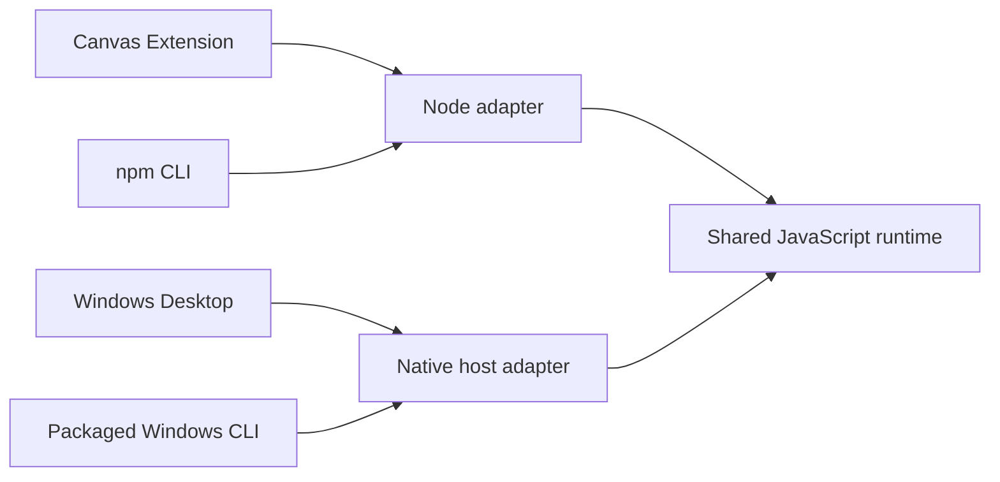

# MarkdStage architecture

This document describes the current cross-surface architecture of MarkdStage.
It is for implementers who already understand the product requirements and need
the component boundaries, trust model, ownership rules, and invariants that must
be preserved.

Architecture decision records under [`docs/adr/`](adr/README.md) explain why
these boundaries were chosen. Component READMEs and the code remain authoritative
for local implementation details and user-interface behavior.

## Surfaces and responsibilities

| Surface | Responsibility | Runtime environment |
| --- | --- | --- |
| Canvas Extension | Copilot-hosted authoring, presentation, editing, inspection, and export | Node.js host with an embedded browser surface |
| npm CLI | Terminal and automation workflows, including browser-based interactive use | Node.js and an installed Chromium-based browser |
| Windows Desktop | Native workspace, presenter, audience-window, and file-activation experience | WinUI 3 and WebView2 |
| Packaged Windows CLI | Console commands and activation of the installed Desktop app | Native host, WebView2, and external Chromium where layout is required |

All surfaces consume the same Markdown deck model. The canonical implementation
of parsing, validation, themes, Architecture DSL, rendering, layout reporting,
and output construction lives under `.github/extensions/markdstage/`.

Host-specific code may provide transport, file access, watching, transient
storage, browser launch, native windows, and platform activation. Product logic
above those boundaries must not be forked by surface.

## Shared runtime and host boundary

The shared runtime depends on an explicitly injected I/O adapter. It does not
select a host by inspecting globals, browser identity, or process state.

The Node adapter serves the Canvas Extension and npm CLI. The native host adapter
serves Desktop and the packaged CLI through a bounded port. The port exposes only
the workspace and transient operations required by the product; it is not a
general filesystem API.

Each host adapter owns security-sensitive path decisions. The Node adapter
enforces them for Canvas and npm CLI; the native host enforces them for Desktop
and the packaged CLI. The runtime sends workspace-relative paths and receives
bounded results. On native surfaces, read-only assets consumed directly by the
browser use host-controlled mappings, while enumeration, mutation, watching,
and data read by JavaScript cross the I/O port.

## Workspace and trust model

Markdown, themes, media, and Architecture DSL inside a workspace are untrusted
input. A workspace root is absolute and canonical for the lifetime of the
session that owns it.

Every surface preserves these rules:

- Reads and writes stay within the selected workspace, except for explicitly
  host-owned transient storage.
- Symbolic links, junctions, mount points, and other link traversal cannot be
  used to escape the workspace.
- Content-type and size limits are enforced at the host boundary and retained by
  the shared runtime.
- Writes are atomic. Source-backed Architecture saves reject stale source rather
  than overwriting an external edit.
- Browser content never receives an unrestricted host object or filesystem path.
- Loopback presentation services use an unguessable URL scope and validate host
  and origin on state-changing requests.

The GUI never derives its workspace from the process working directory. A CLI
invocation with no explicit root uses the caller's current directory, as recorded
by [ADR 0002](adr/0002-cli-current-directory-workspace.md).

## State, identity, and lifecycle

The shared runtime owns deck parsing, slide identity, navigation state, theme
state, validation, and the source-backed reload model. Native hosts retain only
the state needed to integrate that snapshot with platform windows and services.

Desktop owns recent workspaces, native windows, audience-window lifecycle, and
its private user preferences. A canonical workspace root identifies a Desktop
workspace window; repeated activation reuses that window rather than creating a
second owner for the same workspace.

Canvas deck state belongs to the active Canvas instance. The npm CLI's local
server state and Desktop's application state are independent. No presentation
state is synchronized through shared application-data files.

Browser profiles and intermediate output live in host-selected transient storage
and are removed after use. User-authored Markdown, themes, and assets remain in
the workspace and are not owned by the application package.

## Windows execution model

MarkdStage Desktop is distributed as one MSIX application through the
[Microsoft Store](https://apps.microsoft.com/detail/9N9DG772RM03). The package
contains one graphical application entry and a console execution alias.

Interactive packaged CLI requests activate the installed app and report success
only after the app accepts the requested workspace, file, and mode. Repeated
presentation requests reuse the existing workspace and audience windows.

Console-only commands do not activate the presentation app:

- Help, version, guide, and Agent Skill operations are native package data
  operations.
- Validation runs the shared script runtime through WebView2 without an external
  browser.
- Inspection, capture, PDF export, and PowerPoint export use an installed
  Chromium-based browser because they require full browser layout.

The Store-distributed package has completed the package-activation, WebView2, and
external-browser acceptance checks. Those checks remain release requirements for
future Store submissions.

## Generated and distributed artifacts

Generated artifacts are not independent sources of truth:

- `packages/markdstage-cli/shared/` mirrors portable files from the canonical
  Extension before testing and packaging.
- `.github/plugin/markdstage/` is generated from the canonical Extension for
  Awesome Copilot distribution.
- Agent Skills are generated from the canonical guide topics by
  `packages/markdstage-cli/src/skills.mjs`.

Agent Skills are installation artifacts, not development-repository content.
The npm CLI, packaged CLI, and Desktop generate them into the target user's
workspace for Codex, Claude Code, or GitHub Copilot. The MarkdStage development
repository does not check them into agent discovery directories, so development
sessions do not automatically load the product's user-facing Skill.

CI verifies deterministic generation, target-specific content, package
inclusion, installation behavior, and protection of locally modified Skill
files. Generated mirrors must not be edited by hand.

## Cross-surface invariants

- Markdown is the source of truth; exported PowerPoint changes do not round-trip
  into Markdown.
- Parsing, validation, rendering, Architecture DSL, and export behavior have one
  shared implementation.
- A surface difference is intentional only when an accepted ADR records it.
- Error meanings and security decisions remain equivalent across adapters.
- Final output is verified on every runtime path that uses a different browser
  engine; equivalent implementation does not imply identical engine versions.
- The product never downloads or installs Node.js, WebView2, or Chromium at run
  time.
