# Mermaid support in MarkdStage
## Editable where safe, faithfully preserved everywhere

Bundled Mermaid 11.15.0 rendering with hybrid PowerPoint export.

---

## One source, three outcomes

| Where | What MarkdStage does |
| --- | --- |
| Slides and themes | Renders every bundled Mermaid format offline and applies the deck theme |
| Supported PowerPoint content | Keeps safe shapes, text, and connectors as editable objects |
| Unsupported or unsafe content | Preserves the smallest safe image fallback, or the whole diagram when separation is unsafe |

The compatibility guide summarizes editable coverage and fallback behavior.

---

## Flowcharts: common shapes and routes

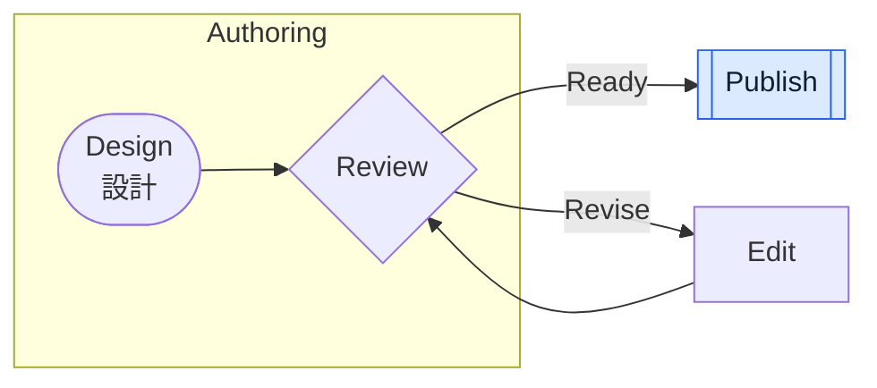

Common nodes, connectors, labels, subgraphs, and supported styling stay editable.

---

## Sequence: messages and control frames

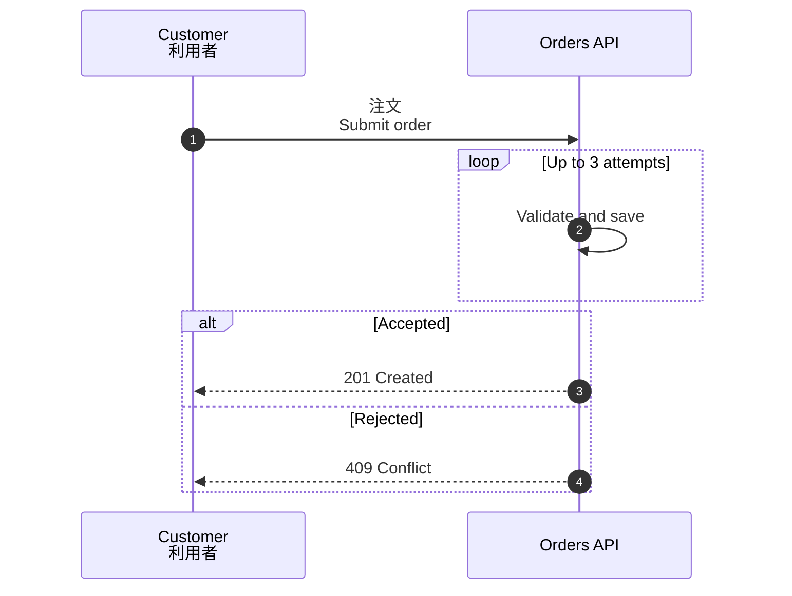

---

## Class: structure and relationships

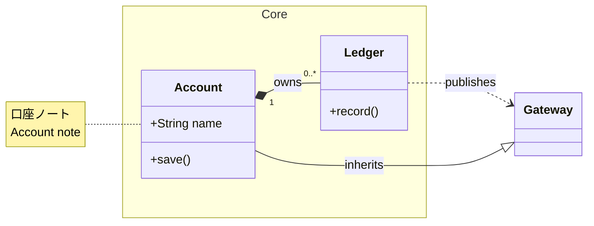

Compartments, common relations, multiplicities, notes, and namespaces remain independent.

---

## State: basic lifecycle

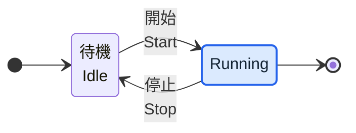

Basic states, labels, start/end pseudo-states, and simple transitions stay editable.

---

## ER: attributes and cardinalities

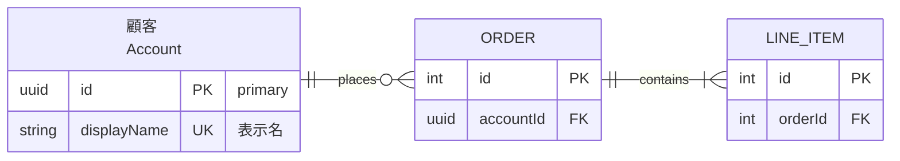

Entity rows, keys, labels, routes, and crow's-foot terminals use the rendered geometry.

---

## Requirement: blocks and relations

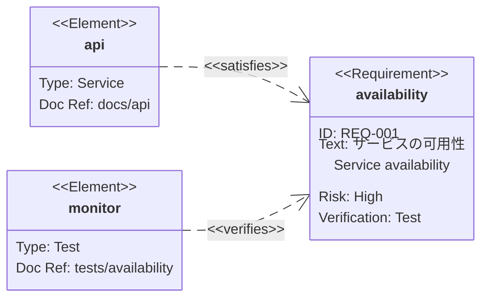

Supported requirement/element boxes, fields, relation labels, and markers stay editable.

---

## Packet and tree view

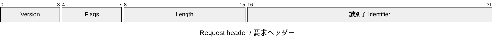

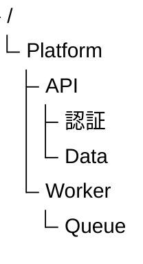

Packet fields and bit labels, plus tree hierarchy lines and labels, remain editable.

---

## Kanban: columns, cards, and labels

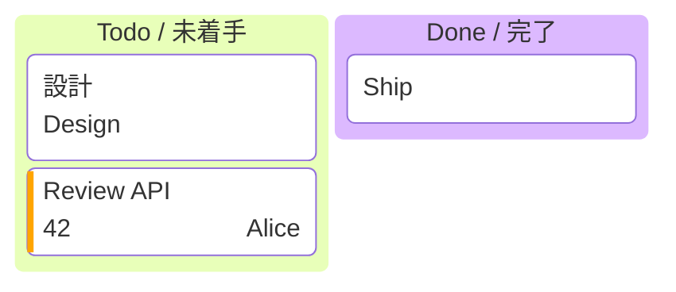

Basic columns, cards, plain ticket/assignee labels, and priority bars stay editable.
Use `kanban`; `kanban-beta` is not a version alias in the bundled renderer.

---

## Block: basic shapes and connectors

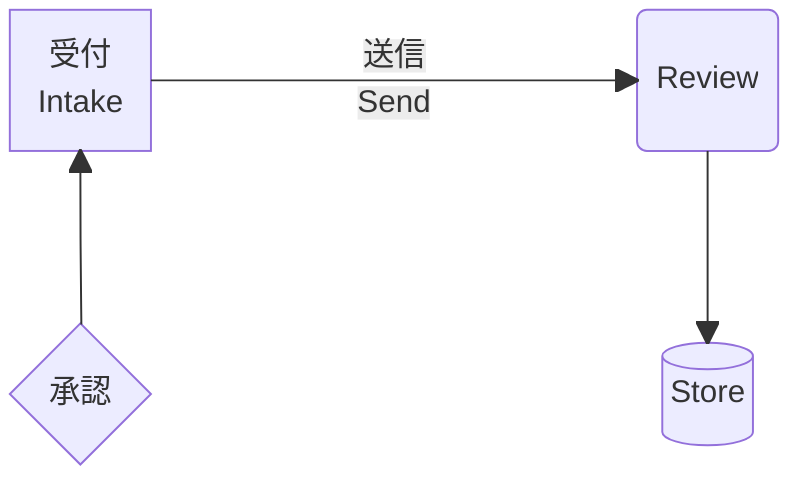

`block` and `block-beta` share editable basic shapes, connectors, and simple HTML labels.
Special outlines and unsafe labels stay local images; arbitrary shapes and complex nesting
are not fully supported.

---

## Quadrant: points, borders, and rotated labels

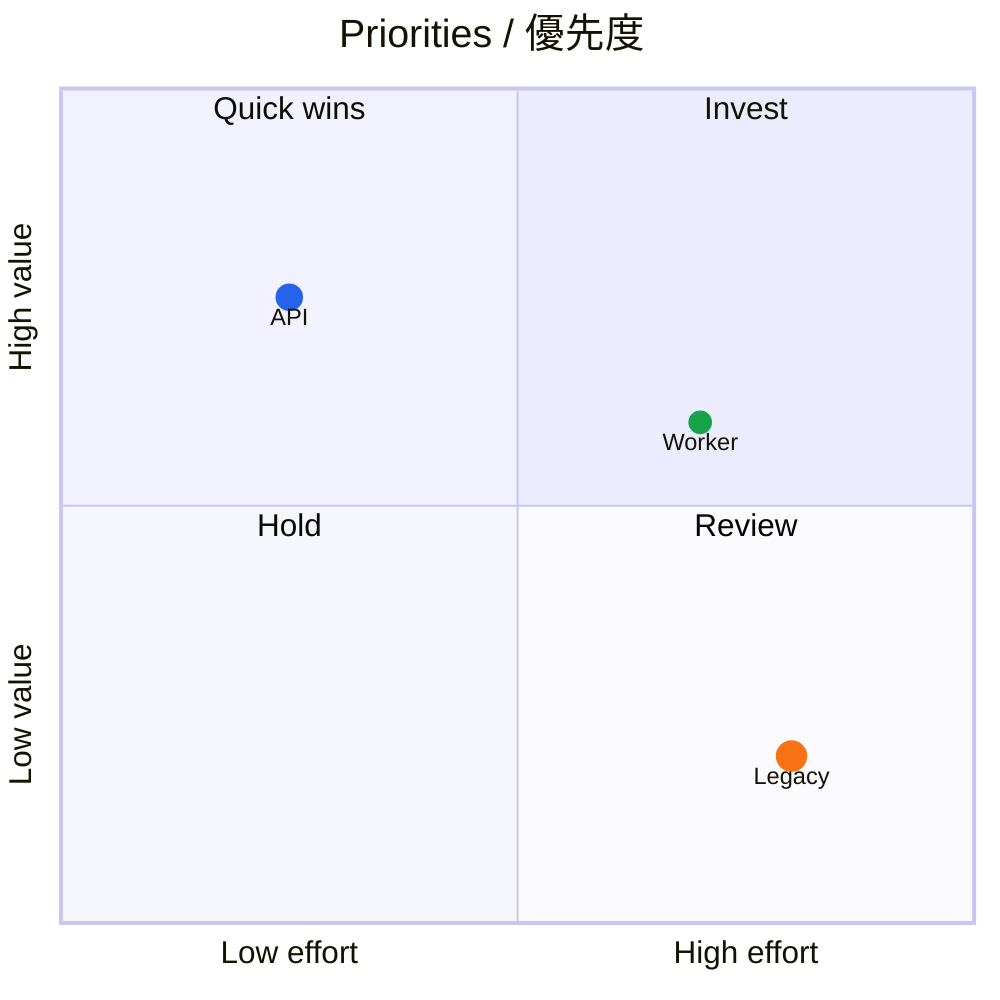

Quadrant rectangles, circular points, borders, titles, and simple axis/point labels stay editable.

---

## XY chart: bars, line vertices, and ticks

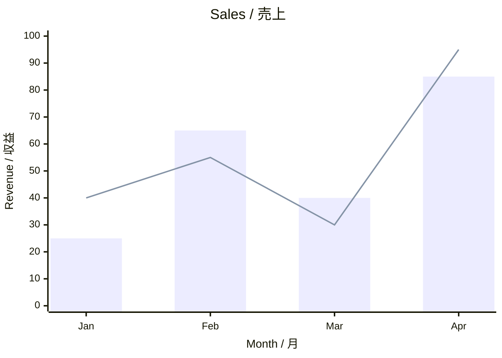

`xychart` and `xychart-beta` share editable bars, straight line segments, axes, ticks,
and rotated labels; horizontal orientation and negative ranges also use rendered geometry.

---

## Charts: the editable boundary

- These are shapes, text, and lines, **not data-backed PowerPoint charts**.
- Positions, sizes, point radii, and line vertices come directly from Mermaid's SVG.
- Japanese and explicit SVG multiline text stay editable; literal HTML markup is not reinterpreted.
- Shadows, gradients, clipping, decorated text, unsafe transforms, and unknown geometry stay local images.
- Closed/curved/disconnected paths and existing element, point, or depth limits retain fallback diagnostics.

---

## Gantt: tasks, dates, rows, and milestones

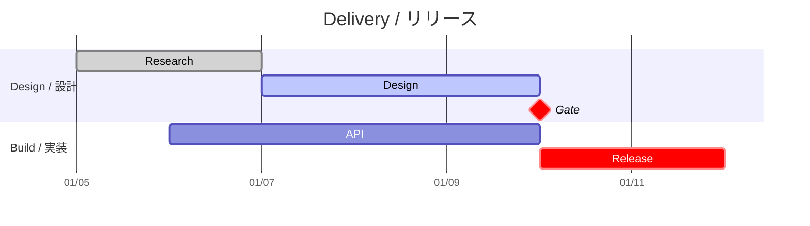

Ordinary tasks (including done/active/critical), labels, date ticks, row backgrounds,
and rectangular excluded periods use Mermaid's rendered geometry, not recreated date math.

---

## Gantt: the editable boundary

- Known milestones keep their rounded diamond silhouette as editable rounded squares: centered 45° rotation and 0.8 scale only.
- Japanese, explicit SVG multiline labels, and simple rotated tick text reuse the common text adapter.
- The usual faded tick line/label pair is native only when its painted extents are safely separated.
- Overlapping or uncertain tick groups (including default top-axis labels) remain local images with their group alpha intact.
- Arbitrary transforms, effects, decorations, or unknown geometry retain local fallback bounds, source paths, reasons, and paint order.
- Other group opacity and existing scene/element/depth limits remain guarded; this is not general CSS transform or calendar-layout support.

---

## Hybrid PowerPoint export

1. Convert supported primitives to native, editable PowerPoint objects.
2. Preserve an unsupported element or effect as the **smallest safe local image**.
3. Use a whole-diagram image only when the unsupported content cannot be separated safely.

Other Mermaid diagram types still render and are preserved as images when editable conversion
is unavailable.

---
layout: backcover
---

# Mermaid support

Editable where safe. Faithfully preserved everywhere.
