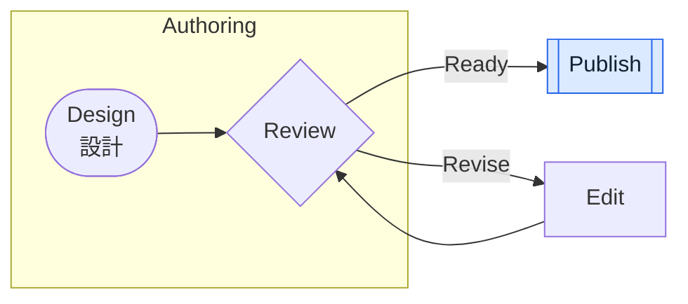
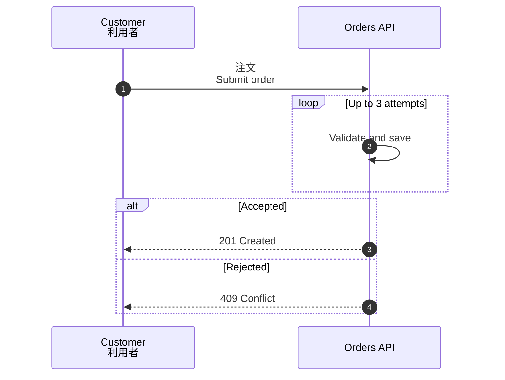
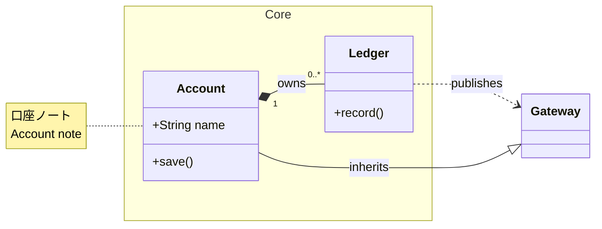
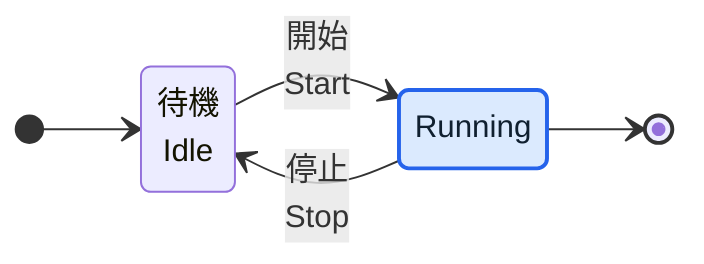
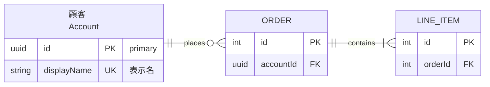
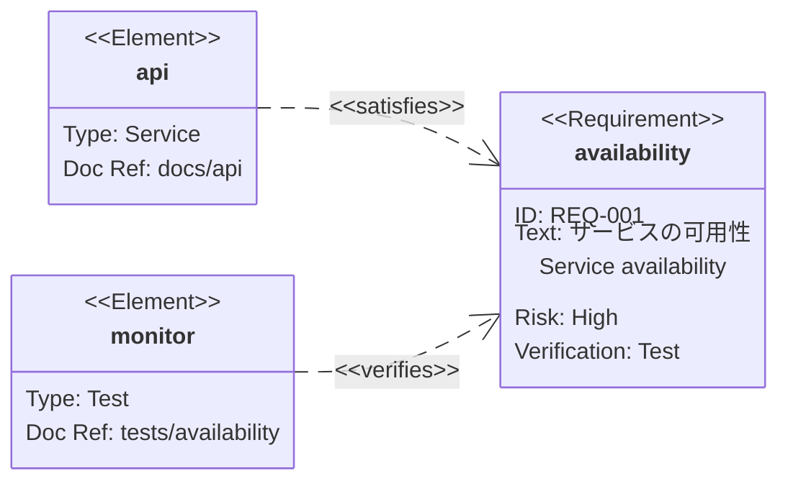
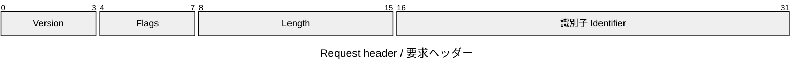
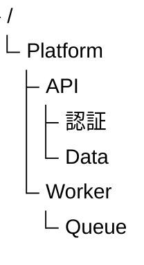
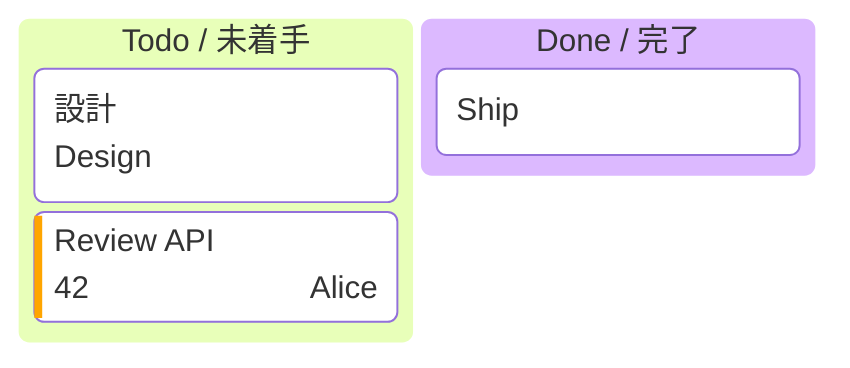
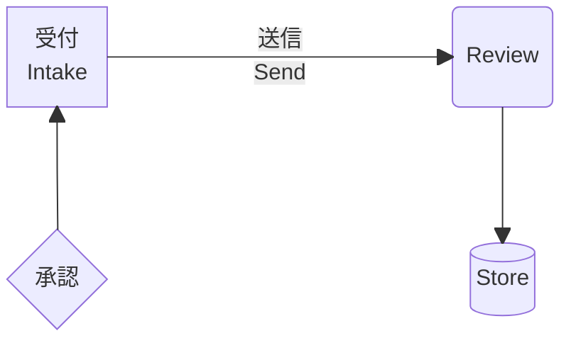

# Mermaid support in MarkdStage
## Editable where safe, faithfully preserved everywhere

Bundled Mermaid 11.15.0 rendering with hybrid PowerPoint export.

---

## One source, three outcomes

| Where | What MarkdStage does |
| --- | --- |
| Slides and themes | Renders every bundled Mermaid format offline and applies the deck theme |
| Supported PowerPoint content | Keeps safe shapes, text, and connectors as editable objects |
| Unsupported or unsafe content | Preserves the smallest safe image fallback, or the whole diagram when separation is unsafe |

The compatibility guide summarizes editable coverage and fallback behavior.

---

## Flowcharts: common shapes and routes

Common nodes, connectors, labels, subgraphs, and supported styling stay editable.

---

## Sequence: messages and control frames

---

## Class: structure and relationships

Compartments, common relations, multiplicities, notes, and namespaces remain independent.

---

## State: basic lifecycle

Basic states, labels, start/end pseudo-states, and simple transitions stay editable.

---

## ER: attributes and cardinalities

Entity rows, keys, labels, routes, and crow's-foot terminals use the rendered geometry.

---

## Requirement: blocks and relations

Supported requirement/element boxes, fields, relation labels, and markers stay editable.

---

## Packet and tree view

Packet fields and bit labels, plus tree hierarchy lines and labels, remain editable.

---

## Kanban: columns, cards, and labels

Basic columns, cards, plain ticket/assignee labels, and priority bars stay editable.
Use `kanban`; `kanban-beta` is not a version alias in the bundled renderer.

---

## Block: basic shapes and connectors

`block` and `block-beta` share editable basic shapes, connectors, and simple HTML labels.
Special outlines and unsafe labels stay local images; arbitrary shapes and complex nesting
are not fully supported.

---

## Hybrid PowerPoint export

1. Convert supported primitives to native, editable PowerPoint objects.
2. Preserve an unsupported element or effect as the **smallest safe local image**.
3. Use a whole-diagram image only when the unsupported content cannot be separated safely.

Other Mermaid diagram types still render and are preserved as images when editable conversion
is unavailable.

---
layout: backcover
---

# Mermaid support

Editable where safe. Faithfully preserved everywhere.
