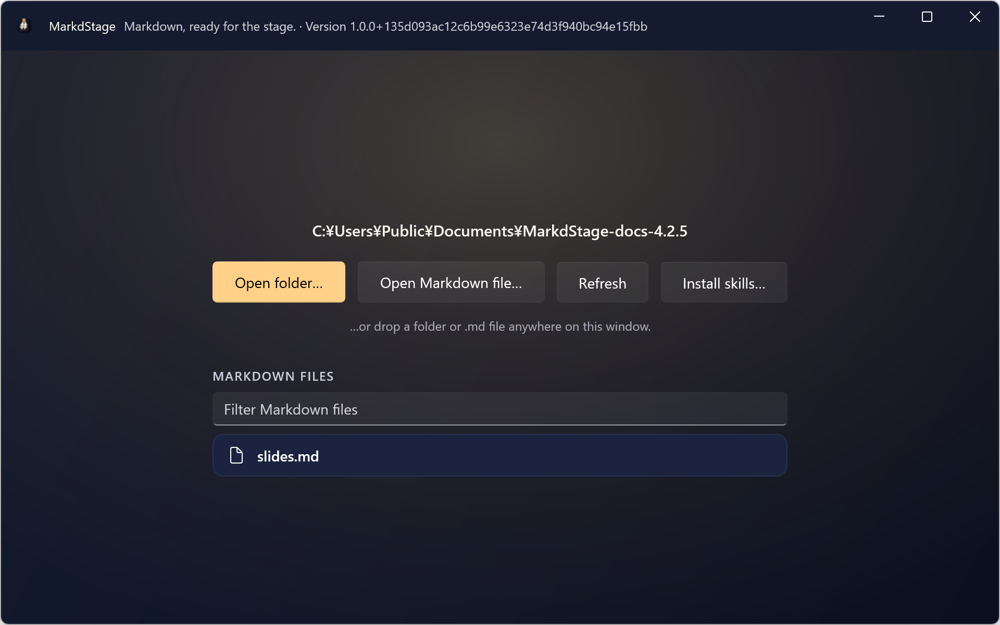
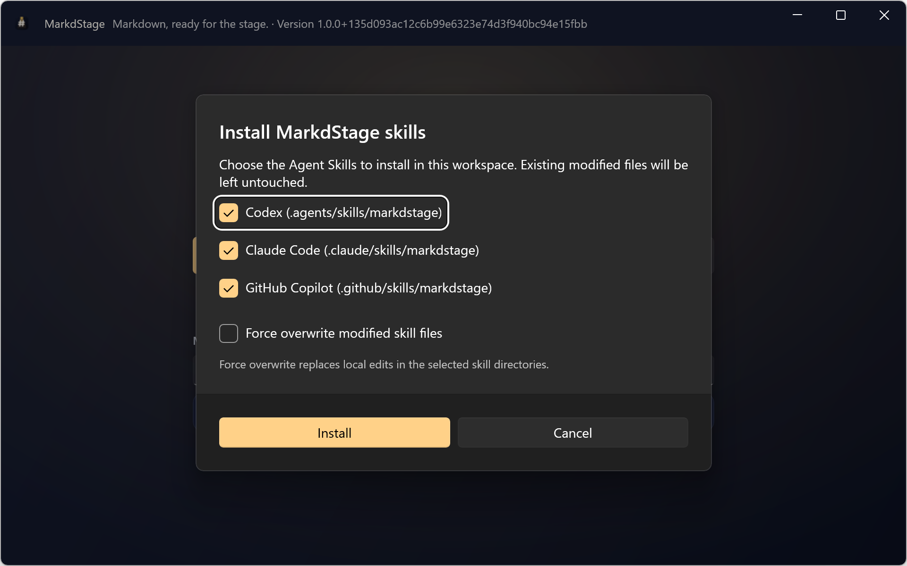
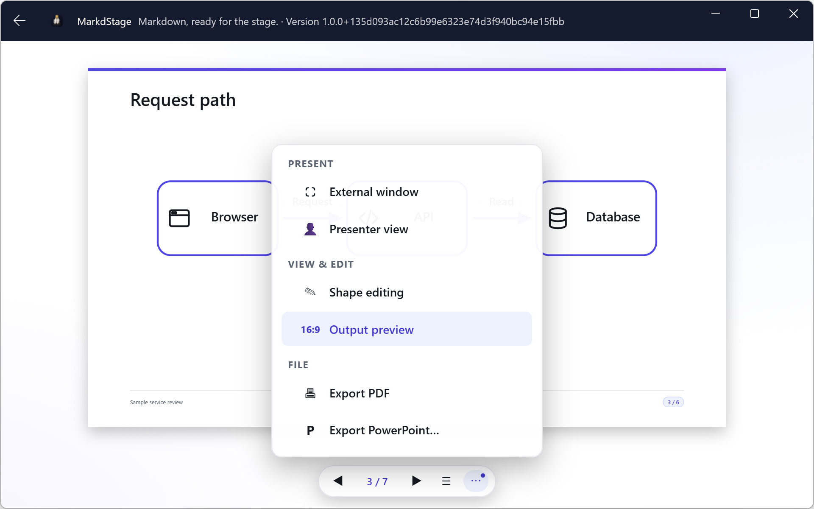
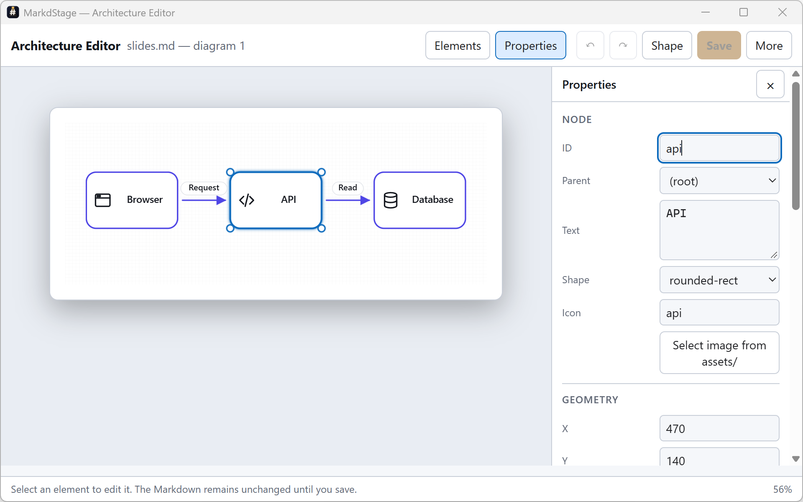
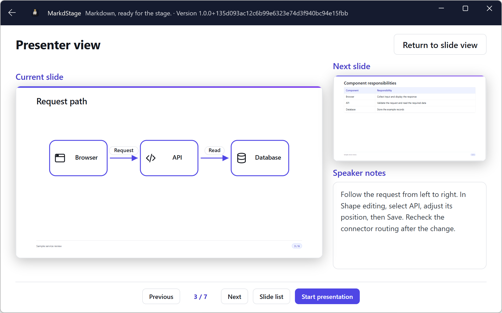

# MarkdStage Desktop

> 日本語版: [日本語](ja/desktop.md)

MarkdStage Desktop is the Windows application for working with Markdown decks. It provides
workspace browsing, Agent Skill installation, the shared slide UI, Architecture diagram editing,
presenter and audience views, and PDF and PowerPoint export.

Write slide text in an external text editor or AI tool. Desktop renders the saved Markdown and
provides visual editing for `architecture` diagrams; it does not include a general-purpose text
editor or an AI chat interface.

## Install and start

Install [MarkdStage from Microsoft Store](https://apps.microsoft.com/detail/9N9DG772RM03),
then start **MarkdStage** from the Start menu. The same installation provides the `markdstage`
CLI; no Node.js or npm installation is needed. See [installation](installation.md) for runtime
requirements, portable ZIPs, and sideloading.

## Open a workspace and a Markdown file

1. Select **Open folder…** and choose your deck folder.
2. Find the `.md` or `.markdown` file in **MARKDOWN FILES**. Use **Filter Markdown files** to
   narrow the list, or **Refresh** after adding files.
3. Select the file to open slide view. **Open Markdown file…** also provides a Windows file picker.



The folder is the workspace for Markdown, assets, themes, generated Skills, and output files.
Use **Back to the file list** at the top left to return to the workspace. The start screen also
lists recent workspaces; the GUI does not choose a workspace from a terminal's current directory.

For a complete exercise using only fictional data, follow the
[Windows walkthrough](windows-walkthrough.md).

## Install Agent Skills in a workspace

After opening a folder, select **Install skills…** on the workspace screen. Choose one or more
targets and select **Install**. All three are selected by default; clear any you do not use.

| Target | Directory created inside the workspace |
| --- | --- |
| Codex | `.agents/skills/markdstage/` |
| Claude Code | `.claude/skills/markdstage/` |
| GitHub Copilot | `.github/skills/markdstage/` |



Desktop writes the same packaged MarkdStage Agent Skills as `markdstage skill install`, without
requiring Node.js. Files that already match are left unchanged. Files with local modifications are
reported as conflicts and are not overwritten by default. Select **Force overwrite modified skill
files** only when you intentionally want to replace those edits.

Open the same workspace in your AI tool so it can discover the Skill. A Skill supplies Markdown
format, theme, diagram, and CLI instructions. It does not install an AI tool, sign in to a service,
or install the Canvas Extension. Direct Markdown editing and presentation do not require a Skill.
See [Agent Skills](cli.md#agent-skills) for equivalent CLI commands.

## Review slides and edit diagrams

Slide view opens with fixed 16:9 **Output preview** enabled. The bottom toolbar contains
previous/next navigation, **Slide list**, and **More controls**.



| Task | Control |
| --- | --- |
| Review fixed output and clipping warnings | **More controls > Output preview** |
| Edit an existing Architecture diagram | **More controls > Shape editing** |
| View the current slide, next slide, and notes | **More controls > Presenter view** |
| Open the native audience window directly | **More controls > External window** |
| Write PDF or PowerPoint | **More controls > Export PDF** or **Export PowerPoint…** |

On a slide with an `architecture` fence, **Shape editing** opens a separate Architecture Editor.
Select a diagram first if the slide has more than one. Change shapes, text, positions, sizes, or
connectors, then select **Save** to write the draft back to the Markdown file. An external source
change causes a stale-save error rather than overwriting the newer file.



The editor requires an existing `architecture` fence, which can initially be empty. It does not
edit Mermaid source, imported Archify diagrams, or general Markdown text.
See [diagrams and media](diagrams-and-media.md) for editing controls and
[themes and layouts](themes-and-layouts.md) for Markdown theme settings.

## Navigate

| Input | Action |
| --- | --- |
| `Left` / `PageUp` | Previous slide |
| `Right` / `PageDown` / `Space` | Next slide |
| `Home` | First slide |
| `End` | Last slide |
| `O` | Open the slide list |
| Left-click or tap an empty margin | Next slide |
| Right-click an empty margin | Previous slide |

Margin navigation applies to the current-slide preview and the audience window. Interactive slide
content is excluded.

Select **Slide list** or press `O` to jump to a page. These shortcuts apply to slide navigation,
not to text fields or an active diagram-editing operation.

## Use speaker notes

Write notes in a top-level HTML comment:

```markdown
## Demonstration

- The audience sees this content.

<!--
Explain the setup, then run the demo.
-->
```

Select **More controls > Presenter view** to see the current slide, next slide, and notes.
Notes are excluded from slide view, the audience window, and PDF. They are included in exported
PowerPoint notes, so review them before sharing that file.



## Present to an audience

Select **Start presentation** in presenter view to open the synchronized native audience window.
You can also use **More controls > External window** from slide view.

- Move the audience window to the target display.
- Press `F11` for fullscreen.
- Press `Esc` to return to windowed mode.
- Close the audience window or select **End presentation** to stop presenting.

Navigation from either window updates both views.

## Export PDF and PowerPoint

1. Return to slide view and check **More controls > Output preview**.
2. Select **Export PDF** or **Export PowerPoint…** in **More controls**.
3. Wait for the success notification, then open the linked output or find it beside the Markdown.
4. Review every exported page, including the automatic back cover.

GUI exports use the source filename: `slides.md` produces `slides.pdf` or `slides.pptx`.
An existing output with that name is replaced. Keep a copy first, or use the CLI's `--output`
option when you need a different name.

Exports require installed Edge, Chrome, or Chromium in addition to WebView2. PowerPoint is hybrid
output: supported text, tables, code, and diagrams remain editable; unsupported representations use
images. PowerPoint edits do not update Markdown. See [presenting and export](presenting-and-export.md)
for Mermaid export choices, notes, and compatibility.

## Use the included CLI

With the Store installation, open a terminal in your workspace:

```console
markdstage --version
markdstage slides.md
markdstage inspect slides.md --json
markdstage present slides.md
markdstage export slides.md --output review.pdf
```

Opening a file through the packaged CLI reuses the corresponding native workspace window.
`present` opens presenter view and the audience window immediately. `inspect` and `export` run
as console commands. The [CLI guide](cli.md) describes npm and portable-package differences.

## Automatic reload

Desktop watches the selected Markdown file. When a valid save is detected, it reloads the deck and
keeps the current slide when possible.

If a save is invalid, Desktop displays an error and keeps the last successfully rendered deck. Fix
and save the file again to recover.

## Surface Pen

While the audience window is open:

| Gesture | Action |
| --- | --- |
| Press the tail button once | Next slide |
| Hold the tail button | Previous slide |

Connecting, removing, or docking the pen does not open MarkdStage or start a presentation.

[Next: Windows walkthrough →](windows-walkthrough.md)
