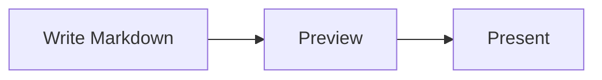

# Diagrams and media

> 日本語版: [日本語](ja/diagrams-and-media.md)

MarkdStage supports Markdown images, Mermaid for automatic layout, and Architecture DSL for stable
placement and routing.

## Use Mermaid for automatic layout

Write a `mermaid` fence:

````markdown

````

Mermaid is bundled and works offline. Use it for flowcharts, sequence diagrams, class diagrams, pie
charts, and other automatically arranged diagrams.

Mermaid diagrams pick up the slide's background, border, text, and accent colors automatically, so
they blend into the deck's theme (including custom themes) instead of using one of Mermaid's own
fixed color schemes.

If Mermaid syntax is invalid, the slide shows an error while preserving the rest of the content.

### Editable Mermaid in PowerPoint

Flowcharts preserve `style`, `classDef`, and `class` colors and text styles. Supported nodes,
subgraphs, connectors, and labels export as editable objects; edge-label backgrounds keep lines
from crossing the text. Stadium, cylinder, and double-circle nodes use multiple editable shapes
when their paint can be reproduced safely.

Basic sequence diagrams export participants, lifelines, messages, notes, and activations.
Self messages (`A->>A`, `A-->>A`) export as editable sampled connectors when the message is a
single unfilled open path. Asynchronous messages (`A-)B`, `B--)A`, including self messages)
use the bundled renderer's filled, notched **stealth** head, not an open arrow. Solid/dashed
strokes and supported start/end heads (including bidirectional self messages) are preserved;
simple Japanese and multiline message labels remain editable. Multiple subpaths, closed or
filled message paths, unknown heads, effects, and unsupported sequence decorations
remain local pictures with their labels retained rather than rasterizing the supported diagram.

Class diagrams export class compartments, unmarked associations, composition (`A *-- B`),
directed associations (`A --> B`), dependencies (`A ..> B`), and multiplicities
(`A "1" -- "many" B`). Composition uses a filled diamond; directed associations and dependencies
use the bundled renderer's filled, notched arrowhead. Markers at either end and dashed dependency
lines are preserved. Simple relationship and multiplicity labels remain editable, including
Japanese and multiline text.

Hollow inheritance/realization triangles (`<|--`, `<|..`) and aggregation diamonds (`o--`) use
editable, unfilled outline strokes, never filled arrow substitutes. Flowchart cross terminals
(`--x`, `x--x`) and sequence cross terminals (`-x`, `--x`, including self messages) use an editable
main connector plus two short strokes per cross. The bundled regular and `-margin` marker variants
retain their start/end placement, endpoint tangent, reference point, units and uniform viewport
scaling; reverse and bidirectional markers keep their original ends. Marker outlines retain their
own solid stroke and color independently of the main line's dash and paint.

The hollow interiors are transparent, so a light background can make them look white; they are
not painted white. Opaque/white or translucent marker paint overrides, nonuniform marker scaling,
viewports clipping the marker geometry, marker effects/transforms and unknown marker geometry
remain local pictures of the affected connector, including its markers. A hollow/cross start
combined with a filled preset end also stays local when the separate primitives cannot retain
SVG marker paint order. Unsupported paint, decorated
labels, complex sequence constructs, effects, and unknown geometry also remain fallback pictures.
Other diagram types, including pie, mindmap, and gitGraph, can still use whole-diagram artwork.
Check the export report for the reason and source path of each fallback.

## Use Architecture DSL for stable placement

Write JSON in an `architecture` fence when element positions, dimensions, containers, or connector
routes must remain stable:

````markdown
```architecture
{
  "version": 1,
  "canvas": { "width": 1200, "height": 500 },
  "elements": [
    {
      "type": "node",
      "id": "client",
      "x": 80,
      "y": 160,
      "width": 260,
      "height": 140,
      "text": "Client",
      "icon": "browser"
    },
    {
      "type": "node",
      "id": "api",
      "x": 700,
      "y": 160,
      "width": 260,
      "height": 140,
      "text": "API",
      "icon": "api"
    },
    {
      "type": "connector",
      "from": "client",
      "to": "api",
      "routing": "orthogonal",
      "label": "HTTPS"
    }
  ]
}
```
````

Nodes support rectangle, rounded rectangle, ellipse, diamond, triangle, hexagon, and parallelogram
shapes. These additive values remain compatible with Architecture DSL v1 and export as native
PowerPoint shapes. Groups support row, column, grid, and layered layouts. Connectors support
straight, orthogonal, and polyline routing.

Connector line patterns use the existing `style.dash` value. Omit it for a solid line, use
`"dash": "1 5"` for a dotted line, or use another numeric pattern such as `"10 6"` for a dashed
line.

## Adjust placement in the Canvas Extension

For a deck created directly in the canvas without a Markdown source association, select
**More controls > Shape editing** to enter the lightweight placement editor. Select an element,
drag it, or use the arrow keys. The editor provides Undo, Redo, and layout release.


Decks created directly in the canvas keep placement changes in canvas state.

Leave edit mode before presenting.

## Use the Advanced Architecture Editor

For Markdown imported with **More controls > Open Markdown**, select
**More controls > Shape editing** to open the dedicated editor directly. If the current slide
contains multiple Architecture blocks, select the diagram from the picker first.


The editor can:

- Add, duplicate, reorder, and delete nodes, groups, images, and connectors
- Change text, shape, icon, position, size, style, ports, routing, and parent group
- Apply or release group layouts
- Select or import assets
- Pan in both directions by dragging blank canvas space
- Collapse Elements and Properties; medium windows keep them as nonmodal docks,
  while narrow windows use nonblocking overlays
- Keep secondary commands in **More** so the canvas remains the primary surface
- Start an empty diagram with **Add first shape**
- Undo and redo draft changes

Changes remain a draft until you select **Save**. If the Markdown changes externally, the editor
does not overwrite it; reload the source and reapply the intended change.

Advanced editing requires a source-backed deck imported through **More controls > Open Markdown**
and an existing `architecture` block. An empty block is valid and can be populated by the editor:

````markdown
```architecture
```
````

## Add images

Standard Markdown images use `/assets/...`:

```markdown

```

Architecture icons and standalone images omit the leading slash:

```json
{
  "type": "image",
  "id": "map",
  "src": "assets/map.svg",
  "fit": "contain",
  "ariaLabel": "Regional system map",
  "x": 80,
  "y": 80,
  "width": 720,
  "height": 420
}
```

Use `contain`, `cover`, or `stretch` for Architecture image fitting. Supported local formats are
SVG, PNG, WebP, JPEG, and JPG.

[Next: Presenting and export →](presenting-and-export.md)
