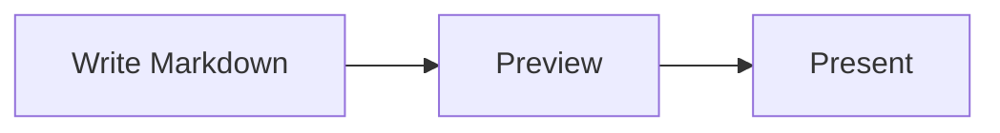
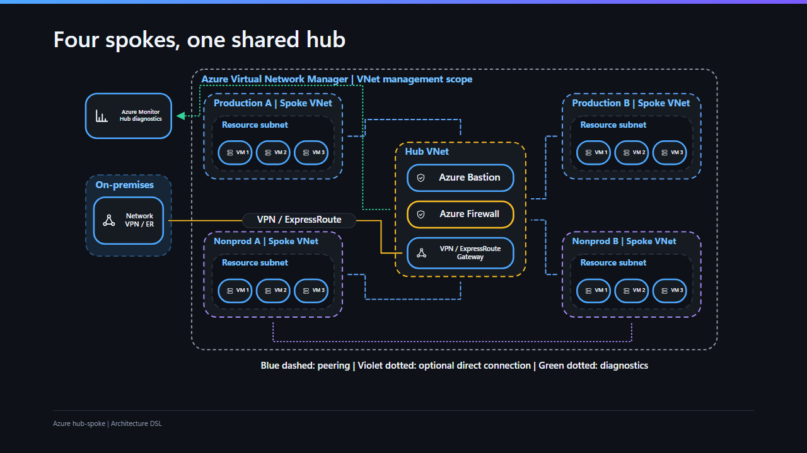
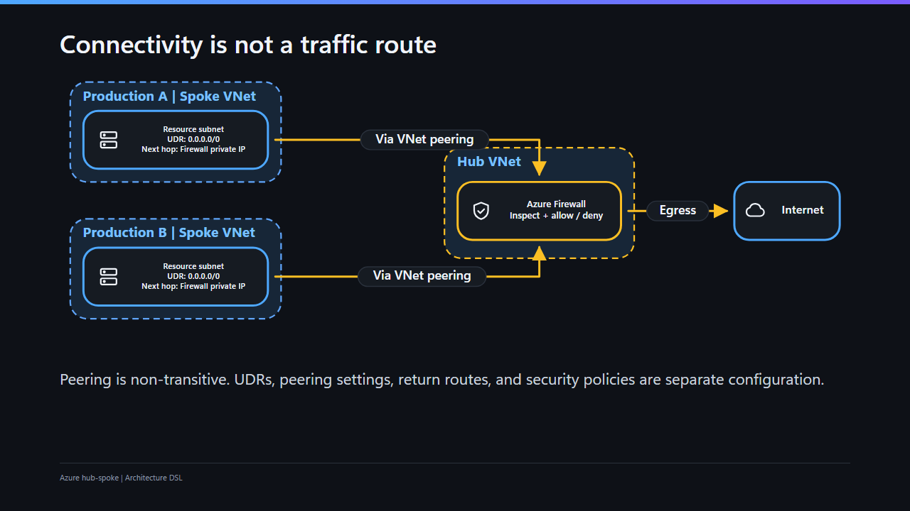

# Diagrams and media

> 日本語版: [日本語](ja/diagrams-and-media.md)

MarkdStage supports Markdown images, Mermaid for automatic layout, and Architecture DSL for stable
placement and routing.

## Use Mermaid for automatic layout

Write a `mermaid` fence:

````markdown

````

Mermaid is bundled and works offline. Use it for flowcharts, sequence diagrams, class diagrams,
state diagrams, requirement diagrams, pie charts, and other automatically arranged diagrams.

Mermaid diagrams pick up the slide's background, border, text, and accent colors automatically, so
they blend into the deck's theme (including custom themes) instead of using one of Mermaid's own
fixed color schemes.

### Mermaid theme coverage

MarkdStage passes the rendered theme palette to the bundled Mermaid 11.15.0 renderer before drawing
the diagram. The same rendered SVG is used by normal view, presenter, fixed preview, PNG, PDF, and
PowerPoint output, so this is not a PowerPoint-only color adjustment.

| Diagram | Theme-controlled roles | Remaining limitation |
| --- | --- | --- |
| C4 | Entity fills and borders use Mermaid's documented `c4` settings. Boundary and relationship strokes, labels, and arrow markers use the theme's line/text roles. Light themes use dark enough entity fills for Mermaid's default white entity text. | Mermaid's bundled C4 renderer hardcodes some boundary, relationship, and marker defaults; MarkdStage repairs only those defaults. If the source contains explicit `UpdateElementStyle` or `UpdateRelStyle`, the fallback is skipped so source-authored colors are not overwritten. |
| `architecture-beta` | `archEdgeColor`, `archEdgeArrowColor`, `archGroupBorderColor`, and `archGroupBorderWidth` follow the theme. | Mermaid service/group icon artwork and its fixed icon-text styling are not all exposed as theme variables. |
| `eventmodeling` | Entity fills/strokes, swimlane backgrounds/strokes, relationship strokes, arrowheads, and attribute backgrounds use Mermaid's documented variables. | Custom themes still need readable `--bg`, `--fg`, and accent values; unsupported decorations and rich labels keep Mermaid's rendered artwork. |

These mappings preserve the distinction between node types instead of flattening every shape to one
color. Explicit colors in Mermaid source take precedence over automatic fallback where Mermaid
exposes them. Theme changes re-render the palette; custom theme values are not modified or
contrast-corrected on the user's behalf.

If Mermaid syntax is invalid, the slide shows an error while preserving the rest of the content.

### Editable Mermaid in PowerPoint

PowerPoint export is hybrid. Supported shapes, text, and connectors stay editable.

Unsupported or unsafe content is preserved as the smallest safe image
fallback.

The whole diagram becomes an image only when native and fallback content
cannot be separated safely.

| Diagram | Approximate editable coverage |
| --- | --- |
| Flowchart | Common nodes, subgraphs, connectors, labels, and safely representable styles |
| Sequence | Basic participants and actors, lifelines, messages, notes, activations, and common control frames |
| Class | Class compartments, common relations and markers, multiplicities, notes, and namespaces |
| State | Basic `stateDiagram-v2` states, start/end pseudo-states, labels, and simple transitions |
| ER | Exact `erDiagram` syntax; entities, attributes, relations, labels, and crow's-foot cardinalities |
| Requirement | `requirementDiagram` blocks, supported relations, labels, and markers |
| Packet / tree view | `packet` fields and bit labels; exact `treeView-beta` hierarchy lines and labels |
| Kanban | Basic columns and cards; plain ticket/assignee fields, priority bars, and simple HTML labels |
| Block | `block` / `block-beta` basic existing shapes, connectors, and simple HTML node/edge labels |
| Quadrant | `quadrantChart` quadrant rectangles, circular data points, borders/axes, titles, and axis/point labels |
| XY chart | `xychart` / `xychart-beta` rectangular bars, straight line-plot segments, ticks, axes, titles, and axis labels; vertical and horizontal orientation |
| Gantt | `gantt` ordinary tasks (done/active/critical included), task/section/title labels, date ticks, row backgrounds, rectangular excluded periods, and known rounded diamond milestones |
| Treemap | `treemap` / `treemap-beta` section/header and leaf rectangles, titles, fitting cell labels and values, with independent fill/stroke alpha |
| Ishikawa | `ishikawa` / `ishikawa-beta` normal-look spine/branch lines, cause-label rectangles, Japanese and measured multiline text, and exact filled spine-facing arrow triangles |
| Mindmap | `mindmap` basic rectangular, rounded, circular, default underlined, and known hexagonal nodes; measured branches and simple HTML labels |
| Timeline | `timeline` known square-bottom/top-rounded cards, underlines, titles, measured SVG text lines, and exact line-end triangles when effects are absent |
| Journey | `journey` task/section rectangles, person/legend circles, face circles/eyes and neutral mouths, visible labels, and exact line-end triangles |
| C4 | Basic boundaries, supported entity boxes, measured labels, and relationship lines; unsupported person artwork and complex entity outlines stay local images |
| Architecture (Mermaid) | `architecture-beta` group frames, simple service boxes, labels, and relationship lines; unsupported service/group icons stay local images |
| Event Modeling | `eventmodeling` basic boxes, relationship lines, and simple HTML labels; unsupported decorations, rich labels, and effects stay local images |
| Other Mermaid diagrams | Render normally in slides and use image fallback where editable conversion is unavailable |

<details>
<summary>Mermaid elements that are not fully editable in PowerPoint</summary>

The list below is intentionally representative rather than exhaustive. These
features still render in the slide, but the affected part may remain an image
in the exported PowerPoint.

| Category | Examples that may stay as image fallback |
| --- | --- |
| Diagram families | Mermaid diagram types outside the editable coverage table, or advanced variants whose SVG structure is not recognized |
| Geometry | Arbitrary closed or curved paths, compound freeform shapes, holes, unknown block outlines, and shapes that exceed scene limits |
| Transforms and clipping | Skew, reflection, nested or non-uniform transforms, arbitrary `clipPath`, masks, and clipping that cannot be separated safely |
| Paint and effects | Gradients, filters, drop shadows, blend modes, group opacity, decorated/stroked text, and effects shared by multiple elements |
| Labels and media | Rich HTML, embedded images/icons, unsupported `foreignObject` content, conditional labels, and text whose source crop must be preserved |
| Chart-like output | Mermaid positions bars, points, and lines as editable shapes where supported; it does not create data-backed PowerPoint charts |
| Special decorations | Cloud/bang nodes, unknown markers, curved satisfaction-face mouths, arbitrary icons, and uncommon milestones or commit decorations |

Fallback is applied to the smallest safe element or subtree whenever possible.
If native and image content cannot be separated without changing the appearance,
the whole diagram may become one image. This is not a promise of full Mermaid
syntax compatibility or general SVG/CSS effect conversion.
</details>

Coverage is intentionally approximate: editability depends on the structures
and effects in the rendered diagram, not only its Mermaid type.

The exporter follows the rendered SVG rather than rebuilding layout from
source, and does not claim that every valid syntax variant is editable.

Kanban labels keep their rendered positions rather than being centered inside
cards; Japanese text, explicit line breaks, and basic bold/italic runs remain
editable. Use `kanban`, not `kanban-beta`: Mermaid 11.15.0 treats the latter's
`-beta` suffix as a column label, not a version alias. Both `block` and
`block-beta` are real aliases. Block rectangles, rounded rectangles, diamonds,
circles, double circles, cylinders, subroutines, and other already-supported
basic polygons reuse the common shape and connector adapters.

These subsets do not promise arbitrary special shapes or complex nesting.
Unknown block outlines retain their own local image while separable labels
and neighboring blocks remain editable. Rich HTML, linked ticket decorations,
embedded images/icons, unsafe effects, and transforms retain the smallest safe
label, shape, or container image. Text clipped by its original HTML viewport
also stays a local label image rather than overflowing the exported card.
No label or decoration is intentionally
discarded, and fallback diagnostics identify its source path and reason.

Quadrant and XY charts use Mermaid's rendered coordinates, including numeric or
categorical ticks, negative ranges, point radii, and each explicit line-plot
vertex. Simple rotated axis labels reuse the common text adapter. These are
editable shapes, lines, and text, **not data-backed PowerPoint charts**; no chart
layout, scale calculation, or source data workbook is recreated.

The chart subset supports plain Japanese text and explicit SVG text line breaks;
it does not interpret HTML line-break markup that Mermaid renders literally.
Filters, shadows, gradients, clipping/masks, decorated or stroked text, unsupported
transforms, and unknown geometry remain local shape, label, or container images.
Closed, curved, disconnected, or over-limit line paths are not approximated as
editable chart lines. Shared group effects preserve the affected subtree as one
image, without consuming separable axes, labels, or neighboring bars/points.
SVG element, scene node, connector point, and depth limits remain in force.

Ishikawa uses the bundled renderer's actual positions, line endpoints, sizes, and
text baselines, including subordinate branches. Its filled start markers become
separate editable triangles at the measured size and angle, with the tip toward
the spine; they are not replaced by approximate PowerPoint arrow presets.
Simple multiline labels use one editable text object per rendered SVG line,
preserving Mermaid's wrapping and line advance rather than recomputing layout.
Safe rectangles and individual fill/stroke alpha reuse the common primitives.

The curved fish-head outline remains **local artwork**, while its safe text
stays editable; therefore an ordinary Ishikawa export is hybrid. `handDrawn`
rough lines, arrowheads, boxes, and fish heads also remain separate local images
with safe labels editable. Their local image bounds include the visible path
strokes, including nearly horizontal rough spines. This is not general
curved/closed-path conversion.
Changed marker geometry, direction, dimensions, units, paint effects, or unsafe
line opacity retain the affected line and its marker together as local artwork.
Text effects, clipping, unsafe transforms, and shared group effects retain the
smallest safe label or subtree, with source paths, reasons, native exclusion
masks, and paint order intact. Existing size, node, element, point, and depth
limits are unchanged; other diagram families are not expanded by this subset.

Gantt uses Mermaid's date positions, durations, task ordering, calendar exclusions,
and SVG dimensions directly. No date arithmetic or calendar layout is reimplemented.
Its known milestone is a centered square with Mermaid's 45° rotation and 0.8 scale.
The exporter preserves its corner radius and scaled stroke as an editable rotated
rounded rectangle, rather than substituting a sharp diamond. Arbitrary rotation,
skew, reflection, noncentered origins, or other CSS transforms are not recognized
as milestones and remain local images. Ordinary tasks never inherit that exception.

Gantt's faded tick groups are separated into editable lines and labels only when
their measured painted extents (including stroke padding) do not overlap and their
effects are safe. Uncertain or overlapping groups, including default top-axis
labels whose text bounds meet their tick lines, retain one local image and their
original group alpha. This is not general group-opacity flattening. Plain Japanese,
explicit SVG line breaks (including multiline section titles), and safe rotated
tick labels share the existing text adapter. Simple multiline Gantt labels use
separately positioned editable text for each rendered SVG line, preserving its
actual advance rather than PowerPoint's default paragraph spacing. Unsupported
multiline structures remain local label images. Filters, gradients, clipping, decorated
text, unusual milestones, and unknown geometry preserve the smallest safe subtree;
source ownership and native exclusion masks retain separable siblings exactly once
in their original paint order. Existing element, node, point, and depth limits apply.

Treemap uses Mermaid's rendered cell positions, sizes, hierarchy, font sizes, and
visible strings; it does not rebuild the layout. Both aliases are supported by
the bundled Mermaid 11.15.0. A leaf's known, untransformed, sibling rectangular
`userSpaceOnUse` clip can be omitted from the **native text object only** when
the measured glyph bounds fit with slack on every edge. The source clip is never
removed. Modified, rounded, transformed, external, ambiguous, or otherwise
unrecognized clips remain local text images, not a general editable clipPath.

Overflowing text stays **only that text's local artwork**, retaining the source
crop rather than leaking outside the cell. Mermaid's own hidden labels, reduced
font sizes, and already-truncated visible strings are not reconstructed or
resurrected. Plain Japanese and simple explicit SVG `tspan` lines are supported;
each multiline text line uses its measured position, not default paragraph
spacing. Rich/uncertain multiline text, stroked/decorated text, text shadows,
and filters remain local images. Cell rectangles and separable sibling labels
stay editable; shared group opacity, clipping, effects, or unsafe transforms
retain the entire affected subtree when splitting it is unsafe. Diagnostics
retain source paths and reasons, native exclusion masks avoid duplicate content,
and existing scene/element/depth limits still apply. This adds no arbitrary
clip/mask geometry, general group compositing, or data-backed PowerPoint chart.

Mindmap, timeline, and journey reuse their rendered positions and dimensions;
they do not rebuild a hierarchy, timeline layout, or satisfaction calculation.
Mindmap's default underlined node retains its rounded background and independent
underline. Its known hexagon uses the rendered quarter-height inset, not a
nearest-width polygon preset. Cloud/bang outlines, rendered icons, rich labels,
and unknown nodes remain local artwork while separable text and branches stay
editable. This does not promise all special nodes or complex mindmap hierarchy.

Timeline cards keep their two quadratic top corners and **square bottom corners**
as a bounded editable shape. SVG-wrapped labels use one text object per measured
line. The bundled renderer applies `brightness(1.2)` to event wrappers: these
default event subtrees remain local images to retain their compositing. If the
source explicitly removes that filter (for example, an init `themeCSS` rule
`.eventWrapper { filter: none; }`), their known cards and text are editable too.
Other filters and shared effects remain local; the exporter never removes them
from the source merely to increase editability.

Journey exports only the visible first `foreignObject` label from its known
SVG `switch`, not the inactive alternative SVG text. Plain, single-line HTML
labels remain editable; wrapped or decorated HTML and conditional/unknown
switch structures retain their own local image. Japanese text is supported.
Timeline/journey preserve literal `<br/>` strings when Mermaid renders them
literally rather than treating them as HTML line breaks. Happy/sad mouth arcs
remain small local images; neutral mouths, eyes, faces, people, task/section
cards, and safe labels stay editable. No satisfaction face or icon is silently
dropped. Timeline/journey's end triangles preserve the measured marker size,
orientation, paint, and offset beyond the line endpoint.

All three subsets keep the existing element, node, point, and nesting limits.
Unsafe transforms, group opacity, changed markers, unknown geometry, and effects
retain diagnostic reasons, source paths, local bounds, paint order, and native
exclusion masks. They do not add general closed curves, arbitrary icons, or
new Architecture DSL shapes; the bounded card/hexagon presets are internal to
the common scene and SVG/PowerPoint backends.

C4, Mermaid architecture, and Event Modeling use the bundled renderer's measured
geometry, not a new layout engine. Safe frames, basic shapes, relationship lines,
and text remain independently editable even when the diagram contains local
artwork. C4 Person images and complex database/queue outlines, unsupported
architecture icons, and unknown decorations retain their original appearance
rather than being replaced by approximate symbols.
Safe two-length stroke dash/gap patterns on known rectangular frames/cards and
straight relations become individually editable line segments with measured
endpoints. This avoids PowerPoint's stroke-width-dependent dash spacing at small
scales. Active sharp miter corners retain their native corner pieces; known
rounded corners use bounded sampling. Unsupported joins/caps, widened rounded
outlines, dash offsets, effects, or excessive segment counts stay local artwork.

Simple Japanese and multiline labels retain their measured positions where safe.
Rich HTML, clipped labels, unknown markers, unsafe transforms, and shared effects
retain the smallest safe label, line, or subtree image. Fallback diagnostics
include the source path and reason; native exclusion masks and paint order keep
the supported and image portions from being duplicated or dropped. Existing
element, node, point, and depth limits still apply. This is a basic hybrid subset,
not full C4 shape/icon coverage or general SVG path conversion.

Mermaid's `architecture-beta` syntax is separate from MarkdStage's JSON
`architecture` fence (Architecture DSL). This addition does not change the
Architecture DSL, its editor, or its supported shape contract.

See the presentation-ready
[Mermaid support example deck](../examples/mermaid-support.md) for representative
syntax and current coverage.

#### Common export rules

- Geometry and placement come from the rendered SVG, including connector routes,
  text bounds, and marker direction.

- Theme colors, supported styles and alpha, and simple Japanese or multiline text
  are preserved when they can be represented safely as native PowerPoint
  objects.

- Effect-free text can retain simple 2D rotation in addition to translation and
  uniform scaling. Gantt milestone shapes recognize only the known centered
  transform described above.

- Semantic markers such as arrowheads, diamonds, inheritance triangles, crosses,
  start/end states, and crow's-foot terminals are retained when their rendered
  form is supported.

- Complex transforms, effects, HTML, embedded icons or images, and unknown
  geometry use a local image fallback when native conversion would change their
  appearance.

- A local fallback does not consume supported sibling nodes, connectors, labels,
  or control frames. Those siblings remain editable whenever ownership can be
  separated safely.

#### Fallback behavior

- Visible Mermaid content is preserved in the exported presentation.

- The smallest safe node, label, connector, marker, decoration, or control frame
  is preferred for image fallback.

- The whole diagram is rasterized only when shared effects, transforms,
  compositing, or ownership make local separation unsafe.

- Mermaid types outside the editable set still render in the slide and typically
  export as a diagram image.

- The export report identifies fallback use with its reason and source path.

## Use Architecture DSL for stable placement

Write JSON in an `architecture` fence when element positions, dimensions, containers, or connector
routes must remain stable:

````markdown
```architecture
{
  "version": 1,
  "canvas": { "width": 1200, "height": 500 },
  "elements": [
    {
      "type": "node",
      "id": "client",
      "x": 80,
      "y": 160,
      "width": 260,
      "height": 140,
      "text": "Client",
      "icon": "browser"
    },
    {
      "type": "node",
      "id": "api",
      "x": 700,
      "y": 160,
      "width": 260,
      "height": 140,
      "text": "API",
      "icon": "api"
    },
    {
      "type": "connector",
      "from": "client",
      "to": "api",
      "routing": "orthogonal",
      "label": "HTTPS"
    }
  ]
}
```
````

Nodes support rectangle, rounded rectangle, ellipse, diamond, triangle, hexagon, and parallelogram
shapes. These additive values remain compatible with Architecture DSL v1 and export as native
PowerPoint shapes. Groups support row, column, grid, and layered layouts. Connectors support
straight, orthogonal, and polyline routing.

Connector line patterns use the existing `style.dash` value. Omit it for a solid line, use
`"dash": "1 5"` for a dotted line, or use another numeric pattern such as `"10 6"` for a dashed
line.

### Example: Azure hub-spoke network

Open the [complete example deck](../../site/examples/azure-hub-spoke.md) in MarkdStage.
Page 2 shows the topology; page 3 separates the outbound traffic path. In Canvas, use
**More controls > Open Markdown** to load the file with a source association before editing it.
The example uses the existing Architecture DSL v1 grammar and built-in icons, with no external
image dependencies.



| Technique | How the example uses it |
| --- | --- |
| Nested `group` elements | The management scope contains VNets; each spoke contains a resource subnet with three VM nodes. |
| Fixed placement | VNet `x`, `y`, `width`, and `height` preserve the overall composition. Child coordinates are relative to the parent group's top-left corner. |
| Local automatic layout | Each resource subnet uses `layout: { "type": "row", "gap": 12, "padding": 16 }`. Its VM children omit coordinates and dimensions. |
| Connection ports and routing | Peering uses `fromPort`, `toPort`, and `orthogonal` routing. Selected connections use `polyline` with explicit `points` to follow chosen corridors. |
| Line styles and direction | `style.stroke` and `style.dash` distinguish connection types. Unarrowed peering links represent bidirectional connectivity; arrows in the traffic view show the outbound direction. |
| Accessible descriptions | Diagram `description` and connector `ariaLabel` explain the scope and connection meaning beyond short visible labels. |

Keep connectivity and packet flow separate:



The traffic view illustrates a subnet UDR for `0.0.0.0/0` with the firewall private IP as the
next hop. Peering is non-transitive: drawing connections does not configure routes, forwarded
traffic, gateway transit, return paths, NSGs, or firewall policies. This is centralized internet
egress, not Azure Firewall forced tunneling to on-premises, and the DSL is not a deployment
template or network simulator.

**Scope and authoring trade-offs.** The topology is an original schematic based on
[Microsoft Learn's hub-spoke architecture](https://learn.microsoft.com/azure/architecture/networking/architecture/hub-spoke),
not a reproduction of its artwork. The outer boundary represents optional Azure Virtual Network
Manager management scope, not another VNet or traffic hop. Hub service subnets, DNS, public IPs,
and detailed routing are omitted. Product symbols use generic built-in icons; official Azure
icons can be supplied through local `icon` assets after checking their usage terms.

Use automatic routing as a starting point, then choose explicit waypoints where a line must
avoid a container or follow a particular corridor. Revisit those waypoints after moving groups;
child positions are group-relative, but the example's root-level connector points use diagram
coordinates. Keep group headings short and leave enough space for node and connector labels:
dense diagrams can shrink text, and connector labels may be omitted when they cannot fit.

For README and other GitHub Markdown pages, publish a rendered image linked to the source,
as above: GitHub does not render `architecture` fences. Keep the Markdown as the source of
truth and regenerate the page 2 and 3 captures after changing the diagrams. See the
[CLI guide](cli.md) for `inspect` and targeted `capture --pages` commands.

## Adjust placement in the Canvas Extension

For a deck created directly in the canvas without a Markdown source association, select
**More controls > Shape editing** to enter the lightweight placement editor. Select an element,
drag it, or use the arrow keys. The editor provides Undo, Redo, and layout release.


Decks created directly in the canvas keep placement changes in canvas state.

Leave edit mode before presenting.

## Use the Advanced Architecture Editor

For Markdown imported with **More controls > Open Markdown**, select
**More controls > Shape editing** to open the dedicated editor directly. If the current slide
contains multiple Architecture blocks, select the diagram from the picker first.


The editor can:

- Add, duplicate, reorder, and delete nodes, groups, images, and connectors
- Change text, shape, icon, position, size, style, ports, routing, and parent group
- Apply or release group layouts
- Select or import assets
- Pan in both directions by dragging blank canvas space
- Collapse Elements and Properties; medium windows keep them as nonmodal docks,
  while narrow windows use nonblocking overlays
- Keep secondary commands in **More** so the canvas remains the primary surface
- Start an empty diagram with **Add first shape**
- Undo and redo draft changes

Changes remain a draft until you select **Save**. If the Markdown changes externally, the editor
does not overwrite it; reload the source and reapply the intended change.

Advanced editing requires a source-backed deck imported through **More controls > Open Markdown**
and an existing `architecture` block. An empty block is valid and can be populated by the editor:

````markdown
```architecture
```
````

## Add images

Standard Markdown images use `/assets/...`:

```markdown

```

Architecture icons and standalone images omit the leading slash:

```json
{
  "type": "image",
  "id": "map",
  "src": "assets/map.svg",
  "fit": "contain",
  "ariaLabel": "Regional system map",
  "x": 80,
  "y": 80,
  "width": 720,
  "height": 420
}
```

Use `contain`, `cover`, or `stretch` for Architecture image fitting. Supported local formats are
SVG, PNG, WebP, JPEG, and JPG.

[Next: Presenting and export →](presenting-and-export.md)
