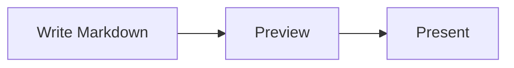

# 図とメディア

> English version: [English](../diagrams-and-media.md)

MarkdStage では、Markdown の画像、自動でレイアウトされる Mermaid、位置や経路を固定できる
Architecture DSL を使えます。

## Mermaid で自動レイアウトする

`mermaid` フェンスに図を書きます。

````markdown

````

Mermaid は同梱しているのでオフラインでも動きます。フローチャート、シーケンス図、クラス図、
円グラフなど、配置を自動で決めてよい図に向いています。

Mermaid の図は背景色、枠線、テキスト、アクセントカラーをスライドのテーマから自動的に取り込むため、
Mermaid 既定の配色ではなく、カスタムテーマを含むデッキのテーマに自然に溶け込みます。

Mermaid の構文に誤りがある場合は、スライドの他の内容はそのままにエラーを表示します。

### PowerPoint で編集できる Mermaid

フローチャートでは `style`、`classDef`、`class` の色や文字スタイルを保持します。
対応するノード、subgraph、コネクター、ラベルは編集可能なオブジェクトになり、
エッジラベルの背景で線が文字を横切るのを防ぎます。stadium、cylinder、二重円は、
塗りを安全に再現できる場合、複数の編集可能な図形で表現します。

基本的な sequence 図では参加者のボックス、Mermaid が出力する下側のミラー表示ボックス、
ライフライン、メッセージ、ノート、activation に対応します。actor の人型は、上側と下側のそれぞれで、
頭の円、胴体・腕・脚の線、ラベルを編集可能なオブジェクトとして出力します。
参加者・actor の単純な日本語ラベルと複数行ラベルも編集できます。
自己メッセージ（`A->>A`、`A-->>A`）は、塗りのない単一の開いたパスの場合、
サンプリングした編集可能なコネクターになります。非同期メッセージ（`A-)B`、`B--)A`、自己宛ても含む）は、
開いた矢印ではなく、同梱 renderer の切り込み付きの塗りつぶし **stealth** 矢印を使います。
実線・破線と対応する始点・終点の矢印（双方向の自己メッセージを含む）を保持し、
日本語・複数行の単純なメッセージラベルも編集できます。複数のサブパス、閉じたパス、
塗り付きのメッセージパス、未知の矢印、エフェクト、未対応の sequence 装飾は、
ラベルを残して局所的な画像にし、対応済みの図全体を画像化しません。

エフェクトのない `rect` 領域は編集可能な背景矩形になります。`autonumber` は数字の文字と、
同梱 renderer の円形背景をそれぞれ編集可能に出力します。`loop`、`alt`、`opt`、`par` は、
入れ子を含めて、枠線、セクション区切り、条件・セクション文字、Mermaid 11.15.0 の既知の五角形タブを
編集可能に出力します。`box` のタイトルも編集可能な文字です。既定の drop-shadow 付き `box` 背景は
狭い範囲の画像として残しますが、タイトル、参加者、ライフライン、制御枠、メッセージは独立した
ネイティブオブジェクトのままです。

class 図ではクラスの区画、マーカーなしの関連、合成（`A *-- B`）、有向関連（`A --> B`）、
依存（`A ..> B`）、多重度（`A "1" -- "many" B`）に対応します。
合成は塗りつぶしの菱形、有向関連と依存は同梱 renderer の切り込み付きの塗りつぶし矢印を使います。
始点・終点のマーカーと依存の破線を保持し、日本語・複数行を含む単純な関係ラベルと多重度も編集できます。

継承・実現の白抜き三角（`<|--`、`<|..`）と集約の白抜き菱形（`o--`）は、
塗りつぶしの矢印に置換せず、編集可能な塗りなしの輪郭線で表現します。
flowchart の × 終端（`--x`、`x--x`）と sequence の × 終端（`-x`、`--x`、自己宛ても含む）は、
編集可能な本線と、× ごとに 2 本の短い線になります。同梱 renderer の通常版・`-margin` 版について、
始点・終点、端点の接線、基準点、単位、マーカーの等方的な viewport 拡大縮小を保持します。
逆向き・双方向のマーカーも元の端点に配置し、輪郭の実線と色は本線の破線や塗りと独立して保持します。

白抜きの内側は透明で、明るい背景では白く見えますが、白で塗りつぶしてはいません。
白などの不透明色や半透明色によるマーカーの塗りの上書き、非等方的な拡大縮小、
マーカー形状を切り取る viewport、マーカーのエフェクト・transform、未知のマーカー形状は、
マーカーを含む関係線単位の局所画像にフォールバックします。
白抜き・× の始点と塗りつぶしプリセットの終点を組み合わせた場合も、
分解した図形で SVG のマーカー描画順を保持できないため局所画像にします。
未対応の塗り、装飾付きラベル、未知の actor 形状や埋め込みアイコン・画像、
未知の sequence 制御構文やタブ形状、装飾された autonumber マーカー、複雑な clip・transform、
エフェクト、未知の形状は、影響する最小の安全な要素または制御枠だけを画像にフォールバックします。
source ownership を分離できる場合、対応済みの兄弟メッセージとラベルはネイティブのままです。
pie、mindmap、gitGraph など、その他の diagram type は図全体の画像になる場合があります。
各フォールバックの理由と source path はエクスポートレポートで確認してください。

## Architecture DSL で配置を固定する

要素の位置、大きさ、コンテナー、コネクターの経路を思いどおりに固定したいときは、
`architecture` フェンスに JSON を書きます。

````markdown
```architecture
{
  "version": 1,
  "canvas": { "width": 1200, "height": 500 },
  "elements": [
    {
      "type": "node",
      "id": "client",
      "x": 80,
      "y": 160,
      "width": 260,
      "height": 140,
      "text": "Client",
      "icon": "browser"
    },
    {
      "type": "node",
      "id": "api",
      "x": 700,
      "y": 160,
      "width": 260,
      "height": 140,
      "text": "API",
      "icon": "api"
    },
    {
      "type": "connector",
      "from": "client",
      "to": "api",
      "routing": "orthogonal",
      "label": "HTTPS"
    }
  ]
}
```
````

ノードには長方形、角丸長方形、楕円、ひし形、三角形、六角形、平行四辺形を使えます。
追加された形状も Architecture DSL v1 のまま下位互換で、PowerPoint ではネイティブ図形として
書き出されます。グループには row、column、grid、layered のレイアウトがあり、コネクターは
straight、orthogonal、polyline の経路を選べます。

コネクターの線種は既存の `style.dash` を使います。実線は `dash` を省略し、点線は
`"dash": "1 5"`、破線は `"10 6"` のような数値パターンを指定します。

## Canvas Extension で配置を調整する

Markdown の元ファイルにひも付かない Canvas で直接作ったデッキでは、
**More controls > Shape editing** を選ぶと、手早く使える配置エディターが開きます。
要素を選び、ドラッグか矢印キーで動かします。エディターには Undo、Redo、レイアウト解除があります。


Canvas で直接作ったデッキでは、変更は Canvas 側に保存されます。

発表を始める前に、編集モードを終了してください。

## Advanced Architecture Editor を使う

**More controls > Open Markdown** で読み込んだ Markdown では、
**More controls > Shape editing** から専用エディターへ直接移動します。現在のスライドに
Architecture ブロックが複数ある場合は、先にピッカーから編集対象を選びます。


エディターでは次の操作ができます。

- ノード、グループ、画像、コネクターの追加、複製、並べ替え、削除
- テキスト、形状、アイコン、位置、サイズ、スタイル、ポート、経路、親グループの変更
- グループレイアウトの適用と解除
- 画像ファイルの選択と読み込み
- キャンバスの余白ドラッグによる上下左右のパン
- Elements / Properties の折りたたみ。中幅では非モーダルドック、狭幅では
  キャンバスを遮断しないオーバーレイとして表示
- 補助コマンドを **More** にまとめ、キャンバスを主役として維持
- 空の図を **Add first shape** から開始
- 編集中の内容の Undo と Redo

変更は **Save** を選ぶまで下書きのままです。Markdown が外部で書き換えられていた場合、
エディターはそれを上書きしません。元のファイルを読み込み直してから、変更をやり直してください。

Advanced editing を使うには、**More controls > Open Markdown** で読み込んだ元ファイルと
ひも付くデッキと、`architecture` ブロックが必要です。次のように中身が空でも構いません。
エディターから要素を足せます。

````markdown
```architecture
```
````

## 画像を追加する

通常の Markdown 画像では `/assets/...` と書きます。

```markdown

```

Architecture のアイコンと単独画像では、先頭のスラッシュを付けません。

```json
{
  "type": "image",
  "id": "map",
  "src": "assets/map.svg",
  "fit": "contain",
  "ariaLabel": "Regional system map",
  "x": 80,
  "y": 80,
  "width": 720,
  "height": 420
}
```

Architecture の画像の収め方は `contain`、`cover`、`stretch` から選べます。
ローカルファイルは SVG、PNG、WebP、JPEG、JPG を扱えます。

[次へ: プレゼンテーションとエクスポート →](presenting-and-export.md)
