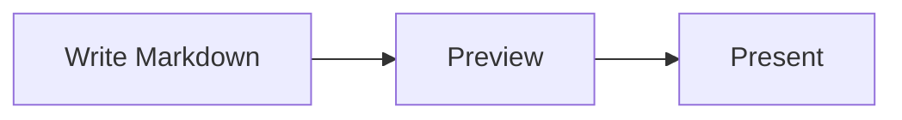

# 図とメディア

> English version: [English](../diagrams-and-media.md)

MarkdStage では、Markdown の画像、自動でレイアウトされる Mermaid、位置や経路を固定できる
Architecture DSL を使えます。

## Mermaid で自動レイアウトする

`mermaid` フェンスに図を書きます。

````markdown

````

Mermaid は同梱しているのでオフラインでも動きます。フローチャート、シーケンス図、クラス図、
状態図、requirement 図、円グラフなど、配置を自動で決めてよい図に向いています。

Mermaid の図は背景色、枠線、テキスト、アクセントカラーをスライドのテーマから自動的に取り込むため、
Mermaid 既定の配色ではなく、カスタムテーマを含むデッキのテーマに自然に溶け込みます。

Mermaid の構文に誤りがある場合は、スライドの他の内容はそのままにエラーを表示します。

### PowerPoint で編集できる Mermaid

PowerPoint 書き出しはハイブリッドです。対応する図形、文字、
コネクターは編集可能なまま保持します。

未対応または安全に変換できない内容は、分離できる最小の安全な範囲を画像として保持します。

ネイティブ要素と画像を安全に分離できない場合だけ、図全体を画像にします。

| 図 | PowerPoint で編集できるおおよその範囲 |
| --- | --- |
| フローチャート | 一般的なノード、subgraph、コネクター、ラベル、安全に表現できるスタイル |
| シーケンス図 | 基本的な participant／actor、lifeline、message、note、activation、一般的な制御枠 |
| クラス図 | class の区画、一般的な関係と marker、多重度、note、namespace |
| 状態図 | 基本的な `stateDiagram-v2` の state、開始・終了 pseudo-state、ラベル、単純な transition |
| ER 図 | 正確な `erDiagram` 構文、entity、属性、relation、ラベル、crow's-foot cardinality |
| requirement 図 | `requirementDiagram` の block、対応する relation、ラベル、marker |
| packet／tree view | `packet` の field と bit label、正確な `treeView-beta` の階層線とラベル |
| その他の Mermaid 図 | スライドでは通常どおり描画し、編集可能変換の対象外は画像として保持 |

<details>
<summary>PowerPoint で完全には編集できない Mermaid 要素</summary>

以下は代表例であり、すべてを網羅するものではありません。スライドには
通常どおり描画されますが、PowerPoint へ書き出すと該当部分が画像として
保持されることがあります。

| カテゴリ | 画像フォールバックになりやすい例 |
| --- | --- |
| 図の種類 | 上の対応表にない Mermaid の図、または SVG の構造を認識できない高度な variant |
| 図形 | 任意の閉じた曲線・曲線 path、複合 freeform、穴を含む図形、未知の block 外形、上限を超える複雑な図形 |
| transform と clipping | skew、反転、入れ子・非等方の transform、任意の `clipPath`、mask、安全に分離できない clipping |
| 塗りとエフェクト | gradient、filter、drop shadow、blend mode、group opacity、装飾付き・輪郭付きテキスト、複数要素で共有するエフェクト |
| ラベルと画像 | 複雑な HTML、埋め込み画像・icon、未対応の `foreignObject`、条件分岐するラベル、元の crop を保つ必要がある文字 |
| チャート風の出力 | 対応範囲では Mermaid の座標を図形・点・線として編集可能にしますが、データ付き PowerPoint chart は作成しません |
| 特殊な装飾 | cloud／bang node、未知の marker、曲線の満足度 face、任意の icon、特殊な milestone や commit 装飾 |

可能な場合は、未対応部分を最小の要素または subtree だけ画像にします。
ネイティブ要素と画像を安全に分離できず、見た目が変わるおそれがある場合は、
図全体が 1 枚の画像になることがあります。Mermaid の全構文や SVG／CSS
エフェクト全般が編集可能になることを保証するものではありません。
</details>

対応範囲は目安です。編集できるかどうかは Mermaid の図の種類だけでなく、
描画された構造やエフェクトにも左右されます。

書き出しではソースから配置を作り直さず、描画済み SVG を使います。
有効な構文のすべてが編集可能になるわけではありません。

代表的な構文と現在の対応範囲は、
プレゼンテーション向けの
[Mermaid 対応例デッキ](../../examples/mermaid-support.md) で確認できます。

#### 共通の書き出しルール

- 図形の形状と配置には描画済み SVG を使います。コネクターの経路、
  文字の境界、marker の向きも SVG に従います。

- テーマ色、対応するスタイルとアルファ、日本語や複数行の単純な
  テキストは、安全に表現できる場合、PowerPoint のネイティブ
  オブジェクトとして保持します。

- エフェクトのない文字と図形では、平行移動と等方拡大縮小に加えて、
  単純な 2D 回転も保持できます。

- 矢印、菱形、継承三角、×、開始・終了 state、crow's-foot terminal
  などの意味を持つ marker は、描画された形を安全に変換できる場合に
  保持します。

- 複雑な transform、エフェクト、HTML、埋め込み icon／image、
  未知の形状は、ネイティブ変換で表示が変わる場合に局所画像へ
  フォールバックします。

- 局所画像と安全に分離できる兄弟の node、connector、label、制御枠は、
  編集可能なまま保持します。

#### 画像フォールバック

- 表示されている Mermaid の内容は、書き出したプレゼンテーションにも
  保持されます。

- node、label、connector、marker、装飾、制御枠のうち、
  分離できる最小の安全な範囲を画像にする方法を優先します。

- 共通のエフェクト、transform、合成、所有関係により安全に
  分離できない場合だけ、図全体を画像にします。

- 編集可能変換の対象外の Mermaid 図もスライドには表示され、
  通常は図全体の画像として書き出されます。

- 書き出しレポートには、フォールバックの理由とソースパスが
  記録されます。

## Architecture DSL で配置を固定する

要素の位置、大きさ、コンテナー、コネクターの経路を思いどおりに固定したいときは、
`architecture` フェンスに JSON を書きます。

````markdown
```architecture
{
  "version": 1,
  "canvas": { "width": 1200, "height": 500 },
  "elements": [
    {
      "type": "node",
      "id": "client",
      "x": 80,
      "y": 160,
      "width": 260,
      "height": 140,
      "text": "Client",
      "icon": "browser"
    },
    {
      "type": "node",
      "id": "api",
      "x": 700,
      "y": 160,
      "width": 260,
      "height": 140,
      "text": "API",
      "icon": "api"
    },
    {
      "type": "connector",
      "from": "client",
      "to": "api",
      "routing": "orthogonal",
      "label": "HTTPS"
    }
  ]
}
```
````

ノードには長方形、角丸長方形、楕円、ひし形、三角形、六角形、平行四辺形を使えます。
追加された形状も Architecture DSL v1 のまま下位互換で、PowerPoint ではネイティブ図形として
書き出されます。グループには row、column、grid、layered のレイアウトがあり、コネクターは
straight、orthogonal、polyline の経路を選べます。

コネクターの線種は既存の `style.dash` を使います。実線は `dash` を省略し、点線は
`"dash": "1 5"`、破線は `"10 6"` のような数値パターンを指定します。

<a id="azure-hub-spoke-example"></a>

### 実例: Azure ハブスポークネットワーク

[サンプルデッキ全体](../../../site/examples/azure-hub-spoke.md)を MarkdStage で開いてください。
2 ページ目が全体構成図、3 ページ目が送信方向の通信経路図です。Canvas で編集する場合は、
**More controls > Open Markdown** からファイルを読み込み、ソースとひも付けてください。
既存の Architecture DSL v1 と組み込みアイコンだけで描画でき、外部画像素材は不要です。


| 表現方法 | サンプルでの使い方 |
| --- | --- |
| `group` の入れ子 | 管理範囲に VNet を置き、各スポークのリソースサブネットに 3 つの VM ノードを配置します。 |
| 固定配置 | VNet の `x`、`y`、`width`、`height` で全体の構図を保ちます。子要素の座標は親グループの左上を基準にします。 |
| 部分的な自動配置 | リソースサブネットに `layout: { "type": "row", "gap": 12, "padding": 16 }` を指定し、子の VM は座標とサイズを省略します。 |
| 接続ポートと経路 | ピアリングには `fromPort`、`toPort` と `orthogonal` を使います。一部の接続には `polyline` と明示的な `points` を指定し、通す場所を決めます。 |
| 線種と方向 | `style.stroke` と `style.dash` で接続の種類を区別します。矢印のないピアリング線は双方向の接続を、通信経路図の矢印は送信方向を表します。 |
| アクセシブルな説明 | 図の `description` と接続線の `ariaLabel` で、短い表示ラベルでは伝えきれない範囲や意味を補います。 |

接続関係とパケットの流れは分けて表現します。


通信経路図では、サブネットの `0.0.0.0/0` の UDR で Firewall のプライベート IP を
ネクストホップに指定する構成を示しています。ピアリングには推移性がないため、線を描くだけで
ルート、転送トラフィック、ゲートウェイ転送、戻り経路、NSG、Firewall ポリシーが設定されるわけでは
ありません。これはインターネット送信の集約であり、Azure Firewall からオンプレミスへの
強制トンネリングとは別の構成です。DSL はデプロイ用テンプレートやネットワークシミュレーターではありません。

**図の範囲と作図上の注意点。** この図は
[Microsoft Learn のハブスポーク構成](https://learn.microsoft.com/ja-jp/azure/architecture/networking/architecture/hub-spoke)
の概念を独自に図示したもので、元の画像の複製ではありません。外枠は任意で使用する Azure Virtual
Network Manager の管理範囲を表し、別の VNet や通信の中継点ではありません。ハブ内のサービス用
サブネット、DNS、パブリック IP、詳細なルーティングは省略しています。サービスの記号には汎用の
組み込みアイコンを使用しています。Azure 公式アイコンを使う場合は、利用条件を確認したうえで
ローカルの `icon` 素材として指定できます。

自動配線を出発点にし、コンテナーを避けたい箇所や通す場所を固定したい箇所には経由点を指定します。
グループを移動した後は、その経由点も見直してください。子要素の位置は親グループ基準ですが、
この例のルート階層にあるコネクターの経由点は図全体の座標です。グループ見出しは短く保ち、
ノードや接続線のラベルに十分な余白を確保してください。密な図では文字が縮小され、
収まらない接続線のラベルが省略されることがあります。

GitHub は `architecture` フェンスを図として描画しないため、README などには、このページのように
描画済み画像とソースへのリンクを掲載します。Markdown を正本とし、図を変更したら 2、3 ページ目の
キャプチャーを再生成してください。`inspect` とページを絞った `capture --pages` の使い方は
[CLI ガイド](cli.md)を参照してください。

## Canvas Extension で配置を調整する

Markdown の元ファイルにひも付かない Canvas で直接作ったデッキでは、
**More controls > Shape editing** を選ぶと、手早く使える配置エディターが開きます。
要素を選び、ドラッグか矢印キーで動かします。エディターには Undo、Redo、レイアウト解除があります。


Canvas で直接作ったデッキでは、変更は Canvas 側に保存されます。

発表を始める前に、編集モードを終了してください。

## Advanced Architecture Editor を使う

**More controls > Open Markdown** で読み込んだ Markdown では、
**More controls > Shape editing** から専用エディターへ直接移動します。現在のスライドに
Architecture ブロックが複数ある場合は、先にピッカーから編集対象を選びます。


エディターでは次の操作ができます。

- ノード、グループ、画像、コネクターの追加、複製、並べ替え、削除
- テキスト、形状、アイコン、位置、サイズ、スタイル、ポート、経路、親グループの変更
- グループレイアウトの適用と解除
- 画像ファイルの選択と読み込み
- キャンバスの余白ドラッグによる上下左右のパン
- Elements / Properties の折りたたみ。中幅では非モーダルドック、狭幅では
  キャンバスを遮断しないオーバーレイとして表示
- 補助コマンドを **More** にまとめ、キャンバスを主役として維持
- 空の図を **Add first shape** から開始
- 編集中の内容の Undo と Redo

変更は **Save** を選ぶまで下書きのままです。Markdown が外部で書き換えられていた場合、
エディターはそれを上書きしません。元のファイルを読み込み直してから、変更をやり直してください。

Advanced editing を使うには、**More controls > Open Markdown** で読み込んだ元ファイルと
ひも付くデッキと、`architecture` ブロックが必要です。次のように中身が空でも構いません。
エディターから要素を足せます。

````markdown
```architecture
```
````

## 画像を追加する

通常の Markdown 画像では `/assets/...` と書きます。

```markdown

```

Architecture のアイコンと単独画像では、先頭のスラッシュを付けません。

```json
{
  "type": "image",
  "id": "map",
  "src": "assets/map.svg",
  "fit": "contain",
  "ariaLabel": "Regional system map",
  "x": 80,
  "y": 80,
  "width": 720,
  "height": 420
}
```

Architecture の画像の収め方は `contain`、`cover`、`stretch` から選べます。
ローカルファイルは SVG、PNG、WebP、JPEG、JPG を扱えます。

[次へ: プレゼンテーションとエクスポート →](presenting-and-export.md)
