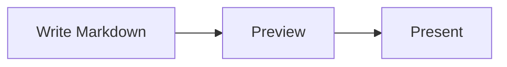

# 図とメディア

> English version: [English](../diagrams-and-media.md)

MarkdStage では、Markdown の画像、自動でレイアウトされる Mermaid、位置や経路を固定できる
Architecture DSL を使えます。

## Mermaid で自動レイアウトする

`mermaid` フェンスに図を書きます。

````markdown

````

Mermaid は同梱しているのでオフラインでも動きます。フローチャート、シーケンス図、クラス図、
状態図、requirement 図、円グラフなど、配置を自動で決めてよい図に向いています。

Mermaid の図は背景色、枠線、テキスト、アクセントカラーをスライドのテーマから自動的に取り込むため、
Mermaid 既定の配色ではなく、カスタムテーマを含むデッキのテーマに自然に溶け込みます。

Mermaid の構文に誤りがある場合は、スライドの他の内容はそのままにエラーを表示します。

### PowerPoint で編集できる Mermaid

PowerPoint 書き出しはハイブリッドです。対応する図形、文字、
コネクターは編集可能なまま保持します。

未対応または安全に変換できない内容は、分離できる最小の安全な範囲を画像として保持します。

ネイティブ要素と画像を安全に分離できない場合だけ、図全体を画像にします。

| 図 | PowerPoint で編集できるおおよその範囲 |
| --- | --- |
| フローチャート | 一般的なノード、subgraph、コネクター、ラベル、安全に表現できるスタイル |
| シーケンス図 | 基本的な participant／actor、lifeline、message、note、activation、一般的な制御枠 |
| クラス図 | class の区画、一般的な関係と marker、多重度、note、namespace |
| 状態図 | 基本的な `stateDiagram-v2` の state、開始・終了 pseudo-state、ラベル、単純な transition |
| ER 図 | 正確な `erDiagram` 構文、entity、属性、relation、ラベル、crow's-foot cardinality |
| requirement 図 | `requirementDiagram` の block、対応する relation、ラベル、marker |
| packet／tree view | `packet` の field と bit label、正確な `treeView-beta` の階層線とラベル |
| C4 | 基本的な Context／Container／Component／Dynamic／Deployment の矩形、境界枠、SVG ラベル、既知の矢印付き関係線 |
| Mermaid architecture | `architecture-beta` のグループ枠、既定の上側角丸サービス箱、ラベル、関係線、既知の方向別三角矢印 |
| Event Modeling | `eventmodeling` の swimlane、矩形の箱、関係線、単純な構造化 HTML ラベル |
| その他の Mermaid 図 | スライドでは通常どおり描画し、編集可能変換の対象外は画像として保持 |

対応範囲は目安です。編集できるかどうかは Mermaid の図の種類だけでなく、
描画された構造やエフェクトにも左右されます。

書き出しではソースから配置を作り直さず、描画済み SVG を使います。
有効な構文のすべてが編集可能になるわけではありません。

C4 の Person PNG、DB／Queue の複雑な輪郭、architecture の入れ子 SVG アイコンは
局所画像として保持し、分離できる文字・枠・関係線は編集可能にします。
同梱 Mermaid 11.15.0 では **`architecture-beta`** の接尾辞が必須です。
MarkdStage 独自の `architecture` フェンス（Architecture DSL）とは別形式です。
Event Modeling は接尾辞なしの小文字 **`eventmodeling`** を使います。
architecture のラベルや Event Modeling の識別子には Mermaid 自体の構文制約があり、
日本語は C4 ラベルや Event Modeling のインラインデータなどで利用できます。

単純な HTML ラベルは描画位置と対応する太字・斜体を保持します。
複雑な HTML、クリッピング、装飾文字、画像、未知の形状・矢印、共有 opacity、
未対応の変換・効果は最小の安全な要素／部分木の画像に残します。
診断の理由・source path、元の描画順、ネイティブ要素の画像除外マスクを維持し、
二重描画や欠落を防ぎます。既存の上限・guard は変更しません。
配置やデータ計算の再実装、任意のアイコン・closed path の全面対応は対象外です。

代表的な構文と現在の対応範囲は、
プレゼンテーション向けの
[Mermaid 対応例デッキ](../../examples/mermaid-support.md) で確認できます。

#### 共通の書き出しルール

- 図形の形状と配置には描画済み SVG を使います。コネクターの経路、
  文字の境界、marker の向きも SVG に従います。

- テーマ色、対応するスタイルとアルファ、日本語や複数行の単純な
  テキストは、安全に表現できる場合、PowerPoint のネイティブ
  オブジェクトとして保持します。

- エフェクトのない文字と図形では、平行移動と等方拡大縮小に加えて、
  単純な 2D 回転も保持できます。

- 矢印、菱形、継承三角、×、開始・終了 state、crow's-foot terminal
  などの意味を持つ marker は、描画された形を安全に変換できる場合に
  保持します。

- 複雑な transform、エフェクト、HTML、埋め込み icon／image、
  未知の形状は、ネイティブ変換で表示が変わる場合に局所画像へ
  フォールバックします。

- 局所画像と安全に分離できる兄弟の node、connector、label、制御枠は、
  編集可能なまま保持します。

#### 画像フォールバック

- 表示されている Mermaid の内容は、書き出したプレゼンテーションにも
  保持されます。

- node、label、connector、marker、装飾、制御枠のうち、
  分離できる最小の安全な範囲を画像にする方法を優先します。

- 共通のエフェクト、transform、合成、所有関係により安全に
  分離できない場合だけ、図全体を画像にします。

- 編集可能変換の対象外の Mermaid 図もスライドには表示され、
  通常は図全体の画像として書き出されます。

- 書き出しレポートには、フォールバックの理由とソースパスが
  記録されます。

## Architecture DSL で配置を固定する

要素の位置、大きさ、コンテナー、コネクターの経路を思いどおりに固定したいときは、
`architecture` フェンスに JSON を書きます。

````markdown
```architecture
{
  "version": 1,
  "canvas": { "width": 1200, "height": 500 },
  "elements": [
    {
      "type": "node",
      "id": "client",
      "x": 80,
      "y": 160,
      "width": 260,
      "height": 140,
      "text": "Client",
      "icon": "browser"
    },
    {
      "type": "node",
      "id": "api",
      "x": 700,
      "y": 160,
      "width": 260,
      "height": 140,
      "text": "API",
      "icon": "api"
    },
    {
      "type": "connector",
      "from": "client",
      "to": "api",
      "routing": "orthogonal",
      "label": "HTTPS"
    }
  ]
}
```
````

ノードには長方形、角丸長方形、楕円、ひし形、三角形、六角形、平行四辺形を使えます。
追加された形状も Architecture DSL v1 のまま下位互換で、PowerPoint ではネイティブ図形として
書き出されます。グループには row、column、grid、layered のレイアウトがあり、コネクターは
straight、orthogonal、polyline の経路を選べます。

コネクターの線種は既存の `style.dash` を使います。実線は `dash` を省略し、点線は
`"dash": "1 5"`、破線は `"10 6"` のような数値パターンを指定します。

## Canvas Extension で配置を調整する

Markdown の元ファイルにひも付かない Canvas で直接作ったデッキでは、
**More controls > Shape editing** を選ぶと、手早く使える配置エディターが開きます。
要素を選び、ドラッグか矢印キーで動かします。エディターには Undo、Redo、レイアウト解除があります。


Canvas で直接作ったデッキでは、変更は Canvas 側に保存されます。

発表を始める前に、編集モードを終了してください。

## Advanced Architecture Editor を使う

**More controls > Open Markdown** で読み込んだ Markdown では、
**More controls > Shape editing** から専用エディターへ直接移動します。現在のスライドに
Architecture ブロックが複数ある場合は、先にピッカーから編集対象を選びます。


エディターでは次の操作ができます。

- ノード、グループ、画像、コネクターの追加、複製、並べ替え、削除
- テキスト、形状、アイコン、位置、サイズ、スタイル、ポート、経路、親グループの変更
- グループレイアウトの適用と解除
- 画像ファイルの選択と読み込み
- キャンバスの余白ドラッグによる上下左右のパン
- Elements / Properties の折りたたみ。中幅では非モーダルドック、狭幅では
  キャンバスを遮断しないオーバーレイとして表示
- 補助コマンドを **More** にまとめ、キャンバスを主役として維持
- 空の図を **Add first shape** から開始
- 編集中の内容の Undo と Redo

変更は **Save** を選ぶまで下書きのままです。Markdown が外部で書き換えられていた場合、
エディターはそれを上書きしません。元のファイルを読み込み直してから、変更をやり直してください。

Advanced editing を使うには、**More controls > Open Markdown** で読み込んだ元ファイルと
ひも付くデッキと、`architecture` ブロックが必要です。次のように中身が空でも構いません。
エディターから要素を足せます。

````markdown
```architecture
```
````

## 画像を追加する

通常の Markdown 画像では `/assets/...` と書きます。

```markdown

```

Architecture のアイコンと単独画像では、先頭のスラッシュを付けません。

```json
{
  "type": "image",
  "id": "map",
  "src": "assets/map.svg",
  "fit": "contain",
  "ariaLabel": "Regional system map",
  "x": 80,
  "y": 80,
  "width": 720,
  "height": 420
}
```

Architecture の画像の収め方は `contain`、`cover`、`stretch` から選べます。
ローカルファイルは SVG、PNG、WebP、JPEG、JPG を扱えます。

[次へ: プレゼンテーションとエクスポート →](presenting-and-export.md)
