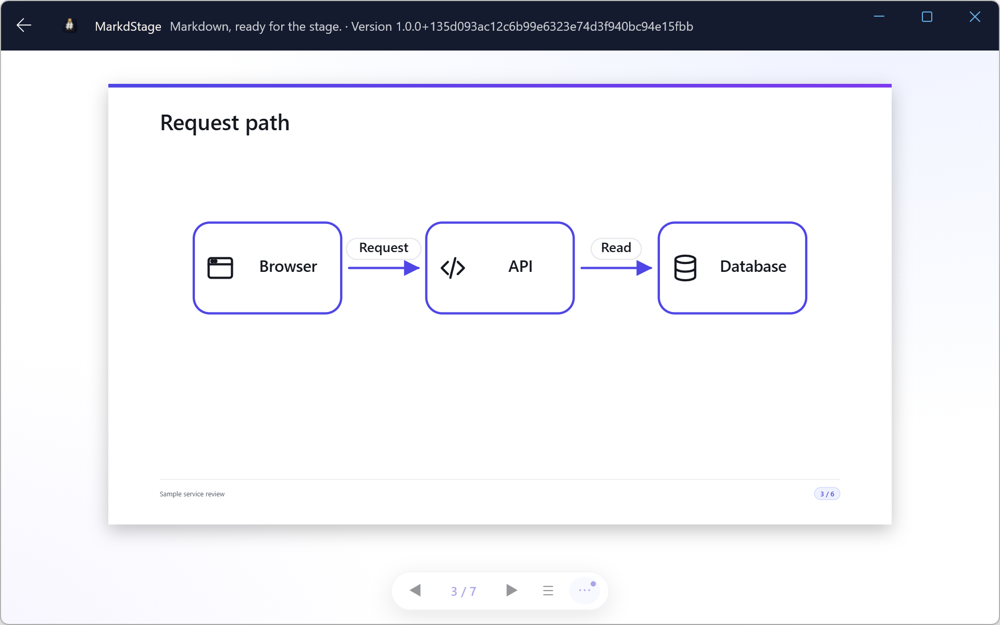

# Quick start

> 日本語版: [日本語](ja/quick-start.md)

This walkthrough uses the included [`examples/quick-start.md`](examples/quick-start.md) deck. Copy
it to your own workspace as `slides.md`. The commands below assume that filename.

## 1. Create a Markdown deck

A minimal deck contains front matter, a title, and `---` slide separators:

```markdown
---
title: My first deck
theme: dark
layout: title
---

# My first deck

A sample Markdown presentation.

---

## Next slide

- Write standard Markdown
- Keep one main idea per slide
```

Save the file with a `.md` or `.markdown` extension.

At the top level, a line containing only `---` after a blank line separates
slides. Do not use custom markers such as `<!-- slide -->`. If a slide ends with
a top-level HTML comment, leave a blank line between the closing comment and the
next `---` separator.

## 2. Open it in Windows Desktop

1. Install [MarkdStage from Microsoft Store](https://apps.microsoft.com/detail/9N9DG772RM03).
   This installs both the GUI and CLI; Node.js is not needed.
2. Start **MarkdStage**, select **Open folder…**, and choose your workspace.
3. Select `slides.md` from the file list.



The screenshot uses the [Windows walkthrough sample](windows-walkthrough.md) to illustrate the UI;
the minimal deck above has different content.

The app opens slide view. Use **More controls** for editing, output preview, presentation, and
export. If presenter view is retained from an earlier session, select **Return to slide view**.

### Canvas alternative

Use either method:

- Ask GitHub Copilot: `Open slides.md in MarkdStage Canvas.`
- Open the MarkdStage canvas, select **More controls > Open Markdown**, and choose the file.

The complete deck opens immediately. Use **◀**, **▶**, the arrow keys, or **☰** to navigate.

### CLI alternative

With the Store installation, `markdstage slides.md` opens the same native application.
For the browser-based npm distribution, use:

```console
npx @markdstage/markdstage slides.md
```

See [installation](installation.md) for npm prerequisites. In the npm UI, select
**More controls > Open Markdown** to choose another file.

## 3. Edit and review

Edit text in your text editor and save; the preview refreshes automatically. On an Architecture
slide, use **More controls > Shape editing** and **Save** to update the diagram in Markdown.
Keep **Output preview** enabled to check the fixed 16:9 result.

AI is optional. To use it with Desktop, return to the workspace list, select **Install skills…**,
choose your AI tool, and open the same folder in that tool. The
[Windows walkthrough](windows-walkthrough.md) includes example requests and a sample diagram.

## 4. Present

- **Canvas Extension:** Select **More controls > External window** for an external audience window,
  or **More controls > Presenter view** to keep the current slide, next slide, and notes together.
- **CLI:** Use the same controls, or start directly in presenter view with
  `markdstage present slides.md`.
- **Desktop:** Select **More controls > Presenter view**, then **Start presentation**.
  The Store CLI's `markdstage present slides.md` opens both views directly.
- Press `F11` in the audience window for fullscreen and `Esc` to leave fullscreen.

## 5. Export a PDF or PowerPoint

These controls are available in Desktop, Canvas, and the npm CLI UI:

1. Ensure **More controls > Output preview** is enabled and correct any clipping warning.
   It starts enabled; click it only if you need to enable it again.
2. Select **More controls > Export PDF**, or **More controls > Export PowerPoint** for a hybrid
   deck whose text, tables, code, and Architecture DSL stay editable in PowerPoint.
3. Review the generated file beside the Markdown. GUI export replaces an existing output with
   the derived filename; copy previous output first if needed.

Or export the same output from the CLI, without installing the Canvas Extension:

```console
markdstage export slides.md --output slides.pdf
markdstage export slides.md --output slides.pptx
```

Exports require installed Edge, Chrome, or Chromium. For the npm distribution without a global
install, replace `markdstage` with `npx @markdstage/markdstage`.

## Next steps

- [Follow the Windows walkthrough](windows-walkthrough.md)
- [Complete the GitHub Copilot hands-on](copilot-hands-on.md)
- [AI-assisted authoring](ai-assisted-authoring.md)
- [Use the Canvas Extension](canvas-extension.md)
- [Use MarkdStage Desktop](desktop.md)
- [Author Markdown slides](markdown-authoring.md)
