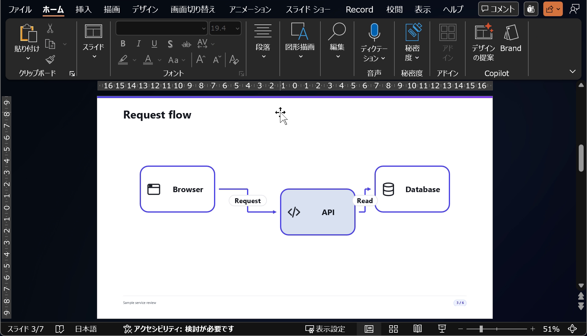

# Windows walkthrough: workspace to exported slides

> 日本語版: [日本語](ja/windows-walkthrough.md)

This exercise covers workspace selection, optional Agent Skills, diagram editing, layout review,
presenter view, and export. Follow a Browser → API → Database service review from source creation
through presentation and output.

## Sample and recording

Download the [sample Markdown](../../site/examples/windows-workflow.md) and save it as `slides.md`
in a new folder, such as `C:\decks\sample-review`. The file has six authored slides, an Architecture
diagram on slide 3, and speaker notes. MarkdStage adds a seventh page as the back cover.
No external assets or account access are required.

[Watch or download the 3-minute 4-second Windows tutorial (MP4)](images/windows-workflow.mp4).
The video starts with a text request to an AI agent and a Markdown output example, then shows
file opening, diagram dragging and Save, presenter and audience windows, GUI PDF/PPTX export,
PDF review, and text and shape editing in PowerPoint. It is silent, with selectable English and Japanese
captions on the [website](https://runceel.github.io/MarkdStage/en/#windows-workflow).

The MarkdStage UI shown is from the **v4.2.5 Windows portable release**.
MarkdStage controls and the sample are in English; the PowerPoint interface is Japanese.
The Store instructions below use the same application's
workspace UI and the Store-installed CLI alias; a portable ZIP does not register that alias.

## 1. Install and open the workspace

1. Install [MarkdStage from Microsoft Store](https://apps.microsoft.com/detail/9N9DG772RM03).
   This provides the GUI and `markdstage` CLI without Node.js or npm.
2. Start **MarkdStage**, select **Open folder…**, and choose your sample folder.
3. Confirm that `slides.md` appears in **MARKDOWN FILES**.


The native UI needs WebView2. Inspection, capture, and export also need installed Edge, Chrome,
or Chromium. See [installation](installation.md) for prerequisites and alternatives.

## 2. Install a Skill if you will use AI

Select **Install skills…**, keep the targets you use, and select **Install**. Codex uses
`.agents/skills/markdstage/`, Claude Code uses `.claude/skills/markdstage/`, and GitHub Copilot
uses `.github/skills/markdstage/`, all inside the selected workspace.


Leave **Force overwrite modified skill files** off unless you intend to replace your local edits.
Open the same folder in the external AI tool. The Skill supplies instructions; it does not
install or sign in to the AI tool, and Desktop has no AI chat interface.

If you use the supplied Markdown unchanged, skip this step and the AI requests below.

## 3. Create or revise the source

You can use the downloaded sample, write Markdown in a text editor, or send a request like this
to your AI tool. **Example request to an AI agent:**

```text
Use the markdstage Skill to create slides.md.

Make six slides reviewing a Browser -> API -> Database service. Use the light theme.
Include a title, objective, Architecture diagram, component responsibilities,
review checklist, and presentation/export checklist.

Add speaker notes. Validate the source and inspect its fixed 16:9 layout.
Fix any errors or clipping.
```

Check that the completion summary identifies the saved file, structure-validation result, layout
result, and unresolved issues. Open the source yourself to check facts and notes.
An AI tool's output is not expected to match the bundled sample byte for byte.

For a focused revision:

```text
Keep the theme, diagram, and slide order unchanged. Shorten the explanation on slide 2.
Save slides.md and recheck the changed slide for fixed 16:9 clipping.
```

In **GitHub Copilot App with the Canvas Extension installed**, the corresponding review request is:

```text
Open slides.md as a file-backed MarkdStage Canvas deck. Use inspect_layout to check clipping,
fix any reported overflow in the Markdown, and show the fixed 16:9 Output preview.
Keep the source association so Shape editing can save changes to the same file.
```

Desktop and Canvas are separate views of the file. An external AI tool does not receive Desktop's
selected slide automatically. See [AI-assisted authoring](ai-assisted-authoring.md) for both paths.

## 4. Edit the Architecture diagram

1. Select `slides.md` in Desktop. If necessary, select **Return to slide view**.
2. Open **Slide list** and choose **3 Request path**.
3. Select **More controls > Shape editing**.
4. Select the **API** node on the drawing surface, or **api — API** in **Elements**.
5. Drag it to adjust its position. The recording moves it from `X=470, Y=140` to `X=550, Y=220`.
   For exact coordinates, open **Properties > Geometry** and enter **X** and **Y**.
6. Select **Save**, close the editor, and confirm the diagram updated in the slide.


Changes are a draft until **Save**. If the source changed in your text editor or AI tool meanwhile,
reload it rather than overwriting the newer version. The diagram must already have an
`architecture` fence; the editor does not edit general Markdown text or Mermaid source.

## 5. Check the output layout

Use **More controls > Output preview** to review the fixed 1280×720 layout. It is enabled by
default. Re-enable it after responsive placement editing and resolve any clipping warning.


For structured checks, run these commands in the sample folder or ask your agent to do so:

```console
markdstage validate slides.md --json
markdstage inspect slides.md --json
markdstage capture slides.md --pages 3
```

Validation checks the source structure; inspection checks slide fit; capture provides an image
for visual review. None of them verifies the technical meaning of the diagram.

## 6. Present with notes

Select **More controls > Presenter view**. Confirm the current slide, next slide, and notes.


Select **Start presentation** to open the synchronized native audience window. Move it to the
audience display; use `F11` for fullscreen and `Esc` to leave fullscreen. **End presentation**
closes it. Alternatively, the Store CLI's `markdstage present slides.md` opens both views directly.

Speaker notes are absent from the audience window and PDF, but included in PowerPoint notes.

## 7. Export and review

Return to slide view, then select **More controls > Export PDF** or **Export PowerPoint…**.
Wait for the success notification. The output is saved beside the source as `slides.pdf` or
`slides.pptx`. **An existing output with that name is replaced.**

For a different filename, use the included CLI:

```console
markdstage export slides.md --output review.pdf
markdstage export slides.md --output review.pptx
```

Review all seven output pages and, for PowerPoint, the notes. Supported text and diagram objects
remain editable in PowerPoint; unsupported representations use images. PowerPoint edits do not
round-trip to Markdown. See [export compatibility](presenting-and-export.md).

## 8. Edit the exported PowerPoint file

PowerPoint is a separate application, not part of the MarkdStage installation. To reproduce the
editing shown in the video:

1. Open the exported `slides.pptx` in PowerPoint and select slide 3.
2. Click inside the **Request path** heading, select its text, and replace it with **Request flow**.
3. Select the **API** rectangle and change **Shape Format > Shape Fill**.
   The recorded Japanese controls are **図形の書式 > 図形の塗りつぶし**.
4. Save with `Ctrl+S` and review the changed slide.



This changes native text and a supported rectangle, not a replacement screenshot. Other exported
objects, including icons and unsupported representations, may be images. These edits change only
the PPTX; keep `slides.md` as the source for future MarkdStage revisions.
