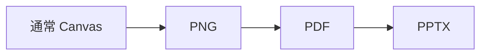

# カスタムテーマの視覚比較

## 同じスライドを 4 つの出力で見比べる

**通常 Canvas　｜　PNG　｜　PDF　｜　PPTX**

> このスライド自体が比較対象です。説明ではなく、実際の文字・余白・色・罫線の見え方を確認します。

`42px の見出し`　`19px の本文`　`72px の左右余白`

---

---
deck: カスタムテーマ視覚比較
kicker: 文字と余白
page: 2
total: 4
size: normal
---

## 文字サイズと余白の実物サンプル

# 見出しのサイズ

本文のサイズと行間を確認するためのサンプルテキストです。  
通常 Canvas、PNG、PDF、PPTX で、同じ位置と同じ密度に見えることを確認します。

### 小見出しのサイズ

| 左余白 | 本文 | 右余白 |
| --- | --- | --- |
| 72px | 19px | 72px |

**太字の強調**　*斜体の強調*　`インラインコード`

---

---
deck: カスタムテーマ視覚比較
kicker: 装飾と密度
page: 3
total: 4
size: normal
---

## 罫線・表・コードの実物サンプル

***

```js
const surfaces = ["Canvas", "PNG", "PDF", "PPTX"];
console.log(surfaces.join(" = "));
```

| 項目 | 表示サンプル | 比較ポイント |
| --- | --- | --- |
| 罫線 | 上のアクセントライン | 太さ・色・位置 |
| 表 | この表のセル | 境界線・余白 |
| コード | 暗色のコードブロック | 背景・文字・行間 |

> 4 つの出力で、装飾の位置がずれたり、密度が変わったりしないことを確認します。

---

---
deck: カスタムテーマ視覚比較
kicker: 図のサイズ
page: 4
total: 4
size: normal
---

## 図のサイズと配置の実物サンプル



| 図の確認項目 | 期待する見た目 |
| --- | --- |
| 横幅 | 4 つの出力で同じ比率 |
| 上下位置 | 見出し・本文と重ならない |
| 色 | カスタムテーマのアクセント色 |
| 余白 | 図の周囲に均一な空き |

**比較対象:** 図の大きさ、カード内の余白、見出しとの距離、固定出力でのクリッピング有無
