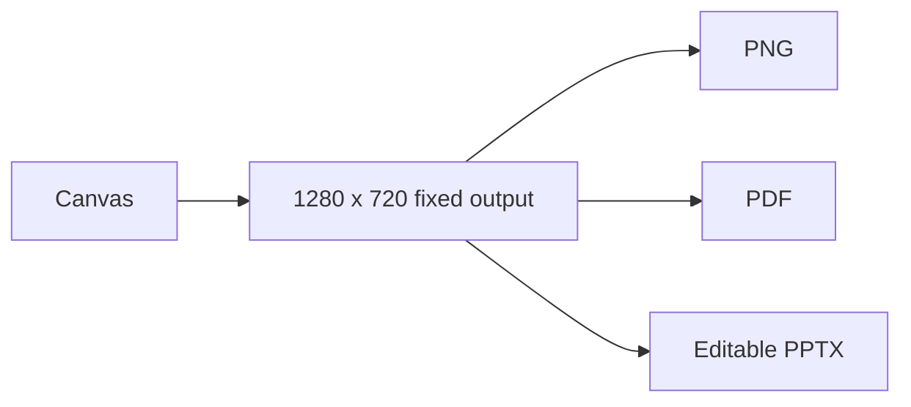

# Custom theme sizing

## Fixed-output parity

This deck is a visual regression check for the custom-theme sizing fix.

- The same theme tokens apply to the responsive canvas and fixed 1280 × 720 output.
- PNG capture, PDF, and editable PowerPoint use the fixed output surface.
- The heading, body, code, kicker, table, rule, and diagram tokens are intentionally visible.

---

---
deck: Custom theme parity
kicker: Density tokens
page: 2
total: 4
size: normal
---

## Typography and spacing tokens

The custom theme owns the type scale and slide density in every output mode.

| Token | Value | Visible effect |
| --- | --- | --- |
| `--slide-h1-size` | `42px` | Heading scale |
| `--slide-body-size` | `19px` | Body scale |
| `--deck-pad-x` | `72px` | Horizontal margin |
| `--deck-pad-y` | `44px` | Vertical margin |
| `--kicker-size` | `14px` | Kicker scale |

The explicit `size: normal` keeps the comparison deterministic.

---

---
deck: Custom theme parity
kicker: Decoration tokens
page: 3
total: 4
size: normal
---

## Tables, rules, and code

The remaining decoration tokens are also shared by responsive and fixed output.

<hr>

```js
const output = ["canvas", "png", "pdf", "pptx"];
console.log(output.join(" = "));
```

| Surface | Expected result |
| --- | --- |
| Canvas | Same colors, margins, and type scale |
| PNG / PDF | Same 1280 × 720 geometry |
| PPTX | Same slide geometry with editable text |

---

---
deck: Custom theme parity
kicker: Diagram bounds
page: 4
total: 4
size: normal
---

## Diagram and image bounds

The fixed output uses the same custom maximum-height tokens as the canvas.



All four surfaces should preserve the same diagram scale, margins, and accent colors.
