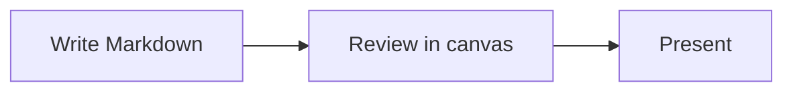
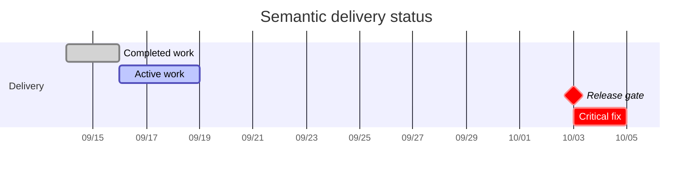

# MarkdStage
## Markdown, ready for the stage.

This deck introduces canvas controls and slide authoring.

<!--
**Speaker notes 1 / 21**

Use this title slide to explain that Markdown supports the entire workflow from authoring to presenting.
-->

---

## Start with the canvas controls

- **▶ / ◀**: Move to the next or previous slide
- **Arrow keys**: Press `→` for next or `←` for previous
- **☰**: Open the slide list and jump to any slide
- **⋯**: Open presentation, editing, preview, import, refresh, and export controls

Navigation happens in the canvas. You can also request "Go to slide 3" in chat.

<!--
**Speaker notes 2 / 21**

Try both the bottom control bar and keyboard navigation.
-->

---

## Separate slides with `---`

One Markdown file can contain multiple slides.

At the end of a slide, add a line containing only `---`.

```markdown
# First slide title

This is the first slide.

---

## Second slide heading

- The next slide starts here
```

The `---` inside a code block is not treated as a slide separator.

<!--
**Speaker notes 3 / 21**

Emphasize that the separator in the code example does not create another slide.
-->

---

## Configure appearance with front matter

At the start of a slide, place settings between `---` lines.

```markdown
---
deck: First presentation
kicker: Getting started
page: 2
total: 6
---
## Slide heading

- The page number appears in the footer
```

- `deck`: Deck name shown in the footer
- `kicker`: Label shown above the heading
- `page` / `total`: Current page number and total page count
- Add `layout: title` to the first slide to make it a title slide

<!--
**Speaker notes 4 / 21**

Front matter controls only appearance and metadata; the body remains standard Markdown.
-->

---

## Use Markdown directly

Combine headings, lists, emphasis, links, and tables.

| Syntax | Purpose |
| --- | --- |
| `## Heading` | Slide topic |
| `- Item` | Organize key points |
| `**Bold**` | Emphasize important terms |
| `` `code` `` | Code or configuration values |

Keep slides readable by avoiding dense prose and presenting one topic per slide.

<!--
**Speaker notes 5 / 21**

Confirm that tables, emphasis, and inline code use consistent theme styling.
-->

---

## Display code and diagrams

Add a language name to a code block to enable syntax highlighting.

```javascript
const slides = ["learn", "write", "present"];
console.log(slides);
```

Mermaid code blocks render as diagrams.



<!--
**Speaker notes 6 / 21**

Demonstrate code syntax highlighting, then Mermaid rendering.
-->

---

## v1.1.0: Architecture DSL diagrams

Write JSON in an `architecture` code fence to render a diagram with fixed placement.

- Layouts: `row` / `column` / `grid` / `layered`
- Shapes and styles: `rect` / `rounded-rect` / `ellipse`
- Routes: `straight` / `orthogonal` / `polyline`

<!--
**Speaker notes 7 / 21**

Introduce the Architecture DSL examples that follow.
-->

---

---
size: normal
---

## Layout-driven architecture diagram

```architecture
{
  "version": 1,
  "title": "Layout-driven platform",
  "description": "A client, service and data flow arranged with nested layouts.",
  "canvas": { "width": 1600, "height": 900 },
  "elements": [
    {
      "type": "group",
      "id": "layout-clients",
      "title": "Clients",
      "x": 60,
      "y": 240,
      "width": 360,
      "height": 360,
      "layout": { "type": "column", "gap": 42, "padding": 54 },
      "children": [
        { "type": "node", "id": "layout-browser", "text": "Browser", "icon": "browser" },
        { "type": "node", "id": "layout-mobile", "text": "Mobile", "icon": "mobile" }
      ]
    },
    {
      "type": "group",
      "id": "layout-services",
      "title": "Services",
      "x": 520,
      "y": 160,
      "width": 620,
      "height": 520,
      "layout": { "type": "grid", "columns": 2, "columnGap": 70, "rowGap": 46, "padding": 54 },
      "children": [
        { "type": "node", "id": "layout-api", "text": "API", "icon": "api" },
        { "type": "node", "id": "layout-worker", "text": "Worker", "icon": "server" },
        { "type": "node", "id": "layout-queue", "text": "Queue", "icon": "queue" },
        { "type": "node", "id": "layout-cache", "text": "Cache", "icon": "database" }
      ]
    },
    {
      "type": "node",
      "id": "layout-data",
      "x": 1270,
      "y": 330,
      "width": 260,
      "height": 140,
      "text": "Database",
      "icon": "database",
      "shape": "ellipse"
    },
    { "type": "connector", "from": "layout-browser", "to": "layout-api", "routing": "orthogonal" },
    { "type": "connector", "from": "layout-mobile", "to": "layout-api", "routing": "orthogonal", "lane": 1 },
    { "type": "connector", "from": "layout-api", "to": "layout-data", "routing": "orthogonal", "label": "query" },
    { "type": "connector", "from": "layout-worker", "to": "layout-data", "routing": "straight" }
  ]
}
```

<!--
**Speaker notes 8 / 21**

Point out that the group layout alone aligns the child elements.
-->

---

---
size: normal
kicker: Architecture DSL / Visual language
---

## Shape. Style. Route.

```architecture
{
  "version": 1,
  "title": "Shape, style and route",
  "description": "Architecture DSL turns visual language into explicit, editable structure.",
  "canvas": { "width": 1600, "height": 820 },
  "elements": [
    {
      "type": "node",
      "id": "shape-rect",
      "x": 120,
      "y": 230,
      "width": 330,
      "height": 170,
      "text": "01\nSHAPE",
      "shape": "rect",
      "icon": "browser",
      "style": { "fill": "surface", "stroke": "accent", "strokeWidth": 4, "cornerRadius": 22, "textColor": "fg", "fontWeight": 700, "lineHeight": 1.35 }
    },
    {
      "type": "node",
      "id": "shape-rounded",
      "x": 635,
      "y": 230,
      "width": 330,
      "height": 170,
      "text": "02\nSTYLE",
      "shape": "rounded-rect",
      "icon": "analytics",
      "style": { "fill": "accentSoft", "stroke": "accentStrong", "strokeWidth": 4, "cornerRadius": 34, "textColor": "fg", "fontWeight": 700, "lineHeight": 1.35 }
    },
    {
      "type": "node",
      "id": "shape-ellipse",
      "x": 1150,
      "y": 230,
      "width": 330,
      "height": 170,
      "text": "03\nROUTE",
      "shape": "ellipse",
      "icon": "network",
      "style": { "fill": "bg", "stroke": "accentLine", "strokeWidth": 4, "textColor": "fg", "fontWeight": 700, "lineHeight": 1.35 }
    },
    {
      "type": "connector",
      "from": "shape-rect",
      "to": "shape-rounded",
      "routing": "straight",
      "label": "style",
      "arrow": true
    },
    {
      "type": "connector",
      "from": "shape-rounded",
      "to": "shape-ellipse",
      "routing": "orthogonal",
      "label": "flow",
      "arrow": true
    }
  ]
}
```

<!--
**Speaker notes 9 / 21**

Read the diagram left to right: choose a shape, add visual emphasis, then define how the flow connects. The same JSON stays editable and presentation-ready.
-->

---

---
size: normal
---

## Automatic routing in a dense diagram

```architecture
{
  "version": 1,
  "title": "Dense service routing",
  "description": "A compact service graph with orthogonal connectors and no manual polylines.",
  "canvas": { "width": 1600, "height": 900 },
  "elements": [
    { "type": "node", "id": "dense-web", "x": 80, "y": 140, "width": 240, "height": 100, "text": "Web", "icon": "browser" },
    { "type": "node", "id": "dense-mobile", "x": 80, "y": 400, "width": 240, "height": 100, "text": "Mobile", "icon": "mobile" },
    { "type": "node", "id": "dense-gateway", "x": 470, "y": 270, "width": 250, "height": 100, "text": "Gateway", "icon": "api" },
    { "type": "node", "id": "dense-orders", "x": 870, "y": 140, "width": 250, "height": 100, "text": "Orders", "icon": "server" },
    { "type": "node", "id": "dense-search", "x": 870, "y": 400, "width": 250, "height": 100, "text": "Search", "icon": "analytics" },
    { "type": "node", "id": "dense-store", "x": 1270, "y": 270, "width": 240, "height": 100, "text": "Data store", "icon": "database" },
    { "type": "connector", "from": "dense-web", "to": "dense-gateway", "routing": "orthogonal" },
    { "type": "connector", "from": "dense-mobile", "to": "dense-gateway", "routing": "orthogonal", "lane": 1 },
    { "type": "connector", "from": "dense-gateway", "to": "dense-orders", "routing": "orthogonal" },
    { "type": "connector", "from": "dense-gateway", "to": "dense-search", "routing": "orthogonal", "label": "query" },
    { "type": "connector", "from": "dense-orders", "to": "dense-store", "routing": "orthogonal" },
    { "type": "connector", "from": "dense-search", "to": "dense-store", "routing": "orthogonal" },
    { "type": "connector", "from": "dense-web", "to": "dense-search", "routing": "orthogonal", "label": "direct" }
  ]
}
```

<!--
**Speaker notes 10 / 21**

Explain that dense connections route automatically without manual waypoints.
-->

---

---
size: normal
---

## Add custom images to Architecture DSL

```architecture
{
  "version": 1,
  "title": "Custom image example",
  "description": "A standalone custom image connected to a node that uses the same asset as its icon.",
  "canvas": { "width": 1600, "height": 900 },
  "elements": [
    {
      "type": "image",
      "id": "image-sample",
      "src": "assets/architecture-image-sample.svg",
      "fit": "contain",
      "ariaLabel": "Architecture DSL custom image example",
      "x": 80,
      "y": 160,
      "width": 900,
      "height": 560,
      "style": { "fill": "surface", "stroke": "accent", "strokeWidth": 4, "cornerRadius": 28 }
    },
    {
      "type": "node",
      "id": "image-node",
      "text": "Custom image",
      "icon": "assets/architecture-image-sample.svg",
      "x": 1180,
      "y": 340,
      "width": 300,
      "height": 160,
      "style": { "fill": "surface", "stroke": "accentStrong", "strokeWidth": 3 }
    },
    {
      "type": "connector",
      "from": "image-sample",
      "to": "image-node",
      "routing": "orthogonal",
      "label": "asset",
      "labelLayer": "behind",
      "arrow": true
    }
  ]
}
```

<!--
**Speaker notes 11 / 21**

The standalone image and node icon share the same local asset.
-->

---

---
size: normal
kicker: Adaptive Cards / Resolved JSON
---

## Render Adaptive Cards from JSON

Use a fully resolved JSON payload in an `adaptive-card` fence.

```adaptive-card
{
  "type": "AdaptiveCard",
  "version": "1.5",
  "body": [
    {
      "type": "Container",
      "style": "emphasis",
      "items": [
        { "type": "TextBlock", "text": "Release readiness", "size": "Large", "weight": "Bolder", "wrap": true },
        {
          "type": "ColumnSet",
          "columns": [
            {
              "type": "Column",
              "width": 1,
              "items": [
                { "type": "TextBlock", "text": "STATUS", "size": "Small", "isSubtle": true },
                { "type": "TextBlock", "text": "Ready", "size": "ExtraLarge", "weight": "Bolder", "color": "Accent" }
              ]
            },
            {
              "type": "Column",
              "width": 2,
              "items": [
                {
                  "type": "FactSet",
                  "facts": [
                    { "title": "Owner", "value": "Platform team" },
                    { "title": "Scope", "value": "Web and desktop" },
                    { "title": "Format", "value": "Editable PowerPoint" }
                  ]
                }
              ]
            }
          ]
        },
        {
          "type": "RichTextBlock",
          "separator": true,
          "inlines": [
            { "type": "TextRun", "text": "One payload. ", "weight": "Bolder" },
            { "type": "TextRun", "text": "The deck theme supplies the colors and typography." }
          ]
        }
      ]
    }
  ]
}
```

<!--
**Speaker notes 12 / 21**

The fence renders a card rather than a JSON code sample. The payload uses the pinned schema 1.5.
Point out the styled container, weighted columns, rich text and FactSet.
The card remains non-interactive; template expansion and remote image fetching are not enabled.
-->

---

---
size: normal
kicker: Adaptive Cards / PowerPoint
---

## Reuse card content in PowerPoint

Approved local images and supported tables remain separate, editable objects.

```adaptive-card
{
  "type": "AdaptiveCard",
  "version": "1.5",
  "body": [
    {
      "type": "ColumnSet",
      "columns": [
        {
          "type": "Column",
          "width": "360px",
          "items": [
            { "type": "TextBlock", "text": "Workspace asset", "size": "Medium", "weight": "Bolder" },
            { "type": "Image", "url": "assets/sample.svg", "altText": "Local MarkdStage sample image", "width": "320px" }
          ]
        },
        {
          "type": "Column",
          "width": "stretch",
          "items": [
            {
              "type": "Table",
              "firstRowAsHeaders": true,
              "showGridLines": true,
              "columns": [{ "width": 1 }, { "width": 2 }],
              "rows": [
                {
                  "type": "TableRow",
                  "cells": [
                    { "type": "TableCell", "items": [{ "type": "TextBlock", "text": "Element", "weight": "Bolder", "wrap": true }] },
                    { "type": "TableCell", "items": [{ "type": "TextBlock", "text": "PowerPoint output", "weight": "Bolder", "wrap": true }] }
                  ]
                },
                {
                  "type": "TableRow",
                  "cells": [
                    { "type": "TableCell", "items": [{ "type": "TextBlock", "text": "TextBlock", "wrap": true }] },
                    { "type": "TableCell", "items": [{ "type": "TextBlock", "text": "Editable text", "wrap": true }] }
                  ]
                },
                {
                  "type": "TableRow",
                  "cells": [
                    { "type": "TableCell", "items": [{ "type": "TextBlock", "text": "FactSet / Table", "wrap": true }] },
                    { "type": "TableCell", "items": [{ "type": "TextBlock", "text": "Editable cells", "wrap": true }] }
                  ]
                }
              ]
            }
          ]
        }
      ]
    }
  ]
}
```

Supported parts stay editable; unsupported details become bounded images.

<!--
**Speaker notes 13 / 21**

Export this deck to PowerPoint and select the text, picture and table cells separately.
The image uses an existing workspace asset, not a remote URL.
Unsupported subtrees become individual images without flattening their supported neighbors.
-->

---

---
size: normal
kicker: Semantic colors / Architecture DSL
---

## Semantic roles across Architecture elements

```architecture
{
  "version": 1,
  "title": "Semantic release states",
  "description": "Semantic colors applied to a group, nodes, connectors, arrowheads, and labels.",
  "canvas": { "width": 1600, "height": 820 },
  "elements": [
    {
      "type": "group",
      "id": "semantic-review",
      "title": "Release review",
      "x": 50,
      "y": 80,
      "width": 1500,
      "height": 600,
      "style": { "fill": "surfaceInfo", "stroke": "borderInfo", "textColor": "fg", "strokeWidth": 4, "cornerRadius": 28 },
      "children": [
        { "type": "node", "id": "semantic-success", "x": 80, "y": 170, "width": 280, "height": 150, "text": "SUCCESS\nApproved", "icon": "success", "style": { "fill": "surfaceSuccess", "stroke": "borderSuccess", "textColor": "fg", "strokeWidth": 5, "cornerRadius": 24, "fontWeight": 700 } },
        { "type": "node", "id": "semantic-info", "x": 430, "y": 170, "width": 280, "height": 150, "text": "INFO\nIn progress", "icon": "activity", "style": { "fill": "surfaceInfo", "stroke": "borderInfo", "textColor": "fg", "strokeWidth": 5, "cornerRadius": 24, "fontWeight": 700 } },
        { "type": "node", "id": "semantic-warning", "x": 780, "y": 170, "width": 280, "height": 150, "text": "WARNING\nNeeds review", "icon": "waiting", "style": { "fill": "surfaceWarning", "stroke": "borderWarning", "textColor": "fg", "strokeWidth": 5, "cornerRadius": 24, "fontWeight": 700 } },
        { "type": "node", "id": "semantic-danger", "x": 1130, "y": 170, "width": 280, "height": 150, "text": "DANGER\nBlocked", "icon": "failure", "style": { "fill": "surfaceDanger", "stroke": "borderDanger", "textColor": "fg", "strokeWidth": 5, "cornerRadius": 24, "fontWeight": 700 } },
        { "type": "node", "id": "semantic-light", "x": 430, "y": 430, "width": 280, "height": 110, "text": "LIGHT", "style": { "fill": "light", "stroke": "secondary", "textColor": "dark", "strokeWidth": 4, "cornerRadius": 20, "fontWeight": 700 } },
        { "type": "node", "id": "semantic-dark", "x": 780, "y": 430, "width": 280, "height": 110, "text": "DARK", "style": { "fill": "dark", "stroke": "primary", "textColor": "light", "strokeWidth": 4, "cornerRadius": 20, "fontWeight": 700 } },
        { "type": "connector", "from": "semantic-success", "to": "semantic-info", "label": "primary", "arrow": true, "style": { "stroke": "primary", "textColor": "primary", "strokeWidth": 5 } },
        { "type": "connector", "from": "semantic-info", "to": "semantic-warning", "label": "warning", "arrow": true, "style": { "stroke": "warning", "textColor": "warning", "strokeWidth": 5 } },
        { "type": "connector", "from": "semantic-warning", "to": "semantic-danger", "label": "danger", "arrow": true, "style": { "stroke": "danger", "textColor": "danger", "strokeWidth": 5 } }
      ]
    }
  ]
}
```

<!--
**Speaker notes 14 / 21**

Compare node surfaces, borders, connector lines, arrowheads, labels, and the light/dark neutral roles. Export this slide to PDF and PowerPoint and verify parity.
-->

---

---
size: normal
kicker: Semantic colors / Adaptive Cards
---

## Semantic containers and text roles

```adaptive-card
{
  "type": "AdaptiveCard",
  "version": "1.5",
  "body": [
    { "type": "Container", "style": "success", "items": [{ "type": "TextBlock", "text": "SUCCESS / Good", "color": "Good", "size": "Large", "weight": "Bolder", "wrap": true }] },
    { "type": "Container", "style": "info", "separator": true, "items": [{ "type": "TextBlock", "text": "INFO / Accent", "color": "Accent", "size": "Large", "weight": "Bolder", "wrap": true }] },
    { "type": "Container", "style": "warning", "separator": true, "items": [{ "type": "TextBlock", "text": "WARNING / Warning", "color": "Warning", "size": "Large", "weight": "Bolder", "wrap": true }] },
    { "type": "Container", "style": "danger", "separator": true, "items": [{ "type": "TextBlock", "text": "DANGER / Attention", "color": "Attention", "size": "Large", "weight": "Bolder", "wrap": true }] }
  ]
}
```

<!--
**Speaker notes 15 / 21**

Built-in themes should show four distinct surfaces and borders. Good, Accent, Warning, and Attention should use success, primary, warning, and danger. The legacy custom theme intentionally exercises fallback.
-->

---

---
size: normal
kicker: Semantic colors / Mermaid
---

## Gantt semantic task states



- **Done** uses success when defined.
- **Active** uses info when defined.
- **Critical** uses danger when defined.
- Other Mermaid diagram palettes and authored `style` / `classDef` colors remain unchanged.

<!--
**Speaker notes 16 / 21**

Compare the Gantt states across all four theme files. The custom theme omits semantic properties, so its previous accent-derived fallback is the expected result.
-->

---

## Add images and links

Place images in the `assets/` folder and reference them with absolute paths.


Use standard Markdown syntax for external links:
[MarkdStage repository](https://github.com/runceel/markdstage)

Give images descriptive alternative text that remains meaningful when an image cannot be displayed.

<!--
**Speaker notes 17 / 21**

Confirm that image alternative text and links use standard Markdown syntax.
-->

---

## Choose a theme and size

Select the deck-wide theme when opening the canvas.

- `dark`: Subdued dark theme (default)
- `light`: Bright, neutral theme
- `microsoft`: Fluent color palette
- `custom`: Define custom colors and title-slide styling with CSS custom properties

Specify a custom theme file from Markdown.

```markdown
---
theme: custom
theme-file: ./themes/brand/theme.css
---
```

<!--
**Speaker notes 18 / 21**

This deck uses the default dark theme while introducing the available theme options.
-->

---

## Adjust slide size

Add a directive at the start of the body for slides that need extra emphasis.

```markdown
<!-- slide-size: large -->

## Slide to display larger
```

<!--
**Speaker notes 19 / 21**

The `slide-size` comment is a display directive, so it does not appear in speaker notes.
-->

---

## Start with the minimum structure

```markdown
# My presentation

---

## Today's key points

- First key point
- Second key point
- Next action
```

**Write → review in the canvas → navigate and present.** That is all you need to get started.

<!--
**Speaker notes 20 / 21**

Explain that a title and key points are enough for a minimal deck.
-->

---

## Summary

- Split a Markdown file into slides with `---`
- Configure the deck name, label, and page numbers in front matter
- Combine lists, code, tables, Mermaid, Adaptive Cards, and images
- Present with canvas buttons or the keyboard
- Export to PDF or editable PowerPoint

Copy this file and replace its title and key points with your own.

<!--
**Speaker notes 21 / 21**

Finally, open presenter view and confirm that the notes change on each slide.
-->
