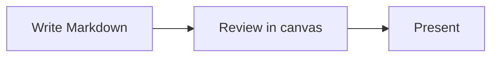
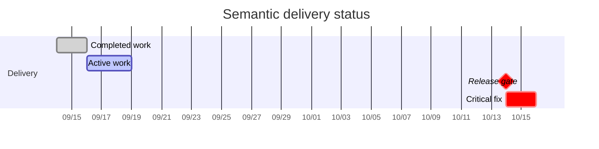
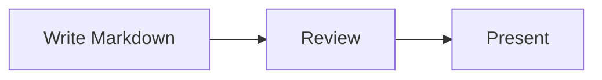

# MarkdStage
## Markdown, ready for the stage.

This deck introduces canvas controls and slide authoring.

<!--
**Speaker notes 1 / 29**

Use this title slide to explain that Markdown supports the entire workflow from authoring to presenting.
-->

---

## Start with the canvas controls

- **▶ / ◀**: Move to the next or previous slide
- **Arrow keys**: Press `→` for next or `←` for previous
- **☰**: Open the slide list and jump to any slide
- **⋯**: Open presentation, editing, preview, import, refresh, and export controls

Navigation happens in the canvas. You can also request "Go to slide 3" in chat.

<!--
**Speaker notes 2 / 29**

Try both the bottom control bar and keyboard navigation.
-->

---

## Separate slides with `---`

One Markdown file can contain multiple slides.

At the end of a slide, add a line containing only `---`.

```markdown
# First slide title

This is the first slide.

---

## Second slide heading

- The next slide starts here
```

The `---` inside a code block is not treated as a slide separator.

<!--
**Speaker notes 3 / 29**

Emphasize that the separator in the code example does not create another slide.
-->

---

## Configure appearance with front matter

At the start of a slide, place settings between `---` lines.

```markdown
---
deck: First presentation
kicker: Getting started
page: 2
total: 6
---
## Slide heading

- The page number appears in the footer
```

- `deck`: Deck name shown in the footer
- `kicker`: Label shown above the heading
- `page` / `total`: Current page number and total page count
- Add `layout: title` to the first slide to make it a title slide

<!--
**Speaker notes 4 / 29**

Front matter controls only appearance and metadata; the body remains standard Markdown.
-->

---

## Use Markdown directly

Combine headings, lists, emphasis, links, and tables.

| Syntax | Purpose |
| --- | --- |
| `## Heading` | Slide topic |
| `- Item` | Organize key points |
| `**Bold**` | Emphasize important terms |
| `` `code` `` | Code or configuration values |

Keep slides readable by avoiding dense prose and presenting one topic per slide.

<!--
**Speaker notes 5 / 29**

Confirm that tables, emphasis, and inline code use consistent theme styling.
-->

---

## Display code and diagrams

Add a language name to a code block to enable syntax highlighting.

```javascript
const slides = ["learn", "write", "present"];
console.log(slides);
```

Mermaid code blocks render as diagrams.


```mermaid
flowchart LR
    A[Write Markdown] --> B[Review in canvas]
    B --> C[Present]
```

<!--
**Speaker notes 6 / 29**

Demonstrate code syntax highlighting, then Mermaid rendering.
-->

---

## v1.1.0: Architecture DSL diagrams

Write JSON in an `architecture` code fence to render a diagram with fixed placement.

- Layouts: `row` / `column` / `grid` / `layered`
- Shapes and styles: `rect` / `rounded-rect` / `ellipse`
- Routes: `straight` / `orthogonal` / `polyline`

<!--
**Speaker notes 7 / 29**

Introduce the Architecture DSL examples that follow.
-->

---

---
size: normal
---

## Layout-driven architecture diagram

```architecture
{
  "version": 1,
  "title": "Layout-driven platform",
  "description": "A client, service and data flow arranged with nested layouts.",
  "canvas": { "width": 1600, "height": 900 },
  "elements": [
    {
      "type": "group",
      "id": "layout-clients",
      "title": "Clients",
      "x": 60,
      "y": 240,
      "width": 360,
      "height": 360,
      "layout": { "type": "column", "gap": 42, "padding": 54 },
      "children": [
        { "type": "node", "id": "layout-browser", "text": "Browser", "icon": "browser" },
        { "type": "node", "id": "layout-mobile", "text": "Mobile", "icon": "mobile" }
      ]
    },
    {
      "type": "group",
      "id": "layout-services",
      "title": "Services",
      "x": 520,
      "y": 160,
      "width": 620,
      "height": 520,
      "layout": { "type": "grid", "columns": 2, "columnGap": 70, "rowGap": 46, "padding": 54 },
      "children": [
        { "type": "node", "id": "layout-api", "text": "API", "icon": "api" },
        { "type": "node", "id": "layout-worker", "text": "Worker", "icon": "server" },
        { "type": "node", "id": "layout-queue", "text": "Queue", "icon": "queue" },
        { "type": "node", "id": "layout-cache", "text": "Cache", "icon": "database" }
      ]
    },
    {
      "type": "node",
      "id": "layout-data",
      "x": 1270,
      "y": 330,
      "width": 260,
      "height": 140,
      "text": "Database",
      "icon": "database",
      "shape": "ellipse"
    },
    { "type": "connector", "from": "layout-browser", "to": "layout-api", "routing": "orthogonal" },
    { "type": "connector", "from": "layout-mobile", "to": "layout-api", "routing": "orthogonal", "lane": 1 },
    { "type": "connector", "from": "layout-api", "to": "layout-data", "routing": "orthogonal", "label": "query" },
    { "type": "connector", "from": "layout-worker", "to": "layout-data", "routing": "straight" }
  ]
}
```

<!--
**Speaker notes 8 / 29**

Point out that the group layout alone aligns the child elements.
-->

---

---
size: normal
kicker: Architecture DSL / Visual language
---

## Shape. Style. Route.

```architecture
{
  "version": 1,
  "title": "Shape, style and route",
  "description": "Architecture DSL turns visual language into explicit, editable structure.",
  "canvas": { "width": 1600, "height": 820 },
  "elements": [
    {
      "type": "node",
      "id": "shape-rect",
      "x": 120,
      "y": 230,
      "width": 330,
      "height": 170,
      "text": "01\nSHAPE",
      "shape": "rect",
      "icon": "browser",
      "style": { "fill": "surface", "stroke": "accent", "strokeWidth": 4, "cornerRadius": 22, "textColor": "fg", "fontWeight": 700, "lineHeight": 1.35 }
    },
    {
      "type": "node",
      "id": "shape-rounded",
      "x": 635,
      "y": 230,
      "width": 330,
      "height": 170,
      "text": "02\nSTYLE",
      "shape": "rounded-rect",
      "icon": "analytics",
      "style": { "fill": "accentSoft", "stroke": "accentStrong", "strokeWidth": 4, "cornerRadius": 34, "textColor": "fg", "fontWeight": 700, "lineHeight": 1.35 }
    },
    {
      "type": "node",
      "id": "shape-ellipse",
      "x": 1150,
      "y": 230,
      "width": 330,
      "height": 170,
      "text": "03\nROUTE",
      "shape": "ellipse",
      "icon": "network",
      "style": { "fill": "bg", "stroke": "accentLine", "strokeWidth": 4, "textColor": "fg", "fontWeight": 700, "lineHeight": 1.35 }
    },
    {
      "type": "connector",
      "from": "shape-rect",
      "to": "shape-rounded",
      "routing": "straight",
      "label": "style",
      "arrow": true
    },
    {
      "type": "connector",
      "from": "shape-rounded",
      "to": "shape-ellipse",
      "routing": "orthogonal",
      "label": "flow",
      "arrow": true
    }
  ]
}
```

<!--
**Speaker notes 9 / 29**

Read the diagram left to right: choose a shape, add visual emphasis, then define how the flow connects. The same JSON stays editable and presentation-ready.
-->

---

---
size: normal
---

## Automatic routing in a dense diagram

```architecture
{
  "version": 1,
  "title": "Dense service routing",
  "description": "A compact service graph with orthogonal connectors and no manual polylines.",
  "canvas": { "width": 1600, "height": 900 },
  "elements": [
    { "type": "node", "id": "dense-web", "x": 80, "y": 140, "width": 240, "height": 100, "text": "Web", "icon": "browser" },
    { "type": "node", "id": "dense-mobile", "x": 80, "y": 400, "width": 240, "height": 100, "text": "Mobile", "icon": "mobile" },
    { "type": "node", "id": "dense-gateway", "x": 470, "y": 270, "width": 250, "height": 100, "text": "Gateway", "icon": "api" },
    { "type": "node", "id": "dense-orders", "x": 870, "y": 140, "width": 250, "height": 100, "text": "Orders", "icon": "server" },
    { "type": "node", "id": "dense-search", "x": 870, "y": 400, "width": 250, "height": 100, "text": "Search", "icon": "analytics" },
    { "type": "node", "id": "dense-store", "x": 1270, "y": 270, "width": 240, "height": 100, "text": "Data store", "icon": "database" },
    { "type": "connector", "from": "dense-web", "to": "dense-gateway", "routing": "orthogonal" },
    { "type": "connector", "from": "dense-mobile", "to": "dense-gateway", "routing": "orthogonal", "lane": 1 },
    { "type": "connector", "from": "dense-gateway", "to": "dense-orders", "routing": "orthogonal" },
    { "type": "connector", "from": "dense-gateway", "to": "dense-search", "routing": "orthogonal", "label": "query" },
    { "type": "connector", "from": "dense-orders", "to": "dense-store", "routing": "orthogonal" },
    { "type": "connector", "from": "dense-search", "to": "dense-store", "routing": "orthogonal" },
    { "type": "connector", "from": "dense-web", "to": "dense-search", "routing": "orthogonal", "label": "direct" }
  ]
}
```

<!--
**Speaker notes 10 / 29**

Explain that dense connections route automatically without manual waypoints.
-->

---

---
size: normal
---

## Add custom images to Architecture DSL

```architecture
{
  "version": 1,
  "title": "Custom image example",
  "description": "A standalone custom image connected to a node that uses the same asset as its icon.",
  "canvas": { "width": 1600, "height": 900 },
  "elements": [
    {
      "type": "image",
      "id": "image-sample",
      "src": "assets/architecture-image-sample.svg",
      "fit": "contain",
      "ariaLabel": "Architecture DSL custom image example",
      "x": 80,
      "y": 160,
      "width": 900,
      "height": 560,
      "style": { "fill": "surface", "stroke": "accent", "strokeWidth": 4, "cornerRadius": 28 }
    },
    {
      "type": "node",
      "id": "image-node",
      "text": "Custom image",
      "icon": "assets/architecture-image-sample.svg",
      "x": 1180,
      "y": 340,
      "width": 300,
      "height": 160,
      "style": { "fill": "surface", "stroke": "accentStrong", "strokeWidth": 3 }
    },
    {
      "type": "connector",
      "from": "image-sample",
      "to": "image-node",
      "routing": "orthogonal",
      "label": "asset",
      "labelLayer": "behind",
      "arrow": true
    }
  ]
}
```

<!--
**Speaker notes 11 / 29**

The standalone image and node icon share the same local asset.
-->

---

---
size: normal
kicker: Adaptive Cards / Resolved JSON
---

## Render Adaptive Cards from JSON

Use a fully resolved JSON payload in an `adaptive-card` fence.

```adaptive-card
{
  "type": "AdaptiveCard",
  "version": "1.5",
  "body": [
    {
      "type": "Container",
      "style": "emphasis",
      "items": [
        { "type": "TextBlock", "text": "Release readiness", "size": "Large", "weight": "Bolder", "wrap": true },
        {
          "type": "ColumnSet",
          "columns": [
            {
              "type": "Column",
              "width": 1,
              "items": [
                { "type": "TextBlock", "text": "STATUS", "size": "Small", "isSubtle": true },
                { "type": "TextBlock", "text": "Ready", "size": "ExtraLarge", "weight": "Bolder", "color": "Accent" }
              ]
            },
            {
              "type": "Column",
              "width": 2,
              "items": [
                {
                  "type": "FactSet",
                  "facts": [
                    { "title": "Owner", "value": "Platform team" },
                    { "title": "Scope", "value": "Web and desktop" },
                    { "title": "Format", "value": "Editable PowerPoint" }
                  ]
                }
              ]
            }
          ]
        },
        {
          "type": "RichTextBlock",
          "separator": true,
          "inlines": [
            { "type": "TextRun", "text": "One payload. ", "weight": "Bolder" },
            { "type": "TextRun", "text": "The deck theme supplies the colors and typography." }
          ]
        }
      ]
    }
  ]
}
```

<!--
**Speaker notes 12 / 29**

The fence renders a card rather than a JSON code sample. The payload uses the pinned schema 1.5.
Point out the styled container, weighted columns, rich text and FactSet.
The card remains non-interactive; template expansion and remote image fetching are not enabled.
-->

---

---
size: normal
kicker: Adaptive Cards / PowerPoint
---

## Reuse card content in PowerPoint

Approved local images and supported tables remain separate, editable objects.

```adaptive-card
{
  "type": "AdaptiveCard",
  "version": "1.5",
  "body": [
    {
      "type": "ColumnSet",
      "columns": [
        {
          "type": "Column",
          "width": "360px",
          "items": [
            { "type": "TextBlock", "text": "Workspace asset", "size": "Medium", "weight": "Bolder" },
            { "type": "Image", "url": "assets/sample.svg", "altText": "Local MarkdStage sample image", "width": "320px" }
          ]
        },
        {
          "type": "Column",
          "width": "stretch",
          "items": [
            {
              "type": "Table",
              "firstRowAsHeaders": true,
              "showGridLines": true,
              "columns": [{ "width": 1 }, { "width": 2 }],
              "rows": [
                {
                  "type": "TableRow",
                  "cells": [
                    { "type": "TableCell", "items": [{ "type": "TextBlock", "text": "Element", "weight": "Bolder", "wrap": true }] },
                    { "type": "TableCell", "items": [{ "type": "TextBlock", "text": "PowerPoint output", "weight": "Bolder", "wrap": true }] }
                  ]
                },
                {
                  "type": "TableRow",
                  "cells": [
                    { "type": "TableCell", "items": [{ "type": "TextBlock", "text": "TextBlock", "wrap": true }] },
                    { "type": "TableCell", "items": [{ "type": "TextBlock", "text": "Editable text", "wrap": true }] }
                  ]
                },
                {
                  "type": "TableRow",
                  "cells": [
                    { "type": "TableCell", "items": [{ "type": "TextBlock", "text": "FactSet / Table", "wrap": true }] },
                    { "type": "TableCell", "items": [{ "type": "TextBlock", "text": "Editable cells", "wrap": true }] }
                  ]
                }
              ]
            }
          ]
        }
      ]
    }
  ]
}
```

Supported parts stay editable; unsupported details become bounded images.

<!--
**Speaker notes 13 / 29**

Export this deck to PowerPoint and select the text, picture and table cells separately.
The image uses an existing workspace asset, not a remote URL.
Unsupported subtrees become individual images without flattening their supported neighbors.
-->

---

---
size: normal
kicker: Semantic colors / Architecture DSL
---

## Semantic roles across Architecture elements

```architecture
{
  "version": 1,
  "title": "Semantic release states",
  "description": "Semantic colors applied to a group, nodes, connectors, arrowheads, and labels.",
  "canvas": { "width": 1600, "height": 820 },
  "elements": [
    {
      "type": "group",
      "id": "semantic-review",
      "title": "Release review",
      "x": 50,
      "y": 80,
      "width": 1500,
      "height": 600,
      "style": { "fill": "surfaceInfo", "stroke": "borderInfo", "textColor": "fg", "strokeWidth": 4, "cornerRadius": 28 },
      "children": [
        { "type": "node", "id": "semantic-success", "x": 80, "y": 170, "width": 280, "height": 150, "text": "SUCCESS\nApproved", "icon": "success", "style": { "fill": "surfaceSuccess", "stroke": "borderSuccess", "textColor": "fg", "strokeWidth": 5, "cornerRadius": 24, "fontWeight": 700 } },
        { "type": "node", "id": "semantic-info", "x": 430, "y": 170, "width": 280, "height": 150, "text": "INFO\nIn progress", "icon": "activity", "style": { "fill": "surfaceInfo", "stroke": "borderInfo", "textColor": "fg", "strokeWidth": 5, "cornerRadius": 24, "fontWeight": 700 } },
        { "type": "node", "id": "semantic-warning", "x": 780, "y": 170, "width": 280, "height": 150, "text": "WARNING\nNeeds review", "icon": "waiting", "style": { "fill": "surfaceWarning", "stroke": "borderWarning", "textColor": "fg", "strokeWidth": 5, "cornerRadius": 24, "fontWeight": 700 } },
        { "type": "node", "id": "semantic-danger", "x": 1130, "y": 170, "width": 280, "height": 150, "text": "DANGER\nBlocked", "icon": "failure", "style": { "fill": "surfaceDanger", "stroke": "borderDanger", "textColor": "fg", "strokeWidth": 5, "cornerRadius": 24, "fontWeight": 700 } },
        { "type": "node", "id": "semantic-light", "x": 430, "y": 430, "width": 280, "height": 110, "text": "LIGHT", "style": { "fill": "light", "stroke": "secondary", "textColor": "dark", "strokeWidth": 4, "cornerRadius": 20, "fontWeight": 700 } },
        { "type": "node", "id": "semantic-dark", "x": 780, "y": 430, "width": 280, "height": 110, "text": "DARK", "style": { "fill": "dark", "stroke": "primary", "textColor": "light", "strokeWidth": 4, "cornerRadius": 20, "fontWeight": 700 } },
        { "type": "connector", "from": "semantic-success", "to": "semantic-info", "label": "primary", "arrow": true, "style": { "stroke": "primary", "textColor": "primary", "strokeWidth": 5 } },
        { "type": "connector", "from": "semantic-info", "to": "semantic-warning", "label": "warning", "arrow": true, "style": { "stroke": "warning", "textColor": "warning", "strokeWidth": 5 } },
        { "type": "connector", "from": "semantic-warning", "to": "semantic-danger", "label": "danger", "arrow": true, "style": { "stroke": "danger", "textColor": "danger", "strokeWidth": 5 } }
      ]
    }
  ]
}
```

<!--
**Speaker notes 14 / 29**

Compare node surfaces, borders, connector lines, arrowheads, labels, and the light/dark neutral roles. Export this slide to PDF and PowerPoint and verify parity.
-->

---

---
size: normal
kicker: Semantic colors / Adaptive Cards
---

## Semantic containers and text roles

```adaptive-card
{
  "type": "AdaptiveCard",
  "version": "1.5",
  "body": [
    { "type": "Container", "style": "success", "items": [{ "type": "TextBlock", "text": "SUCCESS / Good", "color": "Good", "size": "Large", "weight": "Bolder", "wrap": true }] },
    { "type": "Container", "style": "info", "separator": true, "items": [{ "type": "TextBlock", "text": "INFO / Accent", "color": "Accent", "size": "Large", "weight": "Bolder", "wrap": true }] },
    { "type": "Container", "style": "warning", "separator": true, "items": [{ "type": "TextBlock", "text": "WARNING / Warning", "color": "Warning", "size": "Large", "weight": "Bolder", "wrap": true }] },
    { "type": "Container", "style": "danger", "separator": true, "items": [{ "type": "TextBlock", "text": "DANGER / Attention", "color": "Attention", "size": "Large", "weight": "Bolder", "wrap": true }] }
  ]
}
```

<!--
**Speaker notes 15 / 29**

Built-in themes should show four distinct surfaces and borders. Good, Accent, Warning, and Attention should use success, primary, warning, and danger. The legacy custom theme intentionally exercises fallback.
-->

---

---
size: normal
kicker: Semantic colors / Mermaid
---

## Gantt semantic task states


```mermaid
gantt
    title Semantic delivery status
    dateFormat YYYY-MM-DD
    axisFormat %m/%d
    tickInterval 2day
    todayMarker off
    section Delivery
    Completed work :done, completed, 2026-09-14, 2d
    Active work :active, active, after completed, 3d
    Release gate :milestone, crit, gate, after active, 0d
    Critical fix :crit, critical, after active, 2d
```

- **Done** uses success when defined.
- **Active** uses info when defined.
- **Critical** uses danger when defined.
- Other Mermaid diagram palettes and authored `style` / `classDef` colors remain unchanged.

<!--
**Speaker notes 16 / 29**

Compare the Gantt states across all four theme files. The custom theme omits semantic properties, so its previous accent-derived fallback is the expected result.
-->

---

## Add images and links

Place images in the `assets/` folder and reference them with absolute paths.


Use standard Markdown syntax for external links:
[MarkdStage repository](https://github.com/runceel/markdstage)

Give images descriptive alternative text that remains meaningful when an image cannot be displayed.

<!--
**Speaker notes 17 / 29**

Confirm that image alternative text and links use standard Markdown syntax.
-->

---

## Choose a theme and size

Select the deck-wide theme when opening the canvas.

- `dark`: Subdued dark theme (default)
- `light`: Bright, neutral theme
- `microsoft`: Fluent color palette
- `custom`: Define custom colors and title-slide styling with CSS custom properties

Specify a custom theme file from Markdown.

```markdown
---
theme: custom
theme-file: ./themes/brand/theme.css
---
```

<!--
**Speaker notes 18 / 29**

This deck uses the default dark theme while introducing the available theme options.
-->

---

## Adjust slide size

Add a directive at the start of the body for slides that need extra emphasis.

```markdown
<!-- slide-size: large -->

## Slide to display larger
```

<!--
**Speaker notes 19 / 29**

The `slide-size` comment is a display directive, so it does not appear in speaker notes.
-->

---

## Start with the minimum structure

```markdown
# My presentation

---

## Today's key points

- First key point
- Second key point
- Next action
```

**Write → review in the canvas → navigate and present.** That is all you need to get started.

<!--
**Speaker notes 20 / 29**

Explain that a title and key points are enough for a minimal deck.
-->

---

## Reveal list items together

Advance to reveal one parent and its children at a time.

<!-- markdstage: reveal=list-items nested=together -->

- Plan
  - Gather requirements
  - Review the design
- Deliver
  - Implement
  - Verify

<!-- markdstage: reveal=block -->

Each parent and its children appear together. **Rewind** hides the last build.

<!--
**Speaker notes 21 / 29**

Jump here using the slide list to reset the build. In presentation mode the list starts hidden.
The first advance shows Plan and both children; the second shows Deliver and both children.
A third advance shows the closing explanation; a fourth enters the next slide.
Rewind from that slide's initial state returns here with all content visible.
Static reading, output preview, PDF and PNG show the completed list.
-->

---

## Reveal nested items separately

Advance to reveal each numbered item and nested bullet separately.

<!-- markdstage: reveal=list-items nested=separate -->

1. Plan
   - Gather requirements
   - Review the design
2. Deliver
   - Verify

<!-- markdstage: reveal=block -->

Numbering and indentation stay fixed as items appear and disappear.

<!--
**Speaker notes 22 / 29**

Expected order: Plan, Gather requirements, Review the design, Deliver, Verify.
The sixth advance shows the closing explanation.
Rewind hides the explanation first, then the items in reverse order without changing numbering or layout.
Jump away and back using the slide list to confirm that the initial hidden state is restored.
Export to PowerPoint to review native click-triggered Appear builds; PDF remains complete.
-->

---

---
size: normal
kicker: Incremental reveals / Architecture DSL
---

## Build an Architecture diagram

Advance three times: clients, API and request, then database and query.

<!-- markdstage:
{
  "steps": [
    ["reveal-clients"],
    ["reveal-api", "reveal-request"],
    ["reveal-data"]
  ]
}
-->
```architecture
{
  "version": 1,
  "title": "Incremental request flow",
  "canvas": { "width": 1600, "height": 640 },
  "elements": [
    {
      "type": "group",
      "id": "reveal-clients",
      "title": "Clients",
      "x": 60,
      "y": 130,
      "width": 380,
      "height": 340,
      "children": [
        { "type": "node", "id": "reveal-browser", "x": 60, "y": 110, "width": 260, "height": 120, "text": "Browser", "icon": "browser" }
      ]
    },
    { "type": "node", "id": "reveal-api", "x": 650, "y": 240, "width": 280, "height": 120, "text": "API", "icon": "api" },
    { "type": "node", "id": "reveal-data", "x": 1190, "y": 240, "width": 280, "height": 120, "text": "Database", "icon": "database" },
    { "type": "connector", "id": "reveal-request", "from": "reveal-browser", "to": "reveal-api", "label": "request", "arrow": true },
    { "type": "connector", "id": "reveal-query", "from": "reveal-api", "to": "reveal-data", "label": "query", "arrow": true }
  ]
}
```

<!--
**Speaker notes 23 / 29**

The first build reveals the Clients frame and its Browser child together.
The second reveals API and the explicitly scheduled request connector simultaneously.
The third reveals Database; the unscheduled query connector appears automatically when both endpoints are visible.
Rewind hides each build and its connectors in reverse order. The next-build preview should match.
Static preview and PDF show the completed diagram. Review exported PowerPoint builds by clicking in the target application.
-->

---

---
size: normal
kicker: Incremental reveals / Narrative
---

## Explain, then reveal the diagram

Initially, only this introduction and the heading are visible.

<!-- markdstage: reveal=list-items nested=together -->

- Send a request from the browser
- Process it in the API

<!-- markdstage: reveal=block -->

The conclusion appears next, followed by the complete diagram.

<!-- markdstage: reveal=block -->

```architecture
{
  "version": 1,
  "title": "Whole-diagram reveal",
  "canvas": { "width": 1600, "height": 300 },
  "elements": [
    { "type": "node", "id": "block-browser", "x": 100, "y": 80, "width": 400, "height": 140, "text": "Browser", "icon": "browser", "style": { "fontSize": 48 } },
    { "type": "node", "id": "block-api", "x": 1100, "y": 80, "width": 400, "height": 140, "text": "API", "icon": "api", "style": { "fontSize": 48 } },
    { "type": "connector", "id": "block-request", "from": "block-browser", "to": "block-api", "label": "request", "arrow": true, "style": { "fontSize": 36 } }
  ]
}
```

<!--
**Speaker notes 24 / 29**

Use presenter view or the audience window. The first two clicks show the list items.
The third shows the conclusion. The fourth shows the whole Architecture diagram, including both nodes, icons and the connector.
Rewind reverses those builds. The layout does not move, and the next-build preview should match each action.
-->

---

## Reveal an image

Advance once to show the complete image.

<!-- markdstage: reveal=block -->


<!--
**Speaker notes 25 / 29**

The image starts hidden and appears as a single block. Rewind hides it again.
Verify the same click-triggered build in exported PowerPoint; normal preview, PDF and PNG always contain the image.
-->

---

## Reveal a table, then code

The first click shows the table; the second shows the complete code block.

<!-- markdstage: reveal=block -->

| Stage | Result |
| --- | --- |
| Parse | Shared reveal schedule |
| Export | Editable PowerPoint builds |

<!-- markdstage: reveal=block -->

```javascript
const stages = ["parse", "present", "export"];
console.log(stages.join(" -> "));
```

<!--
**Speaker notes 26 / 29**

The table is one build, not a sequence of rows or cells.
The code text, background, accent and shadow appear together in the second build.
Rewind twice and confirm that neither decoration remains visible.
-->

---

## Reveal a complete Mermaid diagram

Advance once: the entire diagram appears together, not node by node.

<!-- markdstage: reveal=block -->


```mermaid
flowchart LR
    A[Write Markdown] --> B[Review]
    B --> C[Present]
```

<!--
**Speaker notes 27 / 29**

All nodes, text, arrows and any fallback artwork share one build.
Export to PowerPoint using both Editable shapes and Images; both should reveal the entire diagram in one click.
Rewind hides the complete diagram. Static views remain complete.
-->

---

## Reveal an entire list at once

Use reveal=block when the list is one explanation rather than separate points.

<!-- markdstage: reveal=block -->

1. Author
   - Write the Markdown
   - Choose the theme
2. Present
   - Advance and rewind

<!-- markdstage: reveal=block -->

One click shows the whole list. The next shows this closing sentence.

<!--
**Speaker notes 28 / 29**

Compare this with the earlier list-items examples: the numbering, parents and children all appear simultaneously.
The closing sentence is a separate paragraph build. Direct slide jumps reset both builds.
-->

---

## Summary

- Split a Markdown file into slides with `---`
- Configure the deck name, label, and page numbers in front matter
- Combine lists, code, tables, Mermaid, Adaptive Cards, and images
- Present with canvas buttons or the keyboard
- Export to PDF or editable PowerPoint

Copy this file and replace its title and key points with your own.

<!--
**Speaker notes 29 / 29**

Finally, open presenter view and confirm that the notes change on each slide.
-->
