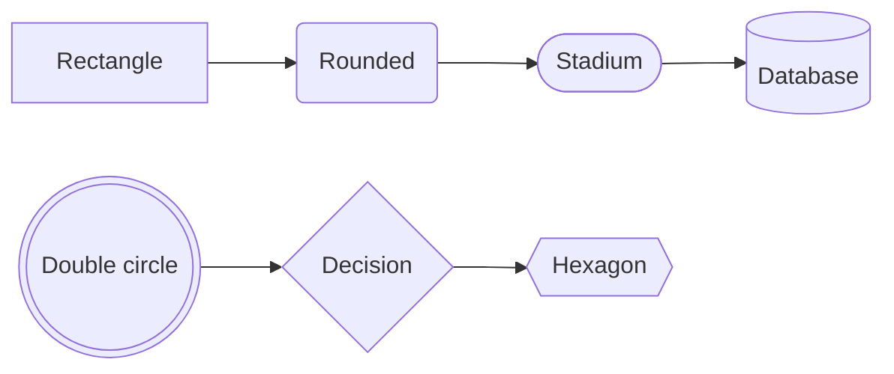
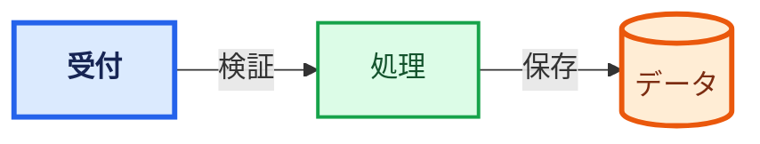
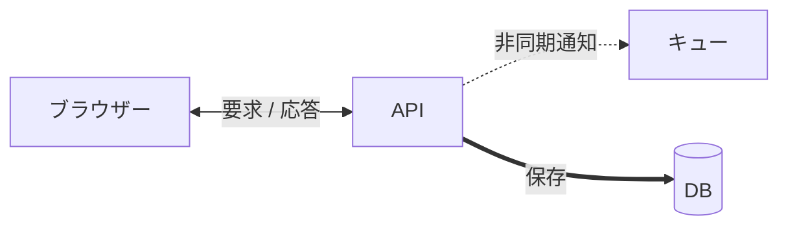
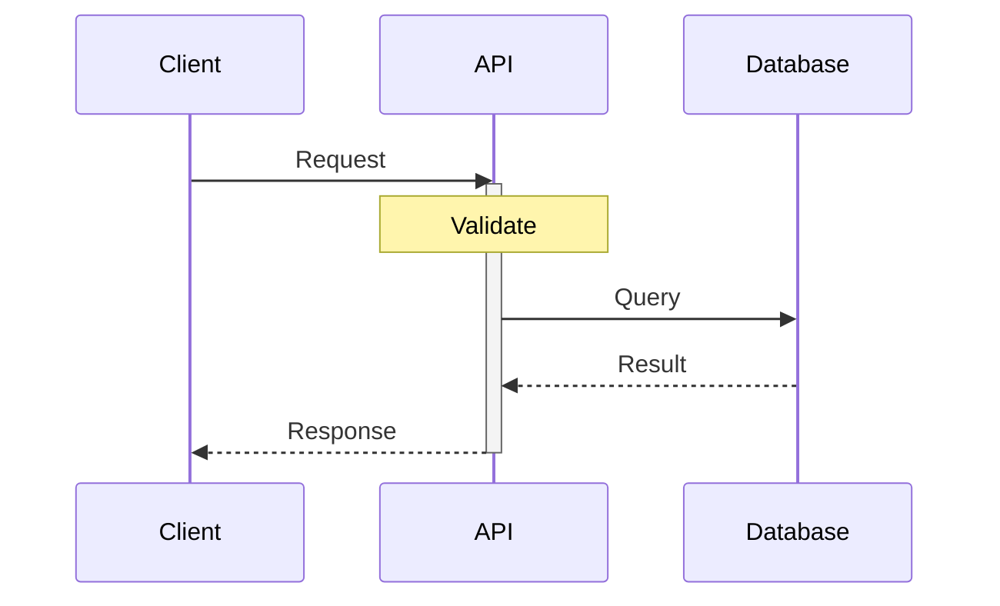
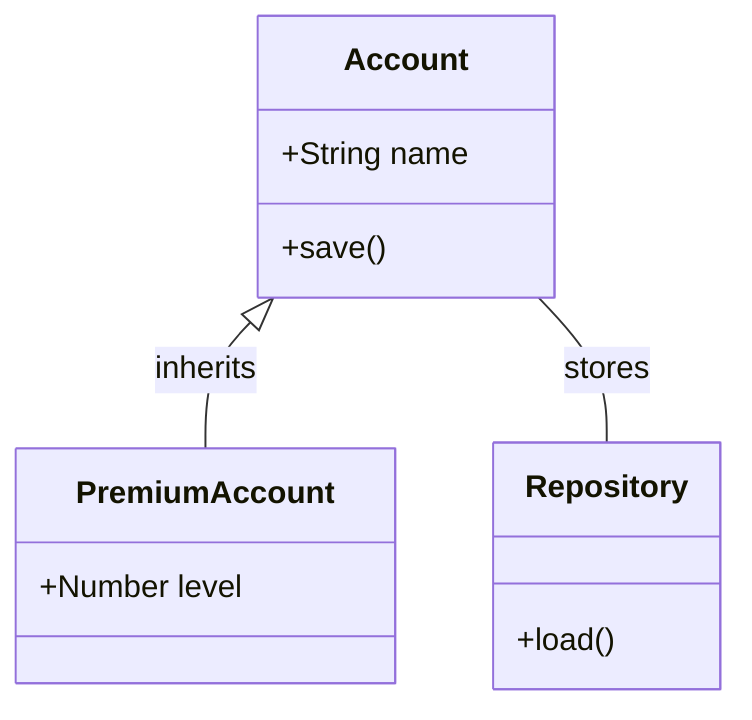
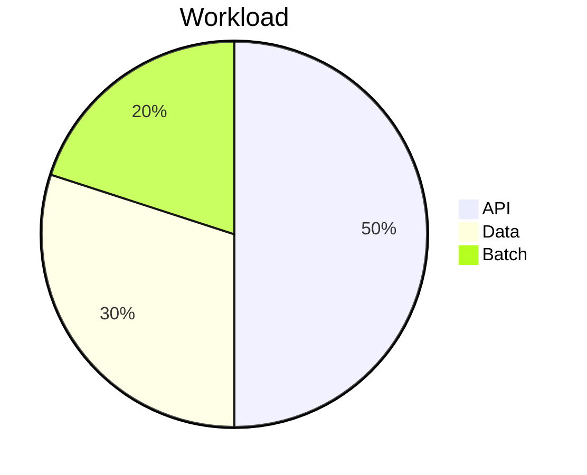
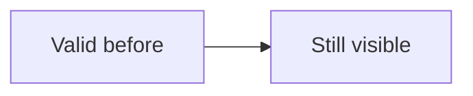
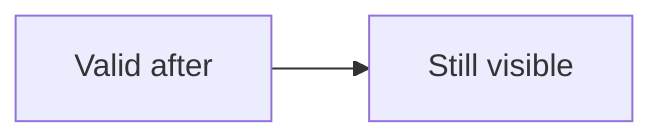

# SVG backend
## 変更を「見て」「触って」確認する

Architecture / Mermaid / Editable PowerPoint

<!--
この作業ツリーの変更後の実装で描画する実演デッキです。変更前の画像ではありません。
通常表示と More controls > Output preview を見比べてください。
PowerPoint 版ではノード、文字、コネクターを個別に選択します。
画像フォールバックを意図したページと、不正入力を意図した最終ページを含みます。
-->

---
## 01 | Architecture の表示を維持

アイコン・グループ・矢印・ラベルの背景を確認。9 枚目は同じ図の light 版です。

```architecture
{
  "version": 1,
  "title": "Client, API and data store",
  "description": "A client sends an HTTPS request to an API inside a platform group.",
  "canvas": { "width": 1400, "height": 440 },
  "elements": [
    { "type": "node", "id": "client", "x": 40, "y": 160, "width": 260, "height": 120, "text": "Client", "icon": "browser" },
    {
      "type": "group", "id": "platform", "x": 410, "y": 50, "width": 900, "height": 330, "title": "Platform",
      "children": [
        { "type": "node", "id": "api", "x": 50, "y": 110, "width": 300, "height": 120, "text": "API", "icon": "api" },
        { "type": "node", "id": "store", "x": 520, "y": 110, "width": 300, "height": 120, "text": "Data store", "icon": "database" }
      ]
    },
    { "type": "connector", "from": "client", "to": "api", "fromPort": "right", "toPort": "left", "label": "HTTPS", "arrow": true },
    { "type": "connector", "from": "api", "to": "store", "fromPort": "right", "toPort": "left", "label": "Query", "arrow": true, "style": { "dash": "10 6" } }
  ]
}
```

<!--
期待: 図の欠け、二重ラベル、線が文字を横切る現象がないこと。
PPTX: ノードとグループは AutoShape、アイコンは別画像。ラベルも編集可能です。
-->

---
## 02 | 追加の Mermaid 形状

Stadium・Database・Double circle も、対応する塗りなら複数の編集可能な図形になります。



<!--
期待: 曲線、二重円、円柱の上面が欠けないこと。
PPTX: この単純な塗りでは、追加形状の構成パーツも個別に選択可能です。
-->

---
theme: light
---
## 03 | classDef / class / style

背景・枠線・文字色・太さを確認。PowerPoint でも指定したスタイルを保持します。



<!--
青は classDef と :::、緑は class 文、オレンジは style 文の指定です。
全ノードがテーマの初期色に戻っていないことを確認してください。
-->

---
## 04 | 矢印・線種・日本語ラベル

双方向の矢印、点線、太線。ラベル文字の背後に線が透けないことを確認します。



<!--
PPTX: 矢印が始点と終点に残り、コネクターを選択して線色と線種を変更できること。
日本語ラベルは画像とネイティブテキストの二重描画になっていないこと。
-->

---
theme: microsoft
---
## 05 | Sequence diagram

参加者・ライフライン・メッセージ・ノート・アクティベーションを個別に確認します。



<!--
PPTX: 単純なシーケンス要素は編集可能です。
破線の応答メッセージ、矢印、細いライフラインが消えていないことを確認します。
-->

---
## 06 | Class diagram と部分フォールバック

クラス枠・メンバー・関連ラベルは編集可能。未対応の継承矢印は画像として保持します。



<!--
期待: name / save / level / load と inherits / stores の文字がすべて残ること。
PPTX: 継承矢印だけがフォールバックし、クラス全体を画像化していないこと。
-->

---
theme: light
---
## 07 | 未対応図も欠落させない

Pie は図全体を画像として出力する想定です。凡例・割合・色が残ることを確認します。



<!--
PPTX: この円グラフは画像として選択できれば正常です。
ネイティブ円グラフへの変換は今回の対応範囲ではありません。
-->

---
theme: light
---
## 08 | 同じ Architecture を light で表示

2 枚目と位置・サイズ・重なり順は同じ。テーマ由来の背景・文字・線色だけが変わります。

```architecture
{
  "version": 1,
  "title": "Client, API and data store",
  "description": "A client sends an HTTPS request to an API inside a platform group.",
  "canvas": { "width": 1400, "height": 440 },
  "elements": [
    { "type": "node", "id": "client", "x": 40, "y": 160, "width": 260, "height": 120, "text": "Client", "icon": "browser" },
    {
      "type": "group", "id": "platform", "x": 410, "y": 50, "width": 900, "height": 330, "title": "Platform",
      "children": [
        { "type": "node", "id": "api", "x": 50, "y": 110, "width": 300, "height": 120, "text": "API", "icon": "api" },
        { "type": "node", "id": "store", "x": 520, "y": 110, "width": 300, "height": 120, "text": "Data store", "icon": "database" }
      ]
    },
    { "type": "connector", "from": "client", "to": "api", "fromPort": "right", "toPort": "left", "label": "HTTPS", "arrow": true },
    { "type": "connector", "from": "api", "to": "store", "fromPort": "right", "toPort": "left", "label": "Query", "arrow": true, "style": { "dash": "10 6" } }
  ]
}
```

---
## 09 | 空の Architecture は有効

下の空白は意図的です。エラーを出さず、図の領域とアクセシビリティ情報を保持します。

```architecture
{
  "version": 1,
  "title": "Empty diagram",
  "description": "This diagram intentionally has no elements.",
  "canvas": { "width": 1200, "height": 300 },
  "elements": []
}
```

<!--
これは描画欠落ではありません。ゼロ要素でも SVG の viewBox とルート情報が維持されるケースです。
source-backed な編集を試す場合は、保存した Markdown を Open Markdown で読み込んでください。
-->

---
## 10 | 不正入力を他の図へ波及させない

中央のエラーアイコンは意図的です。前後の正常な図が両方とも表示されれば期待どおりです。



```mermaid
not-a-diagram invalid
```



<!--
不正入力の再現専用ページです。中央の Mermaid 構文エラーは修正しないでください。
エラー文言の暗い配色は元の Mermaid SVG にも存在する既存の表示で、今回の SVG 変換による欠落ではありません。
前後の正常な図も共通 SVG backend を経由します。
通常表示、固定プレビュー、PDF、PPTX で見比べてください。
-->
